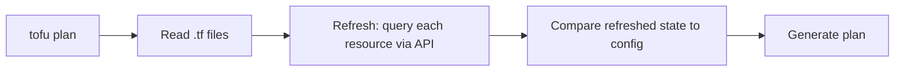
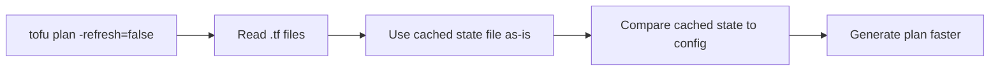

# How to Use -refresh=false to Skip State Refresh

Author: [nawazdhandala](https://www.github.com/nawazdhandala)

Tags: OpenTofu, Performance, Refresh, State, Infrastructure as Code, DevOps

Description: Learn when and how to safely use the -refresh=false flag in OpenTofu to skip the state refresh phase and dramatically speed up plan operations.

## Introduction

By default, `tofu plan` refreshes every resource in state by querying the cloud API before computing the diff. This refresh phase dominates plan time for large configurations. The `-refresh=false` flag skips it, using the cached state instead - safe in many scenarios but requires understanding the trade-offs.

## How Refresh Works by Default



With `-refresh=false`:



## Using -refresh=false

```bash
# Skip refresh - much faster, uses state file as-is

tofu plan -refresh=false

# Apply without refreshing first
tofu apply -refresh=false

# Plan with no-color for CI readability
tofu plan -refresh=false -no-color
```

## When It Is Safe

- **During development iterations**: You are making config changes and know the cloud hasn't changed
- **After a fresh apply**: State was just synchronized - no need to refresh again immediately
- **CI pipelines with drift monitoring**: A separate job runs `plan -refresh-only` on a schedule

## When It Is NOT Safe

- **Before a production apply**: Always refresh to detect drift before modifying production
- **After manual cloud changes**: State will not reflect the actual cloud state
- **Long-running environments**: State may be stale if the last apply was days ago

## Combining with -refresh-only

The counterpart of `-refresh=false` is `-refresh-only`, which *only* refreshes and shows drift:

```bash
# Detect drift without planning any config changes
tofu plan -refresh-only

# Accept the current cloud state as the new baseline
tofu apply -refresh-only
```

## CI/CD Pattern: Separate Drift Detection from Plan

```yaml
# .github/workflows/infra.yml
jobs:
  drift-check:
    schedule:
      - cron: "0 */6 * * *"   # Run every 6 hours
    steps:
      - run: tofu plan -refresh-only -no-color

  pr-plan:
    on: [pull_request]
    steps:
      # Fast plan for developer feedback - skip refresh
      - run: tofu plan -refresh=false -no-color

  production-apply:
    on:
      push:
        branches: [main]
    steps:
      # Full refresh before applying to production
      - run: tofu apply -auto-approve   # No -refresh=false here
```

## Terraform State Refresh Command (Standalone)

```bash
# Refresh state explicitly without planning
tofu apply -refresh-only -auto-approve

# This is the recommended replacement for the deprecated: tofu refresh
```

## Conclusion

`-refresh=false` is one of the simplest performance optimizations in OpenTofu. Use it liberally during development and in PR plans, but always run a full plan (with refresh) before applying to production. Combine it with scheduled `plan -refresh-only` jobs for continuous drift detection without slowing down CI.
