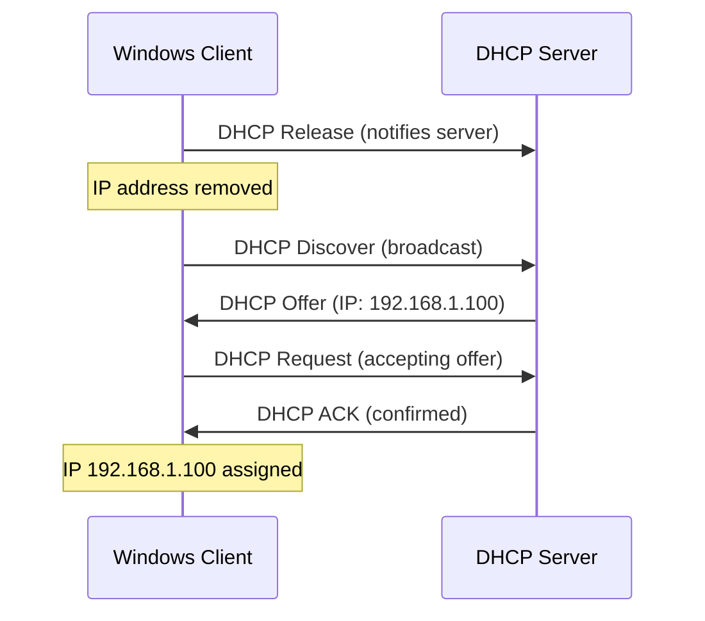

# How to Release and Renew a DHCP IPv4 Address with ipconfig

Author: [nawazdhandala](https://www.github.com/nawazdhandala)

Tags: Window, Networking, Ipconfig, DHCP, IPv4, Network Troubleshooting

Description: Use ipconfig /release and ipconfig /renew to release and renew DHCP leases on Windows, and target specific adapters when only one needs to be refreshed.

## Introduction

Releasing and renewing a DHCP lease forces the adapter to renegotiate its IP address with the DHCP server. This resolves connectivity issues caused by IP conflicts, stale leases, or DHCP server changes.

## Release All DHCP Leases

```cmd
:: Release all DHCP-assigned addresses on all adapters
ipconfig /release
```

After this command, all DHCP-configured adapters will have no IPv4 address. Connectivity is lost until renewal.

## Renew All DHCP Leases

```cmd
:: Request a new DHCP lease on all adapters
ipconfig /renew
```

If a DHCP server is reachable, each adapter will receive a new IP within a few seconds.

## Release and Renew in Sequence

```cmd
:: Full release-and-renew cycle
ipconfig /release
ipconfig /renew

:: Verify the new address
ipconfig
```

## Targeting a Specific Adapter

When you have multiple adapters and only want to renew one:

```cmd
:: Release only the Ethernet adapter
ipconfig /release "Ethernet"

:: Renew only the Ethernet adapter
ipconfig /renew "Ethernet"
```

Use the exact adapter name as shown in `ipconfig /all`.

## Wildcards in Adapter Names

```cmd
:: Release all adapters with "Ethernet" in the name
ipconfig /release "Ethernet*"

:: Renew all Wi-Fi adapters
ipconfig /renew "Wi-Fi*"
```

## What Happens During Release/Renew



## Troubleshooting: APIPA Address (169.254.x.x)

If `ipconfig /renew` assigns a `169.254.x.x` address, no DHCP server responded:

```cmd
:: Check DHCP server is reachable
ping 192.168.1.1      :: Ping known DHCP server IP

:: Check the DHCP client service is running
sc query dhcp
net start dhcp
```

## Force a Specific IP from DHCP

If you have a DHCP reservation, the server will always give you the same IP. Release/renew to get the reserved IP immediately after the reservation is created.

## PowerShell Alternative

```powershell
# Release and renew using PowerShell

$adapter = Get-NetAdapter -Name "Ethernet"
Invoke-CimMethod -ClassName Win32_NetworkAdapterConfiguration `
    -MethodName ReleaseDHCPLease `
    -Filter "Index=$($adapter.InterfaceIndex)"

Invoke-CimMethod -ClassName Win32_NetworkAdapterConfiguration `
    -MethodName RenewDHCPLease `
    -Filter "Index=$($adapter.InterfaceIndex)"
```

## Conclusion

`ipconfig /release` followed by `ipconfig /renew` is the quickest fix for DHCP-related connectivity issues on Windows. Target specific adapters with the adapter name parameter when only one connection needs refreshing.
