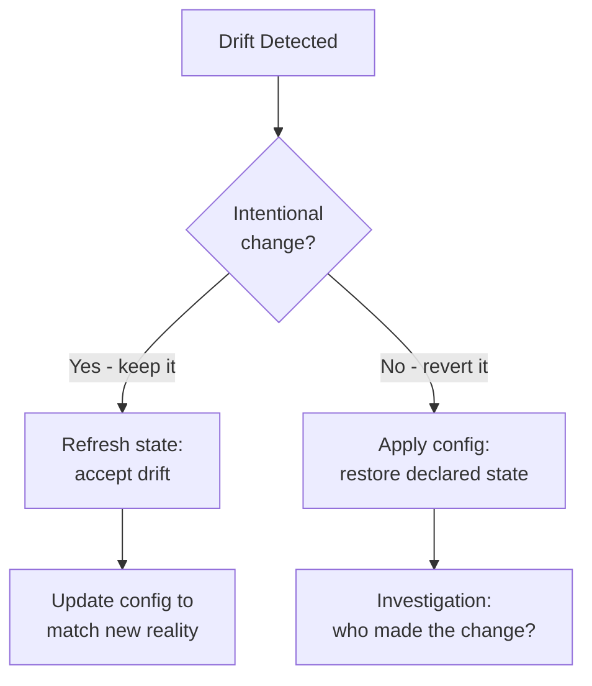

# How to Remediate Drift by Refreshing State in OpenTofu

Author: [nawazdhandala](https://www.github.com/nawazdhandala)

Tags: OpenTofu, Drift Remediation, State Refresh, Infrastructure as Code, Best Practices

Description: Learn how to use tofu apply -refresh-only to accept detected infrastructure drift and update OpenTofu state to match the current cloud reality.

## Introduction

When drift is detected and the out-of-band change is intentional - for example, a database was scaled up manually during an incident and you want to keep the larger size - the correct remediation is refreshing state to accept the drift, not blindly applying to overwrite it.

## Understanding the Two Remediation Paths



## Path 1: Accept the Drift (Refresh State)

```bash
# Step 1: Review what changed

tofu plan -refresh-only -no-color

# Step 2: Verify the changes are intentional
# Read the output carefully:
#   ~ aws_db_instance.main
#     ~ instance_class = "db.t3.medium" -> "db.r5.large"  # Was scaled up during incident

# Step 3: Accept the drift - update state without touching cloud resources
tofu apply -refresh-only

# Output:
# Apply complete! Resources: 0 added, 0 changed, 0 destroyed.
# (State updated to match current cloud state)
```

## Step 4: Update Configuration to Match

After refreshing state, update your configuration to match the new reality - otherwise the next `tofu plan` will plan to revert the change:

```hcl
# BEFORE drift: config had the original value
resource "aws_db_instance" "main" {
  instance_class = "db.t3.medium"  # Old value
}

# AFTER accepting drift: update config to match current state
resource "aws_db_instance" "main" {
  instance_class = "db.r5.large"   # Updated to match what was manually changed
}
```

```bash
# Verify: plan should show no changes now
tofu plan
# Expected: No changes. Your infrastructure matches the configuration.
```

## Selective Refresh: Only Specific Resources

If drift affected only one resource and you want to be surgical:

```bash
# Refresh state for only one resource
tofu apply -refresh-only -target=aws_db_instance.main

# Or refresh a whole module
tofu apply -refresh-only -target=module.databases
```

## The Old Way: tofu refresh (Deprecated)

In older versions of Terraform/OpenTofu, `terraform refresh` was used. It is deprecated and `apply -refresh-only` is the replacement:

```bash
# Deprecated - avoid
tofu refresh

# Use this instead
tofu apply -refresh-only
```

## Automating State Acceptance for Known-Safe Drift

For drift that is consistently expected (e.g., autoscaling changes desired capacity):

```hcl
resource "aws_autoscaling_group" "web" {
  min_size         = 2
  max_size         = 10
  desired_capacity = 4

  lifecycle {
    # Don't plan changes when desired_capacity drifts (autoscaling manages it)
    ignore_changes = [desired_capacity]
  }
}
```

## Conclusion

Refreshing state is the appropriate drift remediation when the manual change was intentional. After running `tofu apply -refresh-only`, always update your configuration files to match the new state - leaving config out of sync with state leads to a plan that will undo the accepted drift on the next apply.
