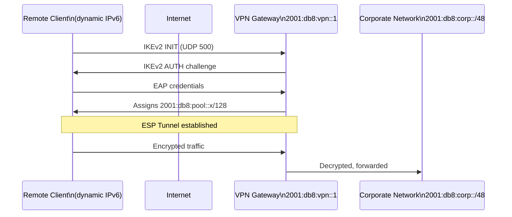

# How to Configure Remote Access IPv6 VPN with IPsec

Author: [nawazdhandala](https://www.github.com/nawazdhandala)

Tags: IPv6, IPsec, VPN, Remote Access, strongSwan

Description: Learn how to configure a road warrior IPv6 VPN using IKEv2 with strongSwan, allowing remote users to connect to corporate IPv6 networks from anywhere.

## Overview

Remote access (road warrior) IPv6 VPNs allow mobile users to connect to corporate networks using IKEv2. The VPN gateway assigns IPv6 addresses to clients from a pool, and client traffic is tunneled through an encrypted ESP connection. strongSwan supports multiple authentication methods including EAP-MSCHAPv2 for username/password and certificate-based authentication.

## Architecture



## VPN Gateway Configuration

### /etc/swanctl/conf.d/remote-access.conf

```text
connections {
    remote-access {
        version = 2
        local_addrs  = 2001:db8:vpn::1
        remote_addrs = %any   # Accept from any IPv6 source

        local {
            auth = pubkey
            certs = vpn-gateway.crt
            id = vpn.example.com
        }
        remote {
            auth = eap-mschapv2
            eap_id = %any
        }

        # Assign IPv6 addresses and DNS to clients
        pools = ipv6-client-pool

        children {
            road-warrior {
                local_ts  = 2001:db8:corp::/48
                remote_ts = ::/0      # Client's tunnel endpoints
                mode = tunnel
                esp_proposals = aes256gcm128-prfsha256-ecp256
                dpd_action = clear
                rekey_time = 3600s
            }
        }

        proposals = aes256-sha256-ecp256
        send_certreq = yes
        dpd_delay = 30s
    }
}

pools {
    ipv6-client-pool {
        addrs = 2001:db8:vpn-clients::/64
        dns   = 2001:db8:corp::53
    }
}

# User authentication secrets (also can use PAM/RADIUS)

secrets {
    eap-alice {
        id = alice
        secret = "Alice-Strong-Password-123!"
    }
    eap-bob {
        id = bob
        secret = "Bob-Strong-Password-456!"
    }
}
```

## Certificate Generation for Gateway

```bash
# Create CA
pki --gen --type rsa --size 4096 --outform pem > /etc/swanctl/private/ca.key.pem
pki --self --ca --lifetime 3650 --in /etc/swanctl/private/ca.key.pem \
    --type rsa --dn "C=US, O=Corp, CN=VPN CA" \
    --outform pem > /etc/swanctl/x509ca/ca.cert.pem

# Create gateway certificate
pki --gen --type rsa --size 2048 --outform pem > /etc/swanctl/private/vpn-gateway.key.pem
pki --req --in /etc/swanctl/private/vpn-gateway.key.pem --type rsa \
    --dn "CN=vpn.example.com" --san "vpn.example.com" --san "2001:db8:vpn::1" \
    --outform pem > /tmp/vpn-gw.csr.pem
pki --issue --in /tmp/vpn-gw.csr.pem --type pkcs10 \
    --cacert /etc/swanctl/x509ca/ca.cert.pem \
    --cakey /etc/swanctl/private/ca.key.pem \
    --lifetime 365 --outform pem > /etc/swanctl/x509/vpn-gateway.crt

chmod 600 /etc/swanctl/private/*.pem
```

## Firewall Rules for Remote Access Gateway

```bash
# Allow IKEv2 from internet
ip6tables -A INPUT -p udp --dport 500 -j ACCEPT    # IKE
ip6tables -A INPUT -p udp --dport 4500 -j ACCEPT   # IKE NAT-T
ip6tables -A INPUT -p esp -j ACCEPT                 # ESP

# Allow forwarding for VPN clients to corporate network
ip6tables -A FORWARD -s 2001:db8:vpn-clients::/64 \
          -d 2001:db8:corp::/48 -j ACCEPT
ip6tables -A FORWARD -s 2001:db8:corp::/48 \
          -d 2001:db8:vpn-clients::/64 -j ACCEPT

# Enable forwarding
sysctl -w net.ipv6.conf.all.forwarding=1
```

## Client Configuration (Windows)

```powershell
# Windows: Add IKEv2 VPN with IPv6 gateway
Add-VpnConnection `
    -Name "Corp VPN" `
    -ServerAddress "vpn.example.com" `
    -TunnelType IKEv2 `
    -AuthenticationMethod EAP `
    -EncryptionLevel Required `
    -RememberCredential $true

# Connect
rasdial "Corp VPN" alice "Alice-Strong-Password-123!"
```

## Client Configuration: Linux with strongSwan

```text
# /etc/swanctl/conf.d/client.conf
connections {
    corp-vpn {
        version = 2
        remote_addrs = vpn.example.com

        local {
            auth = eap
            eap_id = alice
        }
        remote {
            auth = pubkey
            id = vpn.example.com
        }

        children {
            vpn-traffic {
                remote_ts = 2001:db8:corp::/48
                mode = tunnel
                esp_proposals = aes256gcm128-prfsha256-ecp256
                start_action = trap
            }
        }

        proposals = aes256-sha256-ecp256
    }
}

secrets {
    eap-alice {
        id = alice
        secret = "Alice-Strong-Password-123!"
    }
}
```

```bash
# Connect
swanctl --load-all
swanctl --initiate conn:corp-vpn child:vpn-traffic

# Check
swanctl --list-sas
ip -6 addr show   # Should show assigned VPN address
ip -6 route show  # Should show route to corp network
```

## Monitoring Connected Clients

```bash
# Show active connections
swanctl --list-sas

# Sample output per client:
# remote-access: #5, ESTABLISHED, IKEv2, alice@...
#   road-warrior: #5, reqid 5, INSTALLED, TUNNEL
#     local  2001:db8:corp::/48
#     remote 2001:db8:vpn-clients::5/128

# Log connected users
journalctl -u strongswan | grep "ESTABLISHED" | awk '{print $0}' | tail -20
```

## Summary

Remote access IPv6 VPN with strongSwan uses `remote_addrs = %any`, an IP address pool for clients, and EAP-MSCHAPv2 or certificate authentication. Clients receive IPv6 addresses from the configured `pools{}` block. Configure firewall rules to allow UDP 500/4500 and ESP from internet, and to forward client traffic to the corporate network. Clients can connect from Windows (built-in IKEv2), Linux (strongSwan), or iOS/Android (native IKEv2). Monitor connections with `swanctl --list-sas`.
