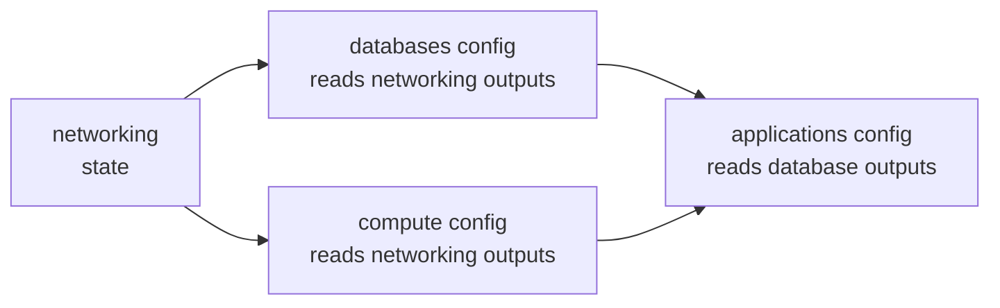

# How to Use Remote State Data Sources to Share Data Between Configs

Author: [nawazdhandala](https://www.github.com/nawazdhandala)

Tags: OpenTofu, Remote State, Data Sources, State Management, Infrastructure as Code, Best Practices

Description: Learn how to use the terraform_remote_state data source to share outputs between independently-managed OpenTofu configurations without creating a monolithic state file.

## Introduction

When infrastructure is split across multiple OpenTofu configurations, they still need to reference each other's resources. The `terraform_remote_state` data source reads another configuration's output values from its remote state file, enabling loose coupling between independently managed components.

## Basic Pattern

```hcl
# networking/outputs.tf — exports values for other configs to consume
output "vpc_id" {
  value = aws_vpc.main.id
}

output "private_subnet_ids" {
  value = aws_subnet.private[*].id
}

output "database_subnet_group_name" {
  value = aws_db_subnet_group.main.name
}
```

```hcl
# databases/main.tf — reads networking outputs
data "terraform_remote_state" "networking" {
  backend = "s3"
  config = {
    bucket = "my-opentofu-state"
    key    = "networking/tofu.tfstate"
    region = "us-east-1"
  }
}

resource "aws_db_instance" "main" {
  identifier          = "prod-postgres"
  engine              = "postgres"
  instance_class      = "db.t3.medium"
  db_subnet_group_name = data.terraform_remote_state.networking.outputs.database_subnet_group_name
}
```

## AWS S3 Backend

```hcl
data "terraform_remote_state" "networking" {
  backend = "s3"
  config = {
    bucket  = "my-opentofu-state"
    key     = "environments/prod/networking/tofu.tfstate"
    region  = "us-east-1"
    # Optionally assume a read-only role for state access
    role_arn = "arn:aws:iam::123456789012:role/state-reader"
  }
}
```

## GCS Backend

```hcl
data "terraform_remote_state" "networking" {
  backend = "gcs"
  config = {
    bucket = "my-opentofu-state"
    prefix = "environments/prod/networking"
  }
}
```

## Dependency Graph Between Configurations



## Alternative: Use a Dedicated Outputs Module

For frequently-shared data, a dedicated "data" configuration that aggregates outputs from multiple sources reduces coupling:

```hcl
# shared-data/main.tf — aggregates and re-exports
data "terraform_remote_state" "networking" {
  backend = "s3"
  config  = { bucket = "my-state", key = "networking/tofu.tfstate", region = "us-east-1" }
}

data "terraform_remote_state" "security" {
  backend = "s3"
  config  = { bucket = "my-state", key = "security/tofu.tfstate", region = "us-east-1" }
}

# shared-data/outputs.tf — clean interface for consumers
output "vpc_id"        { value = data.terraform_remote_state.networking.outputs.vpc_id }
output "web_sg_id"     { value = data.terraform_remote_state.security.outputs.web_sg_id }
output "db_sg_id"      { value = data.terraform_remote_state.security.outputs.db_sg_id }
```

## Caveats

- `terraform_remote_state` requires read access to the state bucket — plan IAM accordingly
- State files may contain sensitive values — the reader gets access to all outputs
- For very sensitive values, use a parameter store (SSM, Vault) instead of state outputs

## Conclusion

Remote state data sources enable independent OpenTofu configurations to share data without merging into a monolith. Keep the shared interface small (export only what consumers need), use IAM to restrict state access to appropriate roles, and consider a dedicated aggregation configuration to reduce the coupling between individual state files.
