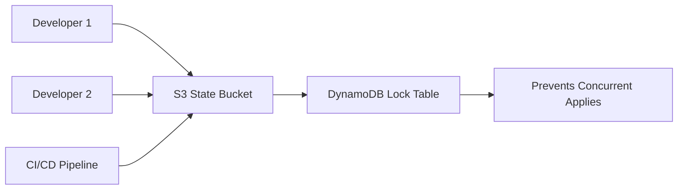

# How to Use Remote State for Team Collaboration in OpenTofu

Author: [nawazdhandala](https://www.github.com/nawazdhandala)

Tags: OpenTofu, Remote State, S3, Team Collaboration, State Management, Infrastructure as Code

Description: Learn how to configure OpenTofu remote state with S3 and DynamoDB to enable safe team collaboration, prevent state file conflicts, and share infrastructure outputs across modules.

---

Remote state moves the OpenTofu state file from local disk to shared storage, enabling multiple team members and CI/CD systems to work on the same infrastructure safely. S3 with DynamoDB locking is the standard pattern on AWS.

## Remote State Architecture



## Bootstrap State Infrastructure

```hcl
# bootstrap/main.tf - run once to create state infrastructure

resource "aws_s3_bucket" "state" {
  bucket = "${var.company}-tofu-state-${var.account_id}"

  lifecycle {
    prevent_destroy = true
  }
}

resource "aws_s3_bucket_versioning" "state" {
  bucket = aws_s3_bucket.state.id
  versioning_configuration {
    status = "Enabled"
  }
}

resource "aws_s3_bucket_server_side_encryption_configuration" "state" {
  bucket = aws_s3_bucket.state.id
  rule {
    apply_server_side_encryption_by_default {
      sse_algorithm = "AES256"
    }
  }
}

resource "aws_s3_bucket_public_access_block" "state" {
  bucket                  = aws_s3_bucket.state.id
  block_public_acls       = true
  block_public_policy     = true
  ignore_public_acls      = true
  restrict_public_buckets = true
}

resource "aws_dynamodb_table" "state_lock" {
  name         = "${var.company}-tofu-lock"
  billing_mode = "PAY_PER_REQUEST"
  hash_key     = "LockID"

  attribute {
    name = "LockID"
    type = "S"
  }

  lifecycle {
    prevent_destroy = true
  }
}
```

## Backend Configuration

```hcl
# backend.tf
terraform {
  backend "s3" {
    bucket         = "mycompany-tofu-state-123456789012"
    key            = "environments/production/terraform.tfstate"
    region         = "us-east-1"
    encrypt        = true
    dynamodb_table = "mycompany-tofu-lock"
  }
}
```

## Partial Backend Config for Multiple Environments

```bash
# Use -backend-config to parameterize backends
tofu init \
  -backend-config="key=environments/${ENVIRONMENT}/terraform.tfstate" \
  -backend-config="bucket=mycompany-tofu-state-${ACCOUNT_ID}"
```

## Referencing Remote State Outputs

```hcl
# Read outputs from another module's state
data "terraform_remote_state" "networking" {
  backend = "s3"
  config = {
    bucket = "mycompany-tofu-state-123456789012"
    key    = "environments/production/networking/terraform.tfstate"
    region = "us-east-1"
  }
}

# Use the networking module's outputs
resource "aws_instance" "app" {
  subnet_id = data.terraform_remote_state.networking.outputs.private_subnet_ids[0]
}
```

## IAM Policy for State Access

```hcl
# Grant specific teams read/write access to their environment's state
resource "aws_iam_policy" "state_readwrite" {
  name = "tofu-state-readwrite-${var.environment}"

  policy = jsonencode({
    Version = "2012-10-17"
    Statement = [
      {
        Effect = "Allow"
        Action = ["s3:GetObject", "s3:PutObject", "s3:DeleteObject"]
        Resource = "arn:aws:s3:::mycompany-tofu-state/*/${var.environment}/*"
      },
      {
        Effect   = "Allow"
        Action   = ["s3:ListBucket"]
        Resource = "arn:aws:s3:::mycompany-tofu-state"
      },
      {
        Effect   = "Allow"
        Action   = ["dynamodb:GetItem", "dynamodb:PutItem", "dynamodb:DeleteItem"]
        Resource = aws_dynamodb_table.state_lock.arn
      }
    ]
  })
}
```

## Best Practices

- Enable S3 versioning on the state bucket so you can recover from accidental state corruption or deletion.
- Use separate state file paths (keys) per environment and per module to minimize blast radius of state operations.
- Never store state locally in CI/CD - always use remote state with locking to prevent concurrent apply races.
- Restrict S3 state access by IAM path prefix so dev teams can't access production state.
- Use `terraform_remote_state` data sources sparingly - prefer SSM parameters or other well-defined outputs for cross-module communication.
