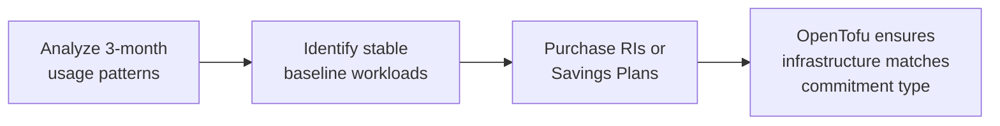

# How to Use Reserved Instances and Savings Plans with OpenTofu

Author: [nawazdhandala](https://www.github.com/nawazdhandala)

Tags: OpenTofu, AWS, Reserved Instances, Savings Plans, Cost Optimization, Infrastructure as Code

Description: Learn how to manage AWS Reserved Instances and Savings Plans commitments alongside OpenTofu infrastructure to maximize discounts while maintaining flexibility.

---

Reserved Instances and Savings Plans can reduce AWS compute costs by 30-72% compared to on-demand pricing. OpenTofu doesn't provision RIs or Savings Plans directly (they're purchasing commitments, not infrastructure), but it helps you track what you've committed to and manage the resources that benefit from those commitments.

## Commitment Strategy



## Tracking Reserved Instance Commitments

```hcl
# reserved_instances.tf - document RI commitments alongside infrastructure

locals {
  # Document active reservations for reference
  reserved_instances = {
    "m5.large-us-east-1" = {
      instance_type  = "m5.large"
      count          = 4
      region         = "us-east-1"
      term           = "1-year"
      payment        = "partial-upfront"
      expires        = "2025-03-15"
      monthly_saving = 45.00  # Savings vs on-demand
    }
  }
}

# Ensure ASG uses the committed instance type
resource "aws_autoscaling_group" "app" {
  # Match the reserved instance type
  launch_template {
    id      = aws_launch_template.app.id
    version = "$Latest"
  }

  # Maintain at least as many instances as RIs purchased
  min_size         = local.reserved_instances["m5.large-us-east-1"].count
  desired_capacity = local.reserved_instances["m5.large-us-east-1"].count
  max_size         = local.reserved_instances["m5.large-us-east-1"].count * 3
}

resource "aws_launch_template" "app" {
  # Must match RI: same instance type, region, and tenancy (default)
  instance_type = "m5.large"

  # On-demand only in base capacity to maximize RI coverage
  instance_market_options {
    # Remove this block - on-demand uses RIs automatically
  }
}
```

## Mixed Instance Policy for RI + Spot

```hcl
# Use RIs for baseline, spot for burst
resource "aws_autoscaling_group" "mixed" {
  mixed_instances_policy {
    instances_distribution {
      on_demand_base_capacity                  = 2  # Always on-demand (covered by RIs)
      on_demand_percentage_above_base_capacity = 0  # All above base is spot
      spot_allocation_strategy                 = "price-capacity-optimized"
    }

    launch_template {
      launch_template_specification {
        launch_template_id = aws_launch_template.app.id
        version            = "$Latest"
      }

      # Override instance types for spot diversification
      override {
        instance_type = "m5.large"   # RI type
      }
      override {
        instance_type = "m5a.large"  # Spot alternative
      }
      override {
        instance_type = "m4.large"   # Spot alternative
      }
    }
  }

  min_size = 2
  max_size = 20
}
```

## Compute Savings Plan Coverage Check

```hcl
# Use AWS Cost Explorer data to validate coverage
data "aws_ce_cost_and_usage" "compute" {
  # This data source requires the aws provider >= 4.0
  time_period {
    start = formatdate("YYYY-MM-01", timeadd(timestamp(), "-720h"))
    end   = formatdate("YYYY-MM-01", timestamp())
  }

  granularity = "MONTHLY"

  filter = jsonencode({
    Dimensions = {
      Key    = "SERVICE"
      Values = ["Amazon Elastic Compute Cloud - Compute"]
    }
  })

  metrics = ["UnblendedCost"]
}
```

## RI Expiry Monitoring

```hcl
# CloudWatch alarm for RI expiry (notify 60 days before expiry)
resource "aws_cloudwatch_metric_alarm" "ri_expiry" {
  alarm_name          = "reserved-instance-expiring-soon"
  comparison_operator = "LessThanThreshold"
  evaluation_periods  = 1
  metric_name         = "RIUtilization"
  namespace           = "AWS/Reservations"
  period              = 86400
  statistic           = "Average"
  threshold           = 100

  alarm_description = "Reserved instance utilization below 100% - check for upcoming expirations"
  alarm_actions     = [aws_sns_topic.cost_alerts.arn]
}
```

## Best Practices

- Analyze 3 months of on-demand usage before purchasing RIs - look for stable baseline workloads that run consistently.
- Use Compute Savings Plans instead of EC2 RIs for flexibility - they apply across instance families, sizes, and regions.
- Set ASG `min_size` to match RI count to ensure you're always utilizing your reservations.
- Alert on RI expiry at 90 days and 30 days before expiration - renewal decisions should be made in advance.
- For RDS, use Reserved DB Instances tied to the specific instance class defined in your OpenTofu configuration.
