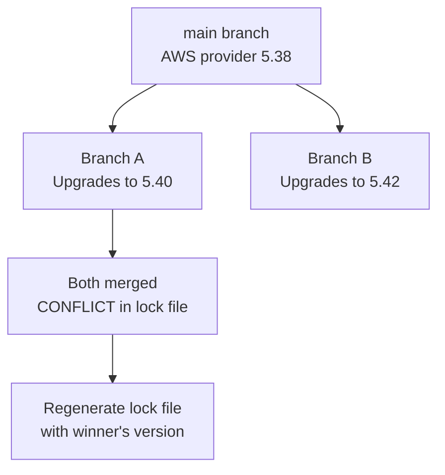

# How to Resolve Lock File Conflicts in OpenTofu

Author: [nawazdhandala](https://www.github.com/nawazdhandala)

Tags: OpenTofu, Lock File, Git Conflicts, Provider Versions, Merge Conflicts, Infrastructure as Code

Description: Learn how to resolve merge conflicts in the OpenTofu .terraform.lock.hcl dependency lock file when multiple team members upgrade providers simultaneously, with strategies to prevent conflicts in the future.

---

Lock file conflicts occur when two branches both update provider versions. Because the lock file is auto-generated HCL with complex checksums, standard git conflict resolution doesn't work — attempting to manually merge checksums produces invalid files. The correct approach is to regenerate the lock file after resolving provider version conflicts in `providers.tf`.

## Conflict Scenario



## Understanding the Conflict

```
# .terraform.lock.hcl after merge conflict — INVALID HCL
provider "registry.opentofu.org/hashicorp/aws" {
<<<<<<< HEAD
  version     = "5.40.0"
  constraints = "~> 5.0"

  hashes = [
    "h1:abc123...",
    "h1:def456...",
=======
  version     = "5.42.0"
  constraints = "~> 5.0"

  hashes = [
    "h1:xyz789...",
    "h1:uvw456...",
>>>>>>> feature/upgrade-aws
  ]
}
```

## Step-by-Step Conflict Resolution

```bash
# Step 1: After git merge/rebase detects conflict in lock file
git status
# modified: .terraform.lock.hcl (both modified)

# Step 2: Resolve providers.tf first — decide which version wins
# Edit providers.tf to use the desired version constraint
cat providers.tf

# Step 3: Accept one version of the lock file as the starting point
# Option A: Use the incoming branch's lock file
git checkout --theirs .terraform.lock.hcl

# Option B: Use the current branch's lock file
git checkout --ours .terraform.lock.hcl

# Step 4: Regenerate the lock file with correct checksums
tofu init -upgrade

# Step 5: Add all platform checksums
tofu providers lock \
  -platform=linux/amd64 \
  -platform=linux/arm64 \
  -platform=darwin/amd64 \
  -platform=darwin/arm64

# Step 6: Verify the lock file is valid
tofu validate

# Step 7: Stage the regenerated lock file
git add .terraform.lock.hcl

# Step 8: Complete the merge
git merge --continue
# or if rebasing:
git rebase --continue
```

## When Resolving Provider Version Disagreements

```bash
# If branch A wants aws ~> 5.40 and branch B wants aws ~> 5.42:
# Choose the higher version (5.42) for the merge result

# 1. Edit providers.tf to use 5.42
vim providers.tf

# 2. Delete the conflicted lock file and regenerate
rm .terraform.lock.hcl

# 3. Install and generate fresh lock file
tofu init

# 4. Add platform checksums
tofu providers lock \
  -platform=linux/amd64 \
  -platform=darwin/amd64 \
  -platform=darwin/arm64

# 5. Run plan to verify no breaking changes
tofu plan
```

## Git Configuration to Prevent Conflicts

```bash
# .gitattributes — mark lock file as requiring special merge handling
# This tells git not to auto-merge the lock file
echo '.terraform.lock.hcl merge=ours' >> .gitattributes

# Alternative: mark as binary to always require manual resolution
echo '.terraform.lock.hcl binary' >> .gitattributes
```

## Lock File Conflict Prevention Strategy

```bash
# Prevention strategy 1: Feature branches should pull main before upgrading
git checkout feature/my-feature
git rebase main  # Get latest lock file from main

# Then perform upgrade
tofu init -upgrade
tofu providers lock -platform=linux/amd64 -platform=darwin/amd64 -platform=darwin/arm64

# Prevention strategy 2: Dedicated "dependency upgrade" branches
# Only one branch upgrades providers at a time
git checkout -b deps/upgrade-providers-march-2026
tofu init -upgrade
tofu providers lock -platform=linux/amd64 -platform=darwin/amd64 -platform=darwin/arm64
git add providers.tf .terraform.lock.hcl
git commit -m "Upgrade AWS provider to 5.45.0"
```

## Automated Conflict Detection in CI

```yaml
# .github/workflows/lock-file-check.yml
name: Lock File Validation

on: [pull_request]

jobs:
  check:
    runs-on: ubuntu-latest
    steps:
      - uses: actions/checkout@v4
        with:
          fetch-depth: 0

      - name: Check for lock file conflicts
        run: |
          if grep -q '<<<<<<' .terraform.lock.hcl; then
            echo "ERROR: .terraform.lock.hcl contains unresolved merge conflicts"
            echo "Run: tofu init -upgrade && tofu providers lock -platform=linux/amd64 -platform=darwin/amd64"
            exit 1
          fi

      - name: Setup OpenTofu
        uses: opentofu/setup-opentofu@v1

      - name: Validate lock file syntax
        run: tofu init
```

## Best Practices

- When resolving lock file conflicts, always regenerate the file with `tofu init -upgrade` rather than manually editing checksums — checksums are cryptographic hashes that must match exactly.
- Resolve `providers.tf` version constraints before regenerating the lock file — the lock file is derived from the version constraints, not the other way around.
- Use Renovate or Dependabot to automate provider upgrades through dedicated PRs — this serializes upgrades and prevents simultaneous version changes that cause conflicts.
- Add `.gitattributes` to mark the lock file as requiring manual merge resolution (`merge=ours`) — this prevents git from attempting an auto-merge that produces invalid HCL.
- In CI, explicitly check for conflict markers (`<<<<<<<`) in the lock file before running `tofu init` — a lock file with conflict markers causes confusing errors that are hard to diagnose.
