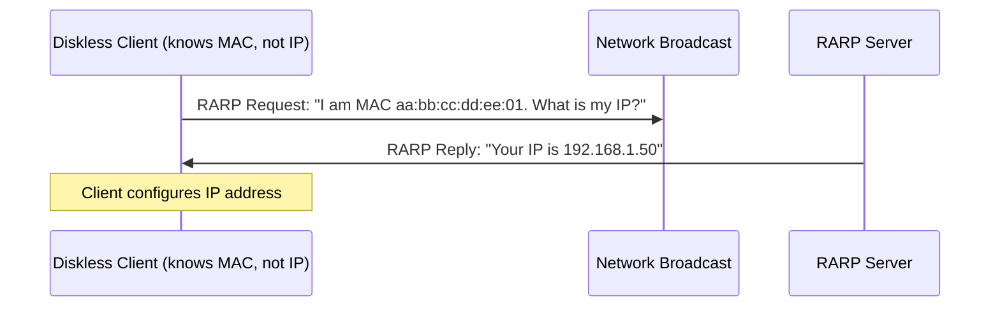

# How to Understand Reverse ARP (RARP)

Author: [nawazdhandala](https://www.github.com/nawazdhandala)

Tags: Networking, ARP, RARP, IPv4, History

Description: Learn what Reverse ARP (RARP) is, how it works, how it differs from ARP, and why BOOTP and DHCP replaced it.

## What Is RARP?

Reverse ARP (RARP), defined in **RFC 903 (1984)**, does the opposite of ARP:

- **ARP**: Given an IP address → find the MAC address
- **RARP**: Given a MAC address → find the IP address

RARP allowed diskless workstations to discover their own IP address at boot time by broadcasting their MAC address to a RARP server.

## How RARP Works



## RARP Packet Format

RARP uses the same 28-byte format as ARP:

| Field | Value |
|-------|-------|
| Hardware type | 1 (Ethernet) |
| Protocol type | 0x0800 (IPv4) |
| Operation | 3 = RARP Request, 4 = RARP Reply |
| Sender MAC | Client's MAC address |
| Sender IP | 0.0.0.0 (unknown) |
| Target MAC | Client's MAC address (same as sender) |
| Target IP | 0.0.0.0 (asking for this) |

The EtherType for RARP is **0x8035**.

## Limitations of RARP

RARP had severe limitations that led to its replacement:

1. **No subnet mask or router information** - IP only, nothing else
2. **Requires a RARP server on every subnet** - doesn't cross routers
3. **Broadcast-based** - routers do not forward broadcasts
4. **No configuration flexibility** - can only return an IP address

## RARP vs ARP vs BOOTP vs DHCP

| Protocol | Direction | Info Provided | Still Used? |
|----------|-----------|--------------|-------------|
| ARP | IP → MAC | MAC address | Yes |
| RARP | MAC → IP | IP address only | No (obsolete) |
| BOOTP | MAC → IP+config | IP, mask, gateway, TFTP | Rarely (legacy) |
| DHCP | MAC → full config | IP, mask, gateway, DNS, options | Yes |

## Why RARP Is Obsolete

RARP was superseded by BOOTP in the late 1980s, then by DHCP in the 1990s. DHCP provides:

- IP address
- Subnet mask
- Default gateway
- DNS servers
- Domain name
- Lease duration
- Dozens of additional options

No modern operating system uses RARP. However, it is still relevant historically and occasionally appears in networking certification exams.

## Viewing RARP Packets with tcpdump

You can capture RARP packets (EtherType 0x8035):

```bash
# Capture RARP packets (if any exist on your network)

sudo tcpdump -n -e -i eth0 rarp

# Or filter by EtherType
sudo tcpdump -n -e -i eth0 'ether proto 0x8035'
```

## Key Takeaways

- RARP resolves MAC addresses to IP addresses (reverse of ARP).
- It was used by diskless workstations in the 1980s-1990s to get their IP at boot.
- RARP uses EtherType 0x8035 and operations 3 (request) and 4 (reply).
- RARP is now completely obsolete, replaced by BOOTP and then DHCP.

**Related Reading:**

- [How to Understand How ARP Maps IP Addresses to MAC Addresses](https://oneuptime.com/blog/post/2026-03-20-how-arp-maps-ip-to-mac-addresses/view)
- [How to Understand BOOTP vs DHCP Differences](https://oneuptime.com/blog/post/2026-03-20-bootp-vs-dhcp-differences/view)
