# How to Understand the Difference Between RFC 4941 and RFC 8981

Author: [nawazdhandala](https://www.github.com/nawazdhandala)

Tags: IPv6, RFC4941, RFC8981, Privacy, Networking, Security

Description: Understand the key differences between RFC 4941 and its successor RFC 8981 for IPv6 temporary address generation, including improved cryptographic properties and address management.

## Introduction

IPv6 privacy extensions have evolved through two major RFCs: RFC 4941 (2007) and its replacement RFC 8981 (2021). Both generate temporary addresses that hide the stable interface identifier, but RFC 8981 addresses several cryptographic and operational weaknesses in the original specification.

## RFC 4941: The Original Privacy Extensions

RFC 4941 introduced temporary addresses generated from a pseudo-random process:

- Uses an MD5-based algorithm seeded by the interface's stable EUI-64 address and a random value
- Generates a new temporary address whenever the preferred lifetime expires
- The stable (public) address is still generated alongside the temporary address
- Temporary addresses have a default preferred lifetime of 1 day and valid lifetime of 7 days

**Key limitations of RFC 4941:**
- MD5 is considered cryptographically weak
- The random seed can potentially be guessed or brute-forced
- The stable address generated alongside it is still EUI-64 based
- No protection against address correlation within the same network across sessions

## RFC 8981: Updated Privacy Extensions

RFC 8981 (2021) obsoletes RFC 4941 with these improvements:

- Uses a PRNG based on SHA-256 (cryptographically stronger)
- The stable address can now use RFC 7217 (opaque IID) instead of EUI-64
- Improved state machine for address lifecycle management
- Clearer rules for when to generate new addresses
- Explicit handling of interface re-enablement and network changes

## Comparison Table

| Feature | RFC 4941 | RFC 8981 |
|---|---|---|
| Hash algorithm | MD5 | SHA-256 |
| Stable address | EUI-64 | RFC 7217 opaque (recommended) |
| Default preferred lifetime | 1 day | 1 day (configurable) |
| Default valid lifetime | 7 days | 7 days (configurable) |
| Status | Obsolete | Current |
| OS support | Universal | Linux 5.7+, macOS 12+, Windows 11 |

## Address Lifecycle Comparison

```mermaid
gantt
    title RFC 4941 vs RFC 8981 Address Lifecycle
    dateFormat  X
    axisFormat %s

    section RFC 4941
    Preferred (temp addr 1)   :0, 86400
    Valid (temp addr 1)       :0, 604800
    Preferred (temp addr 2)   :72000, 158400
    Valid (temp addr 2)       :72000, 676800

    section RFC 8981
    Preferred (temp addr 1)   :0, 86400
    Valid (temp addr 1)       :0, 604800
    Preferred (temp addr 2)   :72000, 158400
    Valid (temp addr 2)       :72000, 676800
```



The lifecycle timing is similar, but RFC 8981 provides a cleaner state machine for handling transitions.

## Checking Which RFC Your System Implements

On Linux, the kernel version determines which RFC is used:

```bash
# Check kernel version
uname -r
# Kernel 5.7+ uses RFC 8981-compatible PRNG (SHA-256 based)

# Check the privacy extension mode
sysctl net.ipv6.conf.eth0.use_tempaddr
# 0 = disabled
# 1 = generate but don't prefer
# 2 = generate and prefer temporary

# Check addr_gen_mode for stable address type
sysctl net.ipv6.conf.eth0.addr_gen_mode
# 0 = EUI-64 (RFC 4941 style stable)
# 2 = stable-privacy/RFC 7217 (RFC 8981 recommended)
```

For a fully RFC 8981 compliant configuration (SHA-256 PRNG + RFC 7217 stable address):

```bash
# /etc/sysctl.d/60-ipv6-privacy.conf
# RFC 8981 recommended configuration

# Use stable-privacy for the stable address (not EUI-64)
net.ipv6.conf.default.addr_gen_mode = 2
net.ipv6.conf.all.addr_gen_mode = 2

# Generate and prefer temporary addresses
net.ipv6.conf.default.use_tempaddr = 2
net.ipv6.conf.all.use_tempaddr = 2
```

Apply with:

```bash
sudo sysctl --system
```

## Operating System Support Matrix

| OS | RFC 4941 | RFC 8981 Notes |
|---|---|---|
| Linux 5.7+ | Yes | SHA-256 PRNG used when addr_gen_mode=2 |
| Windows 10 | Yes | Partial RFC 8981 behaviors |
| Windows 11 | Yes | Improved RFC 8981 compliance |
| macOS 12+ | Yes | Full RFC 8981 support |
| FreeBSD 13+ | Yes | RFC 8981 aligned |

## Conclusion

RFC 8981 supersedes RFC 4941 with stronger cryptography and cleaner address lifecycle management. The practical difference for most deployments is minimal — both RFCs generate rotating temporary addresses that prevent cross-network tracking. However, deploying RFC 7217 stable-privacy addresses alongside RFC 8981 temporary addresses provides the strongest IPv6 privacy posture available today. Update to a modern kernel and OS to benefit from the SHA-256-based PRNG improvements in RFC 8981.
