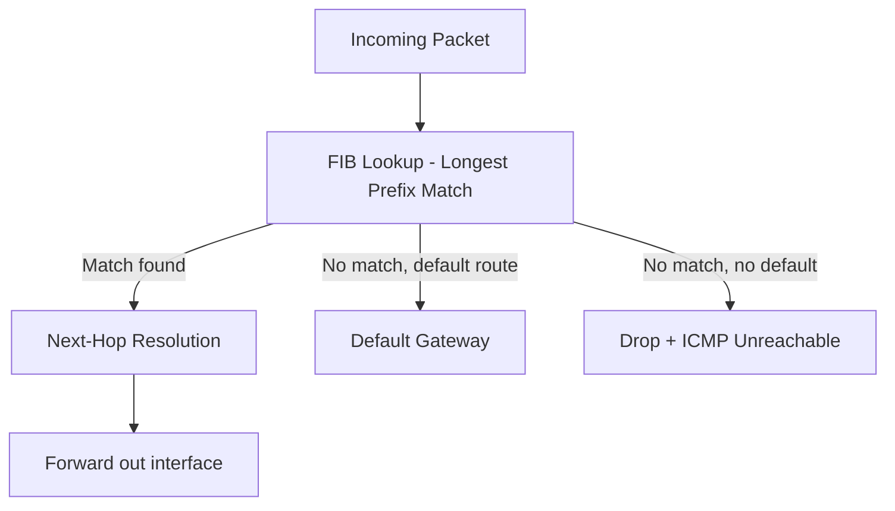

# How to Understand the Routing Information Base vs Forwarding Information Base

Author: [nawazdhandala](https://www.github.com/nawazdhandala)

Tags: Networking, Routing, RIB, FIB, Linux, Architecture

Description: Understand the distinction between the Routing Information Base (RIB) and Forwarding Information Base (FIB) and how they work together in Linux and hardware routers.

## Introduction

The RIB and FIB are two distinct data structures that together handle routing. The RIB is a comprehensive database of all learned routes from all sources (static, OSPF, BGP, connected). The FIB is a distilled, optimized subset installed in the actual forwarding engine. Understanding the difference helps diagnose cases where a route exists in the RIB but packets still fail.

## The RIB (Routing Information Base)

The RIB contains all routes from all protocols, including non-best paths. It is the "full picture" of routing knowledge:

```bash
# FRR's RIB (includes all protocols and non-best paths)

vtysh -c "show ip route"

# Show all routes including non-selected ones
vtysh -c "show ip route detail"

# The RIB marks best routes with >
# Example output:
# B>* 10.20.0.0/24 [20/0] via 10.0.0.2, eth0, weight 1, 00:05:00
# O   10.20.0.0/24 [110/20] via 192.168.1.1, eth1, weight 1, 01:00:00
# The B (BGP) route is installed (>*), OSPF route is in RIB but not selected
```

## The FIB (Forwarding Information Base)

The FIB contains only the best routes actually used for forwarding. On Linux, this is the kernel routing table:

```bash
# The Linux kernel routing table IS the FIB
ip route show

# This shows only the best routes installed for forwarding
# Non-best paths from the RIB are NOT here

# Compare FRR RIB vs kernel FIB
vtysh -c "show ip route" | grep "^[OBSC]"  # RIB entries
ip route show                                # FIB entries
```

## Why Routes May Be in RIB but Not FIB

```bash
# Check if FRR installed a route in the kernel
vtysh -c "show ip route 10.20.0.0/24"
# If marked with * it should be in kernel FIB

# If in FRR RIB but not kernel FIB, check for:
# 1. A higher-priority route in another protocol blocking installation
# 2. Kernel table full (rare)
# 3. Next-hop unresolvable (recursive lookup failure)

# Check kernel installation errors
journalctl -u frr | grep -i "install\|kernel\|error"
```

## Hardware vs Software FIB

On hardware routers, the FIB is stored in specialized TCAM (Ternary Content Addressable Memory) for wire-speed lookups:

```text
RIB (software, full table) --> Best path selection --> FIB (hardware/kernel)
```

When the hardware FIB is full (common on low-cost switches with large BGP tables), routes overflow to software forwarding - causing significant performance degradation.

## FIB Lookup Process



## Monitoring FIB Size on Linux

```bash
# Count routes in the kernel FIB
ip route show | wc -l

# Show route cache statistics
ip -s route show cache

# For detailed kernel routing statistics
cat /proc/net/route   # raw kernel routing table

# Monitor FIB changes in real time
ip monitor route
```

## Conclusion

The RIB is the policy database - it stores everything known about routes. The FIB is the operational database - it stores only what's needed for fast packet forwarding. In a healthy network, the best route in the RIB matches what's in the FIB. Discrepancies between the two are important diagnostic signals that point to installation failures, policy conflicts, or resource exhaustion.
