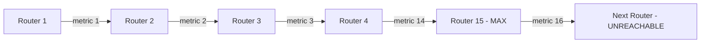

# How to Understand RIPng 15-Hop Limitation

Author: [nawazdhandala](https://www.github.com/nawazdhandala)

Tags: RIPng, IPv6, Hop Count, Distance Vector, Networking

Description: Understand why RIPng is limited to 15 hops, the implications for network design, and when to migrate to OSPFv3 or BGP.

## Overview

RIPng uses hop count as its sole metric, with a maximum of 15 hops. A route with a metric of 16 is considered **unreachable** (infinite metric). This fundamental limitation determines when RIPng is appropriate and when you need a more capable routing protocol.

## Why 15 is the Maximum

The hop count field in each RTE is 1 byte, but:
- Values 1-15 represent reachable routes
- Value **16 = infinity** (unreachable)
- Values 17-255 are reserved or used for special purposes (e.g., next-hop indicator at 255)

This design originated in RFC 1058 (RIP) from 1988 as a simple loop-prevention mechanism. The maximum diameter of 15 hops was a deliberate trade-off between loop prevention and convergence speed.

## Loop Prevention Using Infinity

When a route becomes unreachable, RIPng sets its metric to 16 and advertises it as "poisoned" (Poison Reverse):



## Checking Route Metrics

```bash
# FRRouting: show RIPng routes with hop counts

vtysh -c "show ipv6 ripng"

# Output:
# Network                If         Met    Tag  Time
# R (n) 2001:db8:1::/64  eth0         1    0  02:48  ← 1 hop
# R (n) 2001:db8:2::/64  eth0         3    0  02:30  ← 3 hops
# R (n) 2001:db8:far::/64 eth0        14   0  02:00  ← Near limit!
# R (n) 2001:db8:out::/64 eth0        16   0  --     ← Unreachable
```

## Convergence Problems with Count-to-Infinity

RIPng is susceptible to the "count-to-infinity" problem. When a route fails, routers may keep incrementing the metric until it reaches 16:

```text
Without Poison Reverse:
Time 0: Link R1-R2 fails
Time 30s: R3 tells R2 "I can reach R1 via 2 hops" (R2 updates to 3)
Time 60s: R2 tells R3 "I can reach R1 via 3 hops" (R3 updates to 4)
... continues until metric = 16 (12 update cycles = ~6 minutes!)
```

Split Horizon with Poison Reverse prevents this by advertising the failed route back with metric 16.

## When the Limit Matters in Practice

Real-world implications:
- A campus network with 10 buildings each connected via 2 router hops = 20 hops total → **RIPng cannot span the network**
- A branch network with a single HQ and 8 branches, each 2 hops from HQ = 4 hops max → **RIPng works fine**

## Detecting When You've Hit the Limit

```bash
# Check if any routes have metric 15 (one step from limit)
vtysh -c "show ipv6 ripng" | awk '$3 >= 14 {print "WARNING:", $0}'

# If you see metric 16 in show ipv6 ripng, those routes are unreachable
vtysh -c "show ipv6 ripng" | grep " 16 "
```

## When to Migrate from RIPng to OSPFv3

Migrate when:
- Your network exceeds or approaches 10-15 hops across
- You need sub-second failover (OSPFv3 can converge in <1 second)
- You need more sophisticated traffic engineering
- The network has more than ~50 routers (RIPng becomes slow to converge)

## Summary

RIPng's 15-hop limit is a fundamental protocol constraint, not a configuration limit. It is encoded into the 1-byte metric field (16 = infinity). For networks that fit within 15 hops, RIPng is simple and effective. For larger networks, use OSPFv3 which has no hop count limit and provides faster convergence through link-state topology knowledge.
