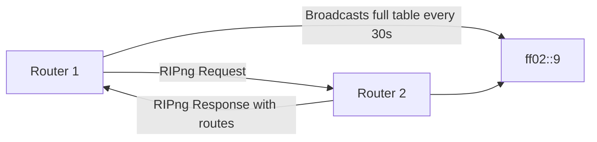

# How to Understand RIPng for IPv6 Routing

Author: [nawazdhandala](https://www.github.com/nawazdhandala)

Tags: RIPng, IPv6, Routing, RFC 2080, Networking

Description: Understand RIPng (RIP next generation) for IPv6 routing, including its operation, message format, and key differences from RIPv2.

## Overview

RIPng (RIP Next Generation) is the IPv6 version of the Routing Information Protocol, defined in RFC 2080. It is a distance-vector routing protocol that uses hop count as its metric and is suitable for small to medium IPv6 networks.

## RIPng Key Characteristics

| Feature | Value |
|---------|-------|
| RFC | 2080 |
| Transport | UDP/IPv6 |
| Port | 521 (both source and destination) |
| Multicast group | ff02::9 (All RIPng routers) |
| Metric | Hop count (1-15) |
| Maximum diameter | 15 hops (16 = unreachable) |
| Update interval | 30 seconds |
| Hold-down timer | 120 seconds |
| Route timeout | 180 seconds |

## RIPng vs RIPv2

| Feature | RIPv2 | RIPng |
|---------|-------|-------|
| IP version | IPv4 | IPv6 |
| Port | UDP 520 | UDP 521 |
| Multicast | 224.0.0.9 | ff02::9 |
| Authentication | Built-in | Uses IPsec |
| Next-hop field | In RTE | Separate RTE entry |
| VLSM support | Yes | Yes |
| Maximum routes | 25 per message | 25 per message |

## How RIPng Operates



RIPng uses Split Horizon with Poison Reverse to prevent routing loops. Routes not updated for 180 seconds are removed from the routing table.

## RIPng Message Format

Each RTE (Route Table Entry) contains:
- IPv6 Prefix (16 bytes)
- Route Tag (2 bytes)
- Prefix Length (1 byte)
- Metric (1 byte: 1-15 for reachable, 16 for unreachable)

```yaml
RIPng message structure:
+--------+--------+-------------------------------+
| Command | Version | Must Be Zero                 |
+--------+--------+-------------------------------+
|         IPv6 Prefix (16 bytes)                  |
+-------------------------------------------------+
|   Route Tag     | Prefix Length | Metric        |
+-------------------------------------------------+
|         ... additional RTEs ...                 |
```

## Next-Hop in RIPng

In RIPng, the next-hop is specified using a special RTE with metric 0xFF (255). All subsequent RTEs use that next hop until another next-hop RTE appears.

## When to Use RIPng

RIPng is appropriate for:
- Small networks with fewer than 15 hops diameter
- Simple branch office or lab environments
- Networks where OSPFv3/BGP complexity is not justified
- Interop with legacy equipment that supports only RIPng

## Summary

RIPng is the IPv6 adaptation of RIP - it uses hop count, UDP port 521, and the ff02::9 multicast address. The 15-hop limit makes it suitable only for small networks. For production IPv6 routing in networks larger than a few sites, prefer OSPFv3 or BGP.
