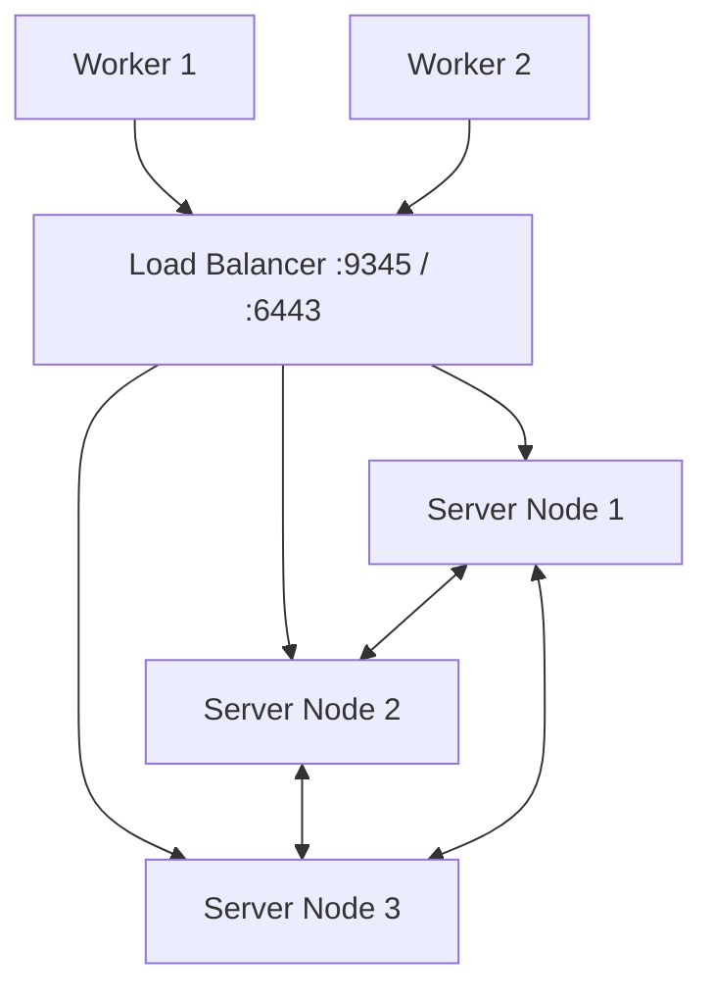

# How to Set Up RKE2 High Availability - Setup

Author: [nawazdhandala](https://www.github.com/nawazdhandala)

Tags: RKE2, High Availability, Kubernetes, etcd, Load Balancer, SUSE Rancher, HA Cluster

Description: Learn how to set up a highly available RKE2 cluster with three server nodes, embedded etcd, and a load balancer so the control plane survives the loss of a single node.

---

An RKE2 HA cluster requires at least three server nodes with embedded etcd to maintain quorum when one node fails. A load balancer in front of the server nodes ensures uninterrupted API access.

---

## HA Architecture



---

## Step 1: Set Up the Load Balancer

Configure your load balancer (HAProxy, Nginx, AWS NLB) to forward traffic to all server nodes:

```text
# HAProxy config snippet

frontend rke2-api
    bind *:6443
    default_backend rke2-servers

frontend rke2-registration
    bind *:9345
    default_backend rke2-servers

backend rke2-servers
    option tcp-check
    server server1 192.168.1.11:6443 check
    server server2 192.168.1.12:6443 check
    server server3 192.168.1.13:6443 check
```

---

## Step 2: Initialize the First Server Node

```yaml
# /etc/rancher/rke2/config.yaml (server-1 ONLY)
token: my-ha-cluster-token
tls-san:
  - "rke2-lb.example.com"   # Load balancer DNS
  - "192.168.1.10"           # Load balancer VIP
cluster-cidr: 10.42.0.0/16
service-cidr: 10.43.0.0/16
cni: canal
```

```bash
systemctl enable --now rke2-server.service
# Wait for the first server to fully initialize
kubectl get nodes
```

---

## Step 3: Join Additional Server Nodes

On server-2 and server-3, set `server` to the load balancer address:

```yaml
# /etc/rancher/rke2/config.yaml (server-2 and server-3)
server: https://rke2-lb.example.com:9345
token: my-ha-cluster-token
tls-san:
  - "rke2-lb.example.com"
  - "192.168.1.10"
```

```bash
systemctl enable --now rke2-server.service
```

---

## Step 4: Verify etcd Cluster Health

```bash
export KUBECONFIG=/etc/rancher/rke2/rke2.yaml
export PATH=$PATH:/var/lib/rancher/rke2/bin

# Check all three server nodes appear
kubectl get nodes -l node-role.kubernetes.io/control-plane=true

# Verify etcd member list
/var/lib/rancher/rke2/bin/etcdctl \
  --endpoints https://127.0.0.1:2379 \
  --cacert /var/lib/rancher/rke2/server/tls/etcd/server-ca.crt \
  --cert /var/lib/rancher/rke2/server/tls/etcd/client.crt \
  --key /var/lib/rancher/rke2/server/tls/etcd/client.key \
  member list
```

Expected: three members all with `started` status.

---

## Step 5: Add Worker Nodes

```yaml
# /etc/rancher/rke2/config.yaml (worker nodes)
server: https://rke2-lb.example.com:9345
token: my-ha-cluster-token
```

```bash
curl -sfL https://get.rke2.io | INSTALL_RKE2_TYPE="agent" sh -
systemctl enable --now rke2-agent.service
```

---

## Failure Tolerance

| Scenario | Status |
|---|---|
| 1 server node down | Cluster continues - etcd quorum maintained |
| 2 server nodes down | Cluster loses quorum - no API writes possible |
| Load balancer down | Cluster continues - existing connections unaffected |

---

## Best Practices

- Use a health check on the load balancer targeting `/healthz` on port 6443 to automatically remove unhealthy server nodes.
- Schedule regular etcd snapshots to S3 (`etcd-snapshot-schedule-cron`, `etcd-snapshot-dir`).
- Do not run user workloads on server nodes - add taints to keep them control-plane-only.
