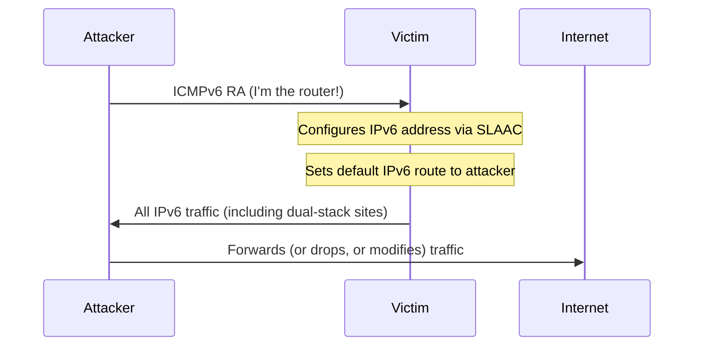

# How to Understand Rogue IPv6 on IPv4-Only Networks

Author: [nawazdhandala](https://www.github.com/nawazdhandala)

Tags: IPv6, Security, Rogue RA, NDP, Dual-Stack

Description: Understand how rogue IPv6 Router Advertisements can hijack traffic on IPv4-only networks and learn how to detect and prevent unauthorized IPv6 activity.

## Overview

Many organizations believe they have "IPv4-only" networks — but modern operating systems have IPv6 enabled by default and will immediately configure themselves if they receive a Router Advertisement (RA). An attacker on the local network who sends a crafted RA can silently redirect all traffic through their machine, even on networks where the organization never intentionally deployed IPv6.

## Why IPv4-Only Networks Are Vulnerable

All modern operating systems (Windows, Linux, macOS) have IPv6 enabled by default. When a host receives an ICMPv6 Router Advertisement:

1. It configures an IPv6 address via SLAAC
2. It installs a default IPv6 route pointing to the RA sender
3. It prefers IPv6 over IPv4 for dual-stack destinations (RFC 6724)



## The Attack: Rogue Router Advertisement

An attacker can send a crafted RA using tools like `fake_router6` or `radvd`:

```bash
# Attacker sends rogue RA claiming to be the default router
# Victim gets IPv6 address and routes through attacker

# Tool: fake_router6 (part of THC-IPv6)
fake_router6 eth0 2001:db8:evil::/64

# Or craft with Scapy
python3 -c "
from scapy.all import *
ra = IPv6(dst='ff02::1')/ICMPv6ND_RA()/ICMPv6NDOptPrefixInfo(prefix='2001:db8::', prefixlen=64)
sendp(Ether(dst='33:33:00:00:00:01')/ra, iface='eth0', count=10)
"
```

## What Happens to the Victim

```bash
# Before rogue RA — victim has no IPv6 route
ip -6 route
# (empty or just link-local)

# After rogue RA — victim now routes through attacker
ip -6 route
# default via fe80::attacker dev eth0 proto ra  ← installed by rogue RA
# 2001:db8::/64 dev eth0 proto kernel  ← from SLAAC
```

Because major websites (Google, Facebook, Microsoft) are IPv6-enabled, the victim's browser will prefer them over IPv4 — sending all traffic through the attacker.

## Detection

### Check for Unexpected IPv6 Addresses

```bash
# On a supposed IPv4-only host
ip -6 addr show | grep -v 'scope link'
# If you see a global unicast address — something sent an RA

# Windows
netsh interface ipv6 show addresses
# Look for "Preferred" global unicast addresses
```

### Listen for Router Advertisements

```bash
# tcpdump: Listen for RA messages (ICMPv6 type 134)
tcpdump -i eth0 'icmp6 and ip6[40] == 134'

# radvdump: Print RA content
radvdump

# ndpmon: NDP monitoring tool
ndpmon -i eth0
```

### NDPMon for Persistent Monitoring

```bash
# Install ndpmon
apt install ndpmon

# Run monitoring — alerts when new routers appear
ndpmon -i eth0 -c /etc/ndpmon/config.xml
```

## Prevention

### Method 1: Disable IPv6 on Hosts (Not Recommended Long-Term)

```bash
# Linux: Disable IPv6 per-interface
sysctl -w net.ipv6.conf.eth0.disable_ipv6=1

# Windows
netsh interface ipv6 set interface "Ethernet" routerdiscovery=disabled
# Or disable via registry
reg add HKLM\SYSTEM\CurrentControlSet\Services\Tcpip6\Parameters /v DisabledComponents /t REG_DWORD /d 0xFF /f
```

### Method 2: RA Guard on Switches (Recommended)

RA Guard (RFC 6105) allows switches to block RA messages on ports connected to hosts:

```
! Cisco Catalyst: Enable RA Guard on access ports
ipv6 nd raguard policy HOST-POLICY
  device-role host

interface GigabitEthernet0/1
  switchport mode access
  ipv6 nd raguard attach-policy HOST-POLICY
```

```
! Juniper EX Series
set vlans default forwarding-options dhcp-security group ACCESS overrides no-dhcpv6
set protocols ipv6-nd-ra-guard interface ge-0/0/1.0 mode host
```

### Method 3: DHCPv6 Snooping

```
! Cisco: DHCPv6 Snooping prevents rogue DHCP and RA
ipv6 dhcp guard policy DHCPGUARD
  device-role server

interface GigabitEthernet0/1
  ipv6 dhcp guard attach-policy DHCPGUARD
```

### Method 4: ip6tables to Drop RA on Hosts

```bash
# Drop incoming Router Advertisements on end hosts
ip6tables -A INPUT -p icmpv6 --icmpv6-type router-advertisement -j DROP

# Persistent (iptables-persistent)
ip6tables-save > /etc/iptables/rules.v6
```

## Summary

Rogue IPv6 Router Advertisements are a real threat even on "IPv4-only" networks because all modern OSes have IPv6 enabled by default. An attacker sending a single RA can become the default gateway for all IPv6 traffic. Prevent this with RA Guard on switches (RFC 6105), DHCPv6 Snooping, and monitoring for unexpected IPv6 configuration changes on hosts.
