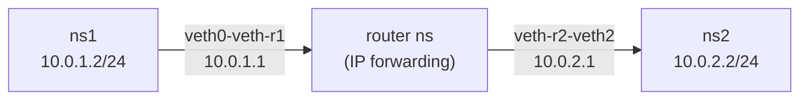

# How to Route Traffic Between Network Namespaces

Author: [nawazdhandala](https://www.github.com/nawazdhandala)

Tags: Linux, Network Namespaces, Routing, veth, iproute2, Networking, Virtual Networking

Description: Configure static routes and a bridge or router namespace to forward traffic between multiple Linux network namespaces on different subnets.

## Introduction

When you have multiple network namespaces on different subnets, you need routing to allow them to communicate. The standard approach is to create a "router" namespace (or use the host as a router) with veth pairs connecting to each namespace, then add static routes so each namespace knows how to reach the others.

## Architecture



## Step 1: Create the Namespaces

```bash
ip netns add ns1
ip netns add ns2
ip netns add router
```

## Step 2: Create and Connect veth Pairs

```bash
# veth pair between ns1 and router

ip link add veth0 type veth peer name veth-r1
ip link set veth0 netns ns1
ip link set veth-r1 netns router

# veth pair between ns2 and router
ip link add veth1 type veth peer name veth-r2
ip link set veth1 netns ns2
ip link set veth-r2 netns router
```

## Step 3: Assign IP Addresses

```bash
# Configure ns1 (10.0.1.0/24 subnet)
ip netns exec ns1 ip link set lo up
ip netns exec ns1 ip addr add 10.0.1.2/24 dev veth0
ip netns exec ns1 ip link set veth0 up

# Configure ns2 (10.0.2.0/24 subnet)
ip netns exec ns2 ip link set lo up
ip netns exec ns2 ip addr add 10.0.2.2/24 dev veth1
ip netns exec ns2 ip link set veth1 up

# Configure router namespace
ip netns exec router ip link set lo up
ip netns exec router ip addr add 10.0.1.1/24 dev veth-r1
ip netns exec router ip link set veth-r1 up
ip netns exec router ip addr add 10.0.2.1/24 dev veth-r2
ip netns exec router ip link set veth-r2 up
```

## Step 4: Enable IP Forwarding in the Router Namespace

```bash
# Enable forwarding inside the router namespace
ip netns exec router sysctl -w net.ipv4.ip_forward=1
```

## Step 5: Add Default Routes in ns1 and ns2

```bash
# ns1 needs to route to 10.0.2.0/24 via the router
ip netns exec ns1 ip route add default via 10.0.1.1

# ns2 needs to route to 10.0.1.0/24 via the router
ip netns exec ns2 ip route add default via 10.0.2.1
```

## Step 6: Test Connectivity

```bash
# Ping from ns1 to ns2
ip netns exec ns1 ping -c 3 10.0.2.2

# Ping from ns2 to ns1
ip netns exec ns2 ping -c 3 10.0.1.2
```

## Routing Directly Between Connected Namespaces

If two namespaces share the same subnet via a veth pair, no routing namespace is needed:

```bash
# ns1 and ns2 on same /24 - no routing needed
ip netns exec ns1 ip route show
# Directly connected routes are added automatically
```

## Conclusion

Routing between network namespaces requires a router (either the host or a dedicated namespace) with IP forwarding enabled, veth pairs connecting each namespace to the router, and default routes in each namespace pointing to the router. This topology mirrors how container runtimes implement multi-container networking.
