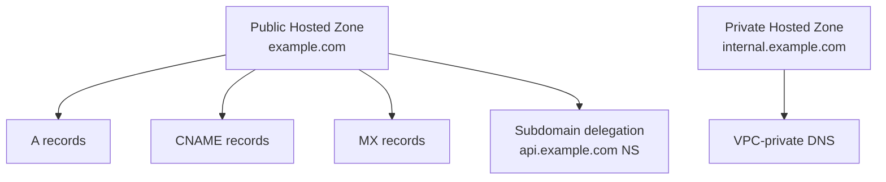

# How to Manage AWS Route 53 Hosted Zones with OpenTofu

Author: [nawazdhandala](https://www.github.com/nawazdhandala)

Tags: OpenTofu, AWS, Route53, DNS, Hosted Zones, Infrastructure as Code

Description: Learn how to create and manage AWS Route 53 hosted zones, DNS records, and health checks using OpenTofu, including public zones, private zones, and delegated subdomains.

---

Route 53 hosted zones are the DNS container for a domain. OpenTofu manages the zones, DNS records, health checks, and delegation configurations as code, ensuring DNS changes go through the same review process as infrastructure changes.

## Route 53 Architecture



## Public Hosted Zone

```hcl
# route53.tf

resource "aws_route53_zone" "main" {
  name    = var.domain_name
  comment = "Public hosted zone for ${var.domain_name}"

  tags = {
    Environment = var.environment
    ManagedBy   = "opentofu"
  }
}

# A record pointing to ALB
resource "aws_route53_record" "apex" {
  zone_id = aws_route53_zone.main.zone_id
  name    = var.domain_name
  type    = "A"

  alias {
    name                   = aws_lb.main.dns_name
    zone_id                = aws_lb.main.zone_id
    evaluate_target_health = true
  }
}

# CNAME for www
resource "aws_route53_record" "www" {
  zone_id = aws_route53_zone.main.zone_id
  name    = "www.${var.domain_name}"
  type    = "CNAME"
  ttl     = 300
  records = [var.domain_name]
}

# MX records for email
resource "aws_route53_record" "mx" {
  zone_id = aws_route53_zone.main.zone_id
  name    = var.domain_name
  type    = "MX"
  ttl     = 300
  records = [
    "10 mail.${var.domain_name}",
    "20 mail2.${var.domain_name}",
  ]
}
```

## Private Hosted Zone for Internal Services

```hcl
# Private zone accessible only within VPC
resource "aws_route53_zone" "internal" {
  name    = "internal.${var.domain_name}"
  comment = "Private zone for internal services"

  vpc {
    vpc_id = var.vpc_id
  }

  tags = {
    Environment = var.environment
    Type        = "private"
  }
}

# Internal service endpoint
resource "aws_route53_record" "database" {
  zone_id = aws_route53_zone.internal.zone_id
  name    = "db.internal.${var.domain_name}"
  type    = "CNAME"
  ttl     = 60
  records = [aws_db_instance.main.address]
}
```

## Health Checks

```hcl
resource "aws_route53_health_check" "app" {
  fqdn              = "api.${var.domain_name}"
  port              = 443
  type              = "HTTPS"
  resource_path     = "/health"
  failure_threshold = 3
  request_interval  = 30

  tags = {
    Name = "api-health-check"
  }
}

# Weighted routing with health checks for active-active
resource "aws_route53_record" "api_primary" {
  zone_id        = aws_route53_zone.main.zone_id
  name           = "api.${var.domain_name}"
  type           = "A"
  set_identifier = "primary"

  weighted_routing_policy {
    weight = 100
  }

  health_check_id = aws_route53_health_check.app.id

  alias {
    name                   = aws_lb.primary.dns_name
    zone_id                = aws_lb.primary.zone_id
    evaluate_target_health = true
  }
}
```

## Subdomain Delegation

```hcl
# Delegate api.example.com to a separate hosted zone (separate team)
resource "aws_route53_zone" "api_subdomain" {
  name = "api.${var.domain_name}"
}

# Add NS records in parent zone to delegate
resource "aws_route53_record" "api_delegation" {
  zone_id = aws_route53_zone.main.zone_id
  name    = "api.${var.domain_name}"
  type    = "NS"
  ttl     = 300
  records = aws_route53_zone.api_subdomain.name_servers
}
```

## Outputs for NS Records

```hcl
output "name_servers" {
  description = "Route 53 name servers to configure at your domain registrar"
  value       = aws_route53_zone.main.name_servers
}
```

## Best Practices

- After creating a hosted zone, update your domain registrar's NS records to Route 53's name servers - this is done outside OpenTofu.
- Use `evaluate_target_health = true` on alias records to Route 53 won't return an unhealthy endpoint.
- Use low TTLs (60s) during migrations and increase them (300-3600s) once DNS is stable.
- Separate public and private hosted zones rather than using split-horizon DNS in a single zone - it's cleaner.
- Create health checks for critical endpoints and attach them to routing policies to enable automatic failover.
