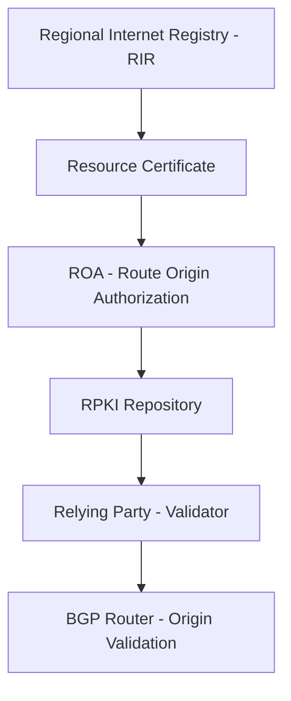

# How to Configure RPKI (Resource Public Key Infrastructure) for IPv6

Author: [nawazdhandala](https://www.github.com/nawazdhandala)

Tags: RPKI, IPv6, BGP, Routing Security, PKI

Description: A practical guide to setting up RPKI for IPv6 to cryptographically validate the origin of BGP route announcements and protect your network from route hijacking.

## What is RPKI?

RPKI (Resource Public Key Infrastructure) is a security framework that uses X.509 certificates to prove ownership of IP address blocks and ASNs. By creating Route Origin Authorizations (ROAs), you authorize specific Autonomous Systems to announce your IPv6 prefixes.

## Architecture Overview



## Step 1: Obtain a Resource Certificate from Your RIR

Contact your RIR (ARIN, RIPE, APNIC, LACNIC, or AFRINIC) to get a resource certificate for your IPv6 prefixes. Most RIRs provide a web portal:

- **RIPE NCC**: https://my.ripe.net → Resource Certification
- **ARIN**: https://account.arin.net → RPKI
- **APNIC**: https://myapnic.net → RPKI

## Step 2: Install an RPKI Validator (Routinator)

Routinator is a widely used open-source RPKI validator:

```bash
# Install Routinator via package manager (Debian/Ubuntu)

sudo apt-get install routinator

# Or install via Cargo (Rust package manager)
cargo install routinator

# Initialize Routinator and accept ARIN's RPA
routinator init --accept-arin-rpa
```

## Step 3: Configure Routinator

```toml
# /etc/routinator/routinator.conf

# Listen for RTR (RPKI-to-Router) protocol on IPv6
rtr-listen = ["[::]:3323", "0.0.0.0:3323"]

# HTTP API for status and metrics
http-listen = ["[::]:8323", "0.0.0.0:8323"]

# Repository cache directory
repository-dir = "/var/lib/routinator/rpki-cache"

# Log level
log-level = "info"
```

## Step 4: Start and Validate

```bash
# Start Routinator service
sudo systemctl enable routinator
sudo systemctl start routinator

# Check validation status via HTTP API
curl http://[::1]:8323/api/v1/status

# Validate a specific prefix/ASN combination
curl "http://[::1]:8323/api/v1/validity/AS64496/2001:db8::/32"
```

## Step 5: Connect Your Router via RTR Protocol

Configure your BGP router to use Routinator as an RTR server. Example for BIRD2:

```text
# /etc/bird/bird.conf
roa6 table rpki6;

protocol rpki routinator {
    # Connect to Routinator over IPv6
    remote "::1" port 3323;

    # Update interval in seconds
    refresh keep 300;
    retry keep 90;
    expire keep 172800;

    # Populate ROA table for IPv6
    roa6 { table rpki6; };
}
```

## Step 6: Apply Origin Validation in BGP

```nginx
# Apply RPKI validation policy to BGP
protocol bgp upstream {
    neighbor 2001:db8:peer::1 as 65001;

    ipv6 {
        import filter {
            if roa_check(rpki6, net, bgp_path.last) = ROA_VALID then {
                bgp_local_pref = 200;  # Prefer valid routes
                accept;
            }
            if roa_check(rpki6, net, bgp_path.last) = ROA_INVALID then {
                reject;  # Drop invalid routes
            }
            accept;  # Accept unknown routes
        };
    };
}
```

## Monitoring

Use [OneUptime](https://oneuptime.com) to monitor your RPKI validator's HTTP endpoint, ensuring it stays online and the ROA database is fresh. Set up alerts for stale data or validator downtime.

## Conclusion

RPKI for IPv6 requires obtaining a resource certificate, creating ROAs, running a validator, and connecting it to your BGP routers via the RTR protocol. Once deployed, invalid IPv6 route announcements are automatically rejected, significantly improving routing security.
