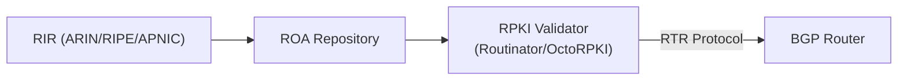

# How to Implement RPKI Route Origin Validation for BGP

Author: [nawazdhandala](https://www.github.com/nawazdhandala)

Tags: BGP, RPKI, Route Origin Validation, Security, ROA, Routing

Description: Learn how to implement RPKI Route Origin Validation to cryptographically verify that BGP route announcements come from authorized autonomous systems.

## What Is RPKI?

Resource Public Key Infrastructure (RPKI) is a cryptographic framework that allows IP address holders to create Route Origin Authorizations (ROAs)—digitally signed records stating which AS is authorized to originate a specific prefix. BGP routers validate incoming routes against the RPKI cache and can reject INVALID routes.

RPKI validation states:
- **Valid:** The prefix/AS pair matches a ROA
- **Invalid:** A ROA exists but the AS or prefix length doesn't match
- **NotFound:** No ROA exists for the prefix (unknown)

## Architecture



## Step 1: Deploy an RPKI Validator

Install Routinator (an open-source RPKI validator) on a Linux server:

```bash
# Install Routinator via package manager (Debian/Ubuntu)
sudo apt-get install routinator

# Initialize the TAL (Trust Anchor Locator) files
routinator init --accept-arin-rpa

# Start the Routinator daemon with RTR server
routinator server --rtr 127.0.0.1:3323 --http 127.0.0.1:9556

# Verify it's fetching ROAs
routinator validate 203.0.113.0/24 65001
```

Routinator downloads ROAs from all five RIRs and serves them to routers via the RTR protocol.

## Step 2: Connect Cisco IOS to the RPKI Cache

Configure the router to connect to your Routinator server:

```
! Define the RPKI cache server (Routinator)
router bgp 65001
 bgp rpki server tcp 192.168.1.100 port 3323 refresh 600
```

Verify the connection:

```
Router# show ip bgp rpki servers

BGP RPKI cache-server 192.168.1.100 port 3323:
  Refresh time: 600 seconds
  State: Connected, Serial number: 42
  Uptime: 00:10:00
  Prefix entries: 180000
```

## Step 3: Enable Route Origin Validation

Enable validation for the BGP neighbor and configure behavior for each validation state:

```
router bgp 65001
 ! Enable validation
 bgp bestpath prefix-validate allow-invalid

 address-family ipv4 unicast
  ! Activate BGP route origin validation
  bgp route-origin-validation enable
 exit-address-family
```

## Step 4: Configure Policy Based on Validation State

Use route maps to apply policy based on the RPKI validation state:

```
! Drop INVALID routes - never install them
route-map RPKI_POLICY deny 10
 match rpki invalid

! Accept VALID routes with high local-preference
route-map RPKI_POLICY permit 20
 match rpki valid
 set local-preference 200

! Accept NOTFOUND routes (no ROA exists) with default preference
route-map RPKI_POLICY permit 30
 match rpki notfound
 set local-preference 100

! Apply to all eBGP neighbors
router bgp 65001
 neighbor 203.0.113.1 route-map RPKI_POLICY in
```

## Step 5: Configure RPKI on FRRouting

```bash
# In FRR bgpd.conf
rpki
 rpki cache 192.168.1.100 3323 preference 1
!
router bgp 65001
 address-family ipv4 unicast
  neighbor 203.0.113.1 route-map RPKI_POLICY in
```

## Step 6: Create Your Own ROA

Register a ROA for your prefix with your RIR (ARIN, RIPE, APNIC, etc.):

- Origin AS: Your AS number
- Prefix: Your allocated prefix (e.g., 198.51.100.0/24)
- Max-length: The maximum prefix length you will announce (typically same as prefix, e.g., /24)

This protects your prefix from being hijacked by unauthorized ASes.

## Step 7: Monitor Validation Results

```
! Check validation state for a specific prefix
Router# show ip bgp 198.51.100.0/24

  BGP routing table entry for 198.51.100.0/24
  ...
  RPKI validation state: valid    <- confirmed by ROA
```

## Conclusion

RPKI Route Origin Validation prevents BGP route hijacking by cryptographically verifying prefix announcements against ROAs. Deploy a local RPKI validator (Routinator), connect it to your routers via RTR, configure route maps to drop INVALID routes, and register ROAs for your own prefixes through your RIR.
