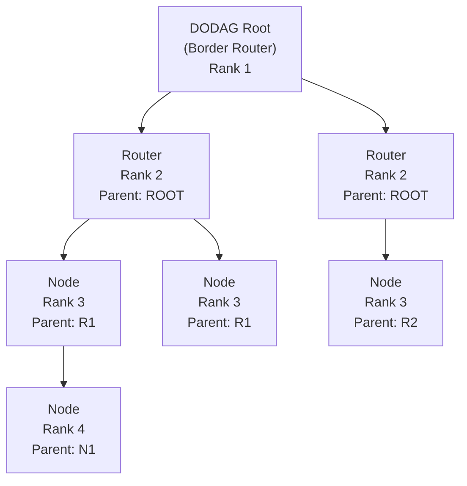

# How to Understand RPL (Routing Protocol for Low-Power Networks) over IPv6

Author: [nawazdhandala](https://www.github.com/nawazdhandala)

Tags: IPv6, RPL, IoT, Routing, 6LoWPAN, Networking

Description: Understand how RPL builds and maintains routing topology in IPv6 IoT mesh networks using DODAG construction, objective functions, and control messages.

## Introduction

RPL (Routing Protocol for Low-Power and Lossy Networks) is defined in RFC 6550. It is the standard routing protocol for IPv6 mesh networks in IoT environments where links are unreliable, nodes have limited resources, and the network topology changes frequently due to device movement or radio interference.

## Core Concepts

### DODAG (Destination-Oriented Directed Acyclic Graph)

RPL organizes the network as a tree-like structure rooted at the border router (or a server):



### Rank

Each node has a "rank" in the DODAG. The root has rank 1. Nodes increase rank as they move away from the root. Rank is computed by the **Objective Function** based on link metrics like ETX (Expected Transmissions).

### Objective Functions

- **OF0**: Default, uses hop count (simple but suboptimal)
- **MRHOF**: Minimum Rank with Hysteresis Objective Function (RFC 6719) — uses ETX for better link quality selection

## RPL Control Messages

| Message | ICMPv6 Type | Purpose |
|---|---|---|
| DIO (DODAG Info Object) | 155 | Advertise DODAG info downward |
| DIS (DODAG Info Solicitation) | 155 | Request DIO from neighbors |
| DAO (Destination Advertisement Object) | 155 | Propagate routing info upward |
| DAO-ACK | 155 | Acknowledge DAO receipt |

## How a New Node Joins

1. Node powers on and listens for **DIO** messages
2. Selects the best parent based on the Objective Function
3. Computes its rank (parent rank + rank_increase)
4. Sends a **DAO** upward to register its address with all ancestors up to the root
5. The root and all intermediate nodes now have a route to the new node

## RPL in OpenThread

OpenThread uses RPL-like routing internally. To observe the routing behavior:

```bash
# OpenThread CLI commands for understanding mesh routing

# Show the current parent
> parent
# Ext Addr: 0011223344556677
# Rloc16: 0x9c00
# Link Quality In: 3
# Link Quality Out: 3
# Age: 123

# Show all routers in the mesh
> router table
# ID   Rloc16  Next Hop  Path Cost  LQI In  LQI Out  Age
#  0   0x0000  0x0000    0          0       0        0
#  1   0x0400  0x0000    1          3       3        5

# Show the routing table (all reachable destinations)
> route
# 0:0:0:0::/0 via fe80::1 (on-mesh)
```

## RPL in Contiki-NG

```c
// Enable RPL in Contiki-NG project configuration
// project-conf.h

#define NETSTACK_CONF_ROUTING rpl_lite_driver   // Lightweight RPL
// or
#define NETSTACK_CONF_ROUTING rpl_classic_driver // Full RFC 6550 RPL

// Set RPL mode
#define RPL_CONF_WITH_NON_STORING 1    // Non-storing mode (routes stored at root)
// vs
#define RPL_CONF_WITH_NON_STORING 0    // Storing mode (routes at each node)
```

```c
// In application code, check RPL status
#include "net/routing/routing.h"

if (NETSTACK_ROUTING.node_is_reachable()) {
    // This node has an upward route to the root - can send data
    LOG_INFO("Reachable via RPL DAG\n");
} else {
    LOG_WARN("Not yet joined RPL DAG\n");
}
```

## RPL Storing vs Non-Storing Mode

| Mode | Route Storage | Upward Traffic | Downward Traffic |
|---|---|---|---|
| Storing | Each router stores routes | All nodes | Via stored routes |
| Non-Storing | Only root stores routes | All nodes | Via source routing headers |

Non-storing mode uses less memory on intermediate nodes (important for class 1 devices) but adds overhead to downward packets (source route header).

## Objective Function Configuration

```c
// Contiki-NG: Use MRHOF for better link quality selection
// project-conf.h

#define RPL_CONF_OF_OCP RPL_OCP_MRHOF   // Use MRHOF
// or
#define RPL_CONF_OF_OCP RPL_OCP_OF0     // Use OF0 (simpler)

// ETX threshold for parent switching (avoid flapping)
#define RPL_MRHOF_CONF_SWITCH_THRESHOLD 384
```

## Conclusion

RPL provides automatic topology discovery and maintenance for IPv6 IoT mesh networks without any manual route configuration. The DODAG construction through DIO/DAO messages, combined with the objective function's link quality metrics, creates an optimal routing tree from constrained sensor nodes to the border router. Understanding RPL storing vs non-storing modes helps choose the right tradeoff between node memory requirements and packet overhead for your specific deployment.
