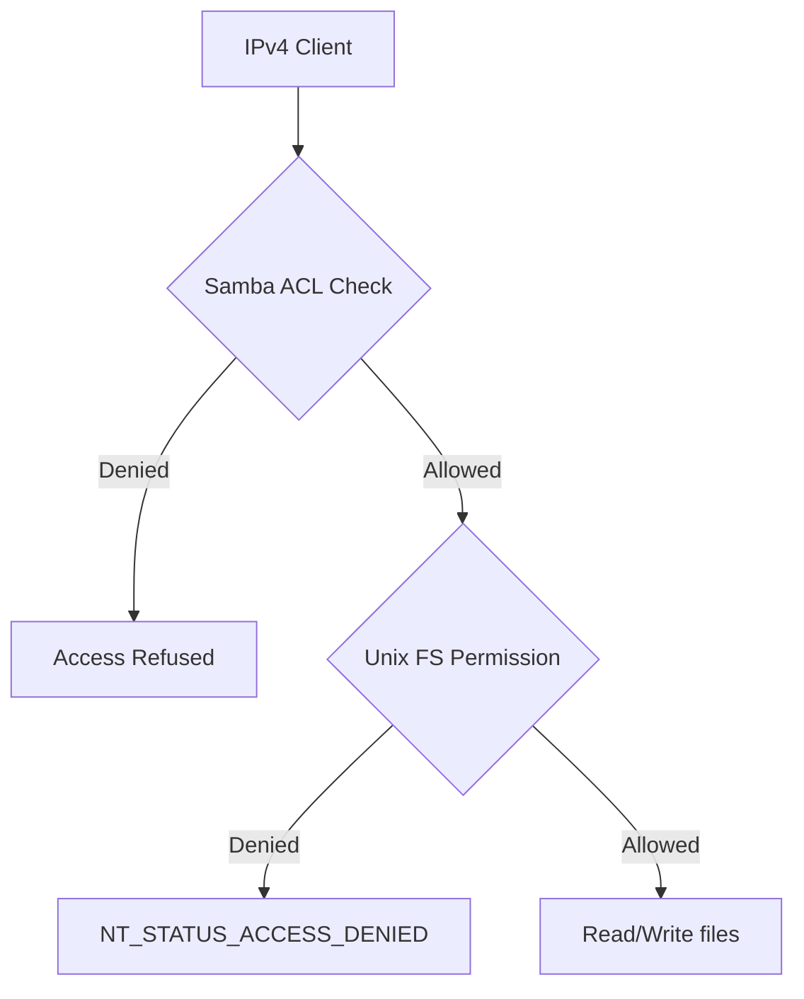

# How to Configure Samba Share Permissions for IPv4 Clients

Author: [nawazdhandala](https://www.github.com/nawazdhandala)

Tags: Samba, SMB, IPv4, Permission, Access Control, Linux, File Sharing

Description: Learn how to configure Samba share permissions combining Unix filesystem permissions and Samba's access controls for IPv4 clients.

---

Samba share permissions work at two levels: Samba-level (who can connect and what they can do) and filesystem-level (Unix permissions on the actual files). Both must allow access for a client to successfully read or write files.

## How Samba Permissions Work



## Basic Share Configuration

```ini
# /etc/samba/smb.conf

[global]
    workgroup = MYORG
    server string = File Server
    security = user

    # Bind to the specific IPv4 address of this server
    interfaces = 192.168.1.10/24 lo
    bind interfaces only = yes

[data]
    comment = Shared Data
    path = /srv/samba/data

    # Allow read access for all authenticated users
    read only = yes

    # Allow specific users to write
    write list = @data-writers, admin

    # Restrict access to the internal IPv4 subnet
    hosts allow = 192.168.1.0/24
    hosts deny = ALL

    # Force all files to be created with these permissions
    create mask = 0664
    directory mask = 0775

    # Map all file operations to the 'samba' group
    force group = samba
```

## Read-Write Share for a Specific Group

```ini
[projects]
    path = /srv/samba/projects
    comment = Development Projects

    # Only members of the 'devteam' group can connect
    valid users = @devteam

    # All devteam members have read/write access
    writable = yes

    # Users NOT in the group are denied
    invalid users =

    create mask = 0660
    directory mask = 0770
    force group = devteam
```

## Setting Up the Filesystem Permissions

```bash
# Create the share directory

mkdir -p /srv/samba/data /srv/samba/projects

# Create a group for each share
groupadd samba
groupadd devteam

# Set ownership and permissions
chown root:samba /srv/samba/data
chmod 2775 /srv/samba/data    # setgid so new files inherit the group

chown root:devteam /srv/samba/projects
chmod 2770 /srv/samba/projects

# Add users to groups
usermod -aG samba john
usermod -aG devteam alice bob
```

## Adding Samba Users

```bash
# Create a Samba-specific password for a system user
smbpasswd -a john
smbpasswd -e john   # Enable the account

# List current Samba users
pdbedit -L
```

## Testing Permissions

```bash
# Test configuration
testparm

# Reload Samba
systemctl reload smb

# Test access from a Linux client
smbclient //192.168.1.10/data -U john%password
# smb: \> ls
# smb: \> put testfile.txt
```

## Key Takeaways

- `valid users` restricts who can authenticate to a share; `hosts allow` restricts which IPv4 addresses can connect.
- Both Samba and Unix filesystem permissions must allow access - the most restrictive wins.
- Use `write list` to allow specific users write access while keeping the share read-only for others.
- `force group` ensures all files created in the share belong to the same group, simplifying permissions management.
