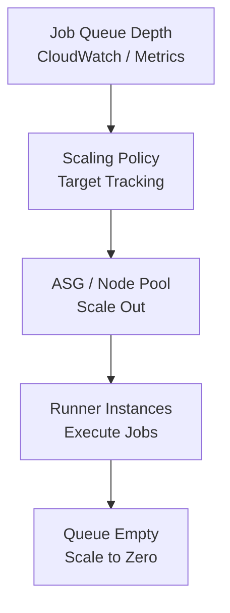

# How to Scale CI/CD Runners with OpenTofu

Author: [nawazdhandala](https://www.github.com/nawazdhandala)

Tags: OpenTofu, CI/CD, Auto Scaling, GitHub Action, GitLab, Runner, Kubernetes, Infrastructure as Code

Description: Learn how to implement elastic scaling for CI/CD runners using OpenTofu with queue-depth-based auto scaling, scheduled scaling for peak hours, and cost optimization through spot instances and...

---

Scaling CI/CD runners requires matching compute capacity to pipeline demand - too few runners cause queue delays, too many waste money on idle compute. OpenTofu manages the scaling policies, node pools, and queue monitoring that enable elastic CI/CD infrastructure.

## Runner Scaling Architecture



## Queue-Depth-Based Scaling with Lambda

```hcl
# scaling.tf - Lambda checks GitHub/GitLab queue and adjusts ASG

resource "aws_lambda_function" "runner_scaler" {
  function_name = "${var.prefix}-runner-scaler"
  role          = aws_iam_role.scaler_lambda.arn
  runtime       = "python3.12"
  handler       = "scaler.handler"
  filename      = data.archive_file.scaler.output_path
  timeout       = 60

  environment {
    variables = {
      ASG_NAME         = aws_autoscaling_group.runners.name
      MAX_RUNNERS      = tostring(var.max_runners)
      GITHUB_TOKEN_ARN = aws_secretsmanager_secret.github_token.arn
      GITHUB_ORG       = var.github_org
      RUNNER_LABELS    = join(",", var.runner_labels)
    }
  }
}

# Run scaler every minute

resource "aws_cloudwatch_event_rule" "scaler" {
  name                = "${var.prefix}-runner-scaler"
  schedule_expression = "rate(1 minute)"
}

resource "aws_cloudwatch_event_target" "scaler" {
  rule      = aws_cloudwatch_event_rule.scaler.name
  target_id = "runner-scaler"
  arn       = aws_lambda_function.runner_scaler.arn
}

resource "aws_lambda_permission" "scaler" {
  statement_id  = "AllowEventBridgeInvoke"
  action        = "lambda:InvokeFunction"
  function_name = aws_lambda_function.runner_scaler.function_name
  principal     = "events.amazonaws.com"
  source_arn    = aws_cloudwatch_event_rule.scaler.arn
}
```

## Scheduled Scaling for Business Hours

```hcl
# scheduled_scaling.tf

# Scale up before business hours
resource "aws_autoscaling_schedule" "morning_scale_up" {
  scheduled_action_name  = "morning-scale-up"
  autoscaling_group_name = aws_autoscaling_group.runners.name
  desired_capacity       = var.business_hours_capacity
  min_size               = 2
  max_size               = var.max_runners
  recurrence             = "0 8 * * MON-FRI"  # 8 AM UTC Mon-Fri
  time_zone              = "UTC"
}

# Scale down after hours
resource "aws_autoscaling_schedule" "evening_scale_down" {
  scheduled_action_name  = "evening-scale-down"
  autoscaling_group_name = aws_autoscaling_group.runners.name
  desired_capacity       = 0
  min_size               = 0
  max_size               = var.max_runners
  recurrence             = "0 18 * * MON-FRI"  # 6 PM UTC Mon-Fri
  time_zone              = "UTC"
}

# Zero capacity on weekends
resource "aws_autoscaling_schedule" "weekend_zero" {
  scheduled_action_name  = "weekend-zero"
  autoscaling_group_name = aws_autoscaling_group.runners.name
  desired_capacity       = 0
  min_size               = 0
  max_size               = var.max_runners
  recurrence             = "0 18 * * FRI"
  time_zone              = "UTC"
}
```

## Kubernetes Cluster Autoscaler for Runner Nodes

```hcl
# cluster_autoscaler.tf

# Node pool with scale-to-zero for CI runners
resource "aws_eks_node_group" "ci_runners" {
  cluster_name    = var.cluster_name
  node_group_name = "ci-runners"
  node_role_arn   = var.node_role_arn
  subnet_ids      = var.private_subnet_ids

  instance_types = ["c6i.xlarge", "c6a.xlarge", "c5.xlarge"]
  capacity_type  = "SPOT"

  scaling_config {
    desired_size = 0
    min_size     = 0
    max_size     = var.max_runner_nodes
  }

  labels = {
    "node-role"                   = "ci-runner"
    "k8s.io/cluster-autoscaler/enabled" = "true"
  }

  taint {
    key    = "dedicated"
    value  = "ci-runners"
    effect = "NO_SCHEDULE"
  }
}

# Cluster autoscaler Helm chart
resource "helm_release" "cluster_autoscaler" {
  name       = "cluster-autoscaler"
  namespace  = "kube-system"
  repository = "https://kubernetes.github.io/autoscaler"
  chart      = "cluster-autoscaler"
  version    = "9.35.0"

  values = [
    yamlencode({
      autoDiscovery = {
        clusterName = var.cluster_name
      }

      awsRegion = var.aws_region

      # Scale down aggressively for cost savings
      scaleDownUnneededTime          = "2m"
      scaleDownDelayAfterAdd         = "2m"
      scaleDownUtilizationThreshold  = 0.5

      rbac = {
        serviceAccount = {
          annotations = {
            "eks.amazonaws.com/role-arn" = aws_iam_role.cluster_autoscaler.arn
          }
        }
      }
    })
  ]
}
```

## Cost Monitoring for Runners

```hcl
# cost_monitoring.tf

# CloudWatch dashboard for runner utilization
resource "aws_cloudwatch_dashboard" "runners" {
  dashboard_name = "${var.prefix}-ci-runners"

  dashboard_body = jsonencode({
    widgets = [
      {
        type = "metric"
        properties = {
          title  = "Runner ASG Capacity"
          period = 60
          metrics = [
            ["AWS/AutoScaling", "GroupDesiredCapacity", "AutoScalingGroupName", aws_autoscaling_group.runners.name],
            [".", "GroupInServiceCapacity", ".", "."],
          ]
        }
      },
      {
        type = "metric"
        properties = {
          title  = "Spot Instance Savings"
          period = 3600
          metrics = [
            ["AWS/EC2Spot", "AvailableInstancePoolsCount"],
          ]
        }
      }
    ]
  })
}
```

## Best Practices

- Implement scale-to-zero for non-business-hours - CI workloads are predictable and bursty. Scheduling zero capacity at night and on weekends can reduce runner costs by 60%+.
- Use Spot instances with diverse instance types - specify at least 5-6 instance types so the ASG can always find available capacity at a good price.
- Monitor queue depth, not instance count - the right metric to scale on is the number of pending jobs, not CPU utilization. Idle runners waiting for jobs look healthy on CPU metrics but waste money.
- Set aggressive scale-down thresholds for runner nodes - `scaleDownUnneededTime = 2m` is appropriate for CI nodes since they have no stateful workloads.
- Tag runner instances with the CI job ID so costs can be attributed to specific pipelines or teams in AWS Cost Explorer.
