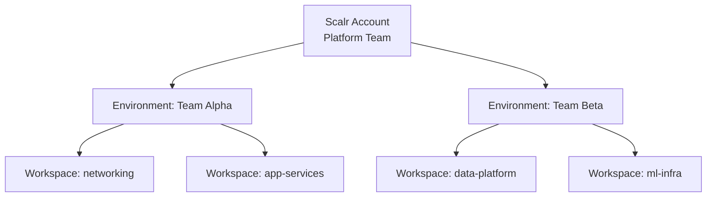

# How to Use Scalr for Multi-Tenant OpenTofu Management

Author: [nawazdhandala](https://www.github.com/nawazdhandala)

Tags: OpenTofu, Scalr, Multi-Tenant, Infrastructure as Code, Governance, DevOps

Description: Learn how to use Scalr's hierarchical account structure to manage OpenTofu deployments across multiple teams and business units while enforcing centralized governance policies.

## Introduction

Scalr is a remote state and operations backend for OpenTofu and Terraform that supports a three-tier hierarchy: Account → Environment → Workspace. This model is well suited for organizations that need to give teams autonomy while platform engineering enforces security and tagging policies at the account level.

## Scalr Hierarchy



## Configuring OpenTofu to Use Scalr Backend

```hcl
# main.tf — configure the Scalr backend
terraform {
  backend "remote" {
    hostname     = "yourorg.scalr.io"
    organization = "env-abc123"  # Scalr environment ID

    workspaces {
      name = "networking-prod"
    }
  }
}
```

## Creating Workspaces via the Scalr Provider

```hcl
# scalr_setup.tf
terraform {
  required_providers {
    scalr = {
      source  = "Scalr/scalr"
      version = "~> 2.0"
    }
  }
}

provider "scalr" {
  hostname = "yourorg.scalr.io"
  # Token from SCALR_TOKEN env var
}

# Create an environment for a team
resource "scalr_environment" "team_alpha" {
  name       = "team-alpha"
  account_id = "acc-xxxxxxxxxx"
}

# Create a workspace for a specific component
resource "scalr_workspace" "networking" {
  name           = "networking-prod"
  environment_id = scalr_environment.team_alpha.id

  # Use OpenTofu
  opentofu_version = "1.9.0"

  # Auto-apply after successful plan
  auto_apply = false

  working_directory = "environments/prod/networking"

  vcs_repo {
    identifier = "my-org/infra-repo"
    branch     = "main"
  }
}
```

## Account-Level Policy Enforcement

Define policies at the account level that apply to all environments:

```hcl
resource "scalr_policy_group" "security_baseline" {
  name       = "security-baseline"
  account_id = "acc-xxxxxxxxxx"

  # OPA policy files
  opa_policies = [
    {
      name   = "require-tags"
      policy = file("policies/require_tags.rego")
      enforcement_level = "hard-mandatory"
    },
    {
      name   = "deny-public-s3"
      policy = file("policies/deny_public_s3.rego")
      enforcement_level = "hard-mandatory"
    }
  ]
}

# Attach to all environments
resource "scalr_policy_group_linkage" "alpha_security" {
  policy_group_id = scalr_policy_group.security_baseline.id
  environment_id  = scalr_environment.team_alpha.id
}
```

## Variable Hierarchy

Scalr supports variables at account, environment, and workspace levels. Lower levels inherit and can override higher-level variables:

```hcl
# Account-level variable (applies to all teams)
resource "scalr_variable" "aws_region" {
  key          = "AWS_DEFAULT_REGION"
  value        = "us-east-1"
  category     = "env"
  account_id   = "acc-xxxxxxxxxx"
  final        = false  # Allow lower levels to override
}

# Environment-level override for a team in a different region
resource "scalr_variable" "team_beta_region" {
  key            = "AWS_DEFAULT_REGION"
  value          = "eu-west-1"
  category       = "env"
  environment_id = scalr_environment.team_beta.id
}
```

## RBAC for Multi-Tenant Access

```hcl
resource "scalr_iam_team" "alpha_engineers" {
  name       = "alpha-engineers"
  account_id = "acc-xxxxxxxxxx"
  users      = ["user@example.com"]
}

resource "scalr_access_policy" "alpha_env_write" {
  subject {
    type = "team"
    id   = scalr_iam_team.alpha_engineers.id
  }

  scope {
    type = "environment"
    id   = scalr_environment.team_alpha.id
  }

  # Allow plan and apply within the environment
  role_ids = ["role-plan", "role-apply"]
}
```

## Conclusion

Scalr's hierarchical model lets platform teams centralize governance — state storage, policies, and RBAC — while giving product teams full autonomy within their environment. OpenTofu workspaces sit at the leaf level, inheriting security baselines automatically and benefiting from centrally managed remote state.
