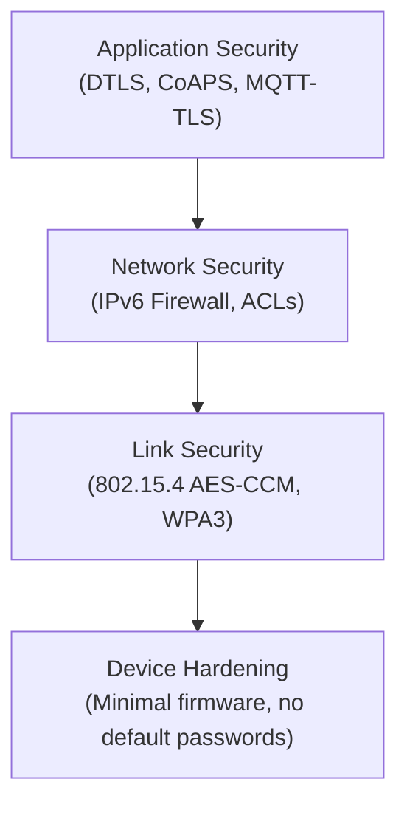

# How to Secure IPv6 IoT Devices

Author: [nawazdhandala](https://www.github.com/nawazdhandala)

Tags: IPv6, IoT, Security, Firewall, DTLS, Networking

Description: Implement security best practices for IPv6-connected IoT devices including firewall rules, DTLS for encrypted communication, and network segmentation.

## Introduction

IPv6 gives every IoT device a globally routable address, which means every device is directly reachable from the internet without NAT. This significantly raises the security stakes: without proper controls, your temperature sensor could be accessible to anyone on the internet.

## Security Layers for IPv6 IoT



## Step 1: Firewall Rules at the Border Router

The border router is the primary defense for the entire IoT segment:

```bash
# /etc/ip6tables-iot.rules

# Applied on the Linux border router's infrastructure interface (eth0)

# Default policies
ip6tables -P INPUT DROP
ip6tables -P FORWARD DROP
ip6tables -P OUTPUT ACCEPT

# Allow established/related connections (stateful inspection)
ip6tables -A FORWARD -m state --state ESTABLISHED,RELATED -j ACCEPT

# Allow ICMPv6 (required for IPv6 to work)
ip6tables -A FORWARD -p icmpv6 -j ACCEPT
ip6tables -A INPUT -p icmpv6 -j ACCEPT

# Allow IoT devices to initiate connections to the cloud (outbound from mesh)
ip6tables -A FORWARD -i lowpan0 -o eth0 -j ACCEPT

# Block all unsolicited inbound connections to IoT devices from the internet
ip6tables -A FORWARD -i eth0 -o lowpan0 -j DROP

# Allow specific management traffic (e.g., from a trusted management host only)
MGMT_HOST="2001:db8:mgmt::10"
IOT_DEVICE="2001:db8:mesh:1::sensor1"
ip6tables -A FORWARD -i eth0 -o lowpan0 \
    -s "$MGMT_HOST" -d "$IOT_DEVICE" \
    -p tcp --dport 22 -j ACCEPT  # SSH management
```

## Step 2: Enable DTLS on CoAP (CoAPS)

For encrypted communication between IoT devices and servers:

```python
# coap_server_secure.py - CoAP server with DTLS using aiocoap

import asyncio
import aiocoap
import ssl

async def main():
    # Load server certificate and private key
    ssl_context = ssl.SSLContext(ssl.PROTOCOL_TLS_SERVER)
    ssl_context.load_cert_chain(
        certfile='/etc/iot/server-cert.pem',
        keyfile='/etc/iot/server-key.pem'
    )

    # Create DTLS-enabled CoAP server context
    # coaps:// uses DTLS on port 5684
    protocol = await aiocoap.Context.create_server_context(
        root_resource,
        bind=('::', 5684),
        # DTLS configuration
        server_credentials=ssl_context
    )

asyncio.run(main())
```

## Step 3: Network Segmentation for IoT

Separate IoT devices from enterprise systems using VLANs or separate subnets:

```bash
# Create separate IPv6 prefix for IoT devices
# This is a /64 from the border router's delegated prefix

IOT_PREFIX="2001:db8:mesh:1::/64"
ENTERPRISE_PREFIX="2001:db8:1:1::/64"

# Prevent IoT devices from talking to enterprise systems
ip6tables -A FORWARD \
    -s "$IOT_PREFIX" \
    -d "$ENTERPRISE_PREFIX" \
    -j DROP

# Only allow IoT to cloud endpoints
ip6tables -A FORWARD \
    -s "$IOT_PREFIX" \
    -d "2001:db8:cloud::/48" \
    -j ACCEPT

ip6tables -A FORWARD \
    -s "$IOT_PREFIX" \
    -j DROP  # Block all other IoT egress
```

## Step 4: 802.15.4 Link-Layer Security

For Thread/6LoWPAN mesh networks, enable IEEE 802.15.4 security:

```bash
# Enable security on the 802.15.4 interface (Linux iwpan)
sudo iwpan dev wpan0 set security_on 1

# Set the network key (32 hex chars = 128-bit AES key)
# IMPORTANT: Use a strong random key in production
sudo iwpan dev wpan0 set security key 00112233445566778899aabbccddeeff

# All frames on the mesh are now encrypted with AES-CCM
```

## Step 5: Rate Limiting

Prevent DoS attacks against IoT devices:

```bash
# Rate limit inbound connections to IoT devices
# (even from trusted management hosts)
ip6tables -A FORWARD -i eth0 -o lowpan0 \
    -p tcp --dport 22 \
    -m limit --limit 10/min --limit-burst 20 \
    -j ACCEPT

# Log and drop connection floods
ip6tables -A FORWARD -i eth0 -o lowpan0 \
    -m limit --limit 5/sec --limit-burst 30 \
    -j LOG --log-prefix "IoT-FLOOD: "
ip6tables -A FORWARD -i eth0 -o lowpan0 -j DROP
```

## Step 6: IPv6 Neighbor Discovery Protection

Prevent ND spoofing attacks (IPv6 equivalent of ARP spoofing):

```bash
# Enable ND security with RA Guard on the border router's LAN switch
# (handled at the switch level - see switch vendor documentation)

# On the Linux border router, ensure rp_filter is enabled
sysctl -w net.ipv6.conf.lowpan0.accept_source_route=0
sysctl -w net.ipv6.conf.lowpan0.accept_ra=0    # BR doesn't accept RAs
```

## Step 7: Certificate-Based Device Identity

```bash
# Generate a device certificate for a specific IoT device
openssl req -newkey ec -pkeyopt ec_paramgen_curve:P-256 \
    -keyout /etc/iot/device-sensor1.key \
    -out /etc/iot/device-sensor1.csr \
    -subj "/CN=sensor1.iot.example.com/O=IoT Department"

# Sign with your IoT CA
openssl x509 -req -in /etc/iot/device-sensor1.csr \
    -CA /etc/iot/iot-ca.crt -CAkey /etc/iot/iot-ca.key \
    -CAcreateserial -out /etc/iot/device-sensor1.crt -days 365
```

## Conclusion

Securing IPv6 IoT devices requires a multi-layer approach: firewall rules at the border router to control what traffic reaches the devices, DTLS for encrypted application-layer communication, 802.15.4 link-layer security for mesh networks, network segmentation to isolate IoT from enterprise systems, and certificate-based device identity. The direct addressability of IPv6 makes these protections critical - without them, every IoT device is directly exposed to the internet.
