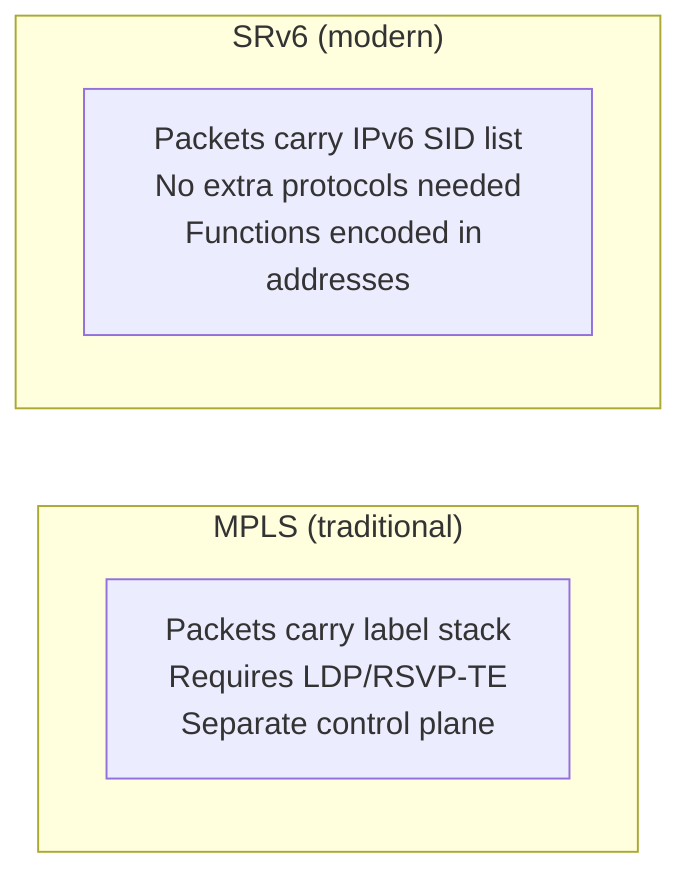
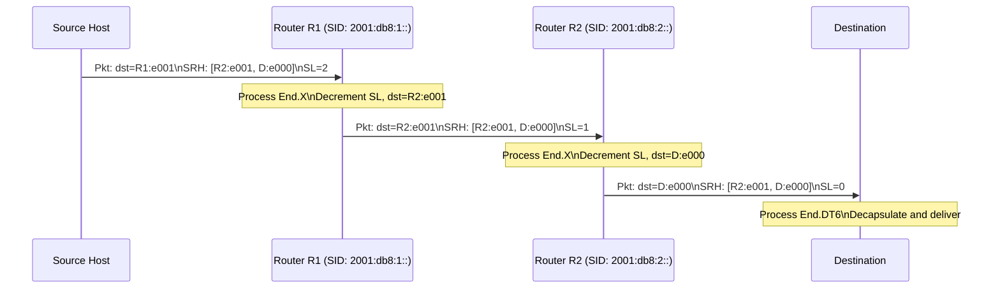

# How to Understand Segment Routing over IPv6 (SRv6)

Author: [nawazdhandala](https://www.github.com/nawazdhandala)

Tags: SRv6, Segment Routing, IPv6, Networking, MPLS, RFC 8754

Description: Understand Segment Routing over IPv6 (SRv6) architecture, how SIDs encode both routing and service instructions, and why SRv6 is replacing MPLS in modern networks.

## Introduction

Segment Routing over IPv6 (SRv6) is a source-routing architecture that uses IPv6 extension headers to carry a sequence of routing instructions (segments). Each instruction is encoded as a regular IPv6 address (a Segment Identifier, or SID), eliminating the need for MPLS labels while adding programmable network behavior.

## Core Concepts

### Segment Identifier (SID)

An SRv6 SID is a 128-bit IPv6 address structured as:

```javascript
SID = Locator (prefix) + Function + Arguments

Example SID: 2001:db8:1:1:e000::
  Locator:   2001:db8:1:1::/48  (identifies the node)
  Function:  e000               (End.DT4 = IPv4 routing)
  Arguments: ::                  (none in this case)
```

### Segment Routing Header (SRH)

The SRH is an IPv6 Routing Header (Type 4) that carries the ordered list of SIDs.

```text
IPv6 Header:
  Destination: first SID in the segment list
  Next Header: 43 (Routing Header)

Segment Routing Header (Type 4):
  Segment Left: N (decremented at each SID)
  Last Entry: index of last SID
  Flags: 0
  Tag: 0
  Segment List[N-1]: 2001:db8:3:3::e001  (first to process)
  Segment List[N-2]: 2001:db8:2:2::e001
  Segment List[0]:   final destination SID

IPv6 Payload (TCP/UDP data)
```

## SRv6 vs MPLS



| Feature | MPLS | SRv6 |
|---|---|---|
| Encapsulation | Label stack | IPv6 SRH extension header |
| Address space | 20-bit labels | 128-bit IPv6 addresses |
| End-to-end visibility | None (labels are local) | Yes (SIDs are globally routable) |
| Service encoding | MPLS VPN labels | Functions in SID (L3VPN, L2VPN) |
| Hardware support | Widespread | Growing rapidly |
| Compression | Implicit (labels are compact) | uSID, NEXT-C-SID compression |

## SRv6 End Functions

Functions are the service actions encoded in a SID. Common End functions:

| Function | Name | Description |
|---|---|---|
| End | Plain endpoint | Forward packet to next SID |
| End.X | Cross-connect | Forward to specific interface |
| End.T | Table lookup | Forward using specific routing table |
| End.DX4 | IPv4 decap | Decapsulate and route IPv4 |
| End.DX6 | IPv6 decap | Decapsulate and route IPv6 |
| End.DT4 | IPv4 table | Decap into IPv4 VPN table |
| End.DT6 | IPv6 table | Decap into IPv6 VPN table |

## Basic SRv6 Packet Processing



## Why SRv6 Matters

1. **Simplicity**: No separate MPLS control plane (LDP/RSVP-TE)
2. **Flexibility**: New behaviors deployed by adding SID functions, no hardware upgrade
3. **VPN support**: L3VPN, L2VPN, and EVPN built into SID functions
4. **Traffic engineering**: Explicit paths encoded directly in packet
5. **Observability**: SIDs are real IPv6 addresses, visible to traceroute

## Conclusion

SRv6 is the foundation of modern programmable networking, combining IPv6 routing with service chaining through SID functions. It is being deployed in major ISP and data center networks as an MPLS replacement. Use OneUptime to monitor SRv6 network paths end-to-end and detect SID processing failures.
