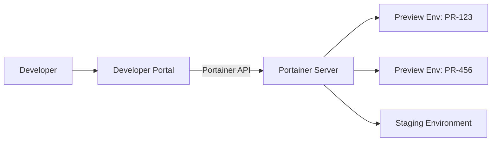

# How to Build a Self-Service Developer Portal with Portainer API

Author: [nawazdhandala](https://www.github.com/nawazdhandala)

Tags: Portainer, API, Developer Portal, Self-Service, Automation, Platform Engineering

Description: Use the Portainer REST API as the backend for a self-service developer portal that lets engineering teams deploy preview environments, manage stacks, and view container status without direct Portainer access.

---

A self-service developer portal abstracts Portainer's complexity behind a simplified interface tailored to your team's workflow. Developers request environments, deploy branches, and check service status through a friendly UI — the portal handles Portainer API calls behind the scenes.

## Portal Architecture



## Step 1: Design the Portal's API Contract

Define what developers can request through the portal:

```
POST /environments          Create a preview environment for a branch
DELETE /environments/:id    Tear down an environment
GET  /environments          List the caller's active environments
GET  /environments/:id/logs Stream logs from a stack's containers
POST /environments/:id/restart  Restart a specific service
```

The portal translates each request into Portainer API calls.

## Step 2: Environment Creation Endpoint

```python
# Flask/FastAPI example — create a preview environment
import requests
import os

PORTAINER_URL = os.environ["PORTAINER_URL"]
PORTAINER_TOKEN = os.environ["PORTAINER_TOKEN"]
ENDPOINT_ID = 1

def create_preview_environment(branch_name: str, image_tag: str, requester: str) -> dict:
    """Deploy a preview stack for a given branch."""
    stack_name = f"preview-{branch_name.replace('/', '-').lower()}"
    
    # Build a dynamic stack definition
    stack_content = f"""
version: "3.8"
services:
  api:
    image: my-registry/api:{image_tag}
    environment:
      - ENVIRONMENT=preview
      - BRANCH={branch_name}
    ports:
      - "0:8080"  # Dynamic port assignment
    labels:
      - "preview.requester={requester}"
      - "preview.branch={branch_name}"
"""
    
    resp = requests.post(
        f"{PORTAINER_URL}/api/stacks?type=2&method=string&endpointId={ENDPOINT_ID}",
        headers={
            "Authorization": f"Bearer {PORTAINER_TOKEN}",
            "Content-Type": "application/json"
        },
        json={
            "Name": stack_name,
            "StackFileContent": stack_content,
            "Env": []
        }
    )
    resp.raise_for_status()
    return {"stack_id": resp.json()["Id"], "name": stack_name}
```

## Step 3: List Environments Endpoint

```python
def list_preview_environments(requester: str) -> list:
    """List all preview stacks belonging to a requester."""
    resp = requests.get(
        f"{PORTAINER_URL}/api/stacks",
        headers={"Authorization": f"Bearer {PORTAINER_TOKEN}"}
    )
    stacks = resp.json()
    
    # Filter to only this requester's previews
    return [
        {
            "id": s["Id"],
            "name": s["Name"],
            "status": s["Status"],
            "created": s["CreationDate"]
        }
        for s in stacks
        if s["Name"].startswith("preview-")
    ]
```

## Step 4: Tear Down Environment

```python
def delete_preview_environment(stack_id: int) -> None:
    """Remove a preview environment and its resources."""
    requests.delete(
        f"{PORTAINER_URL}/api/stacks/{stack_id}?endpointId={ENDPOINT_ID}",
        headers={"Authorization": f"Bearer {PORTAINER_TOKEN}"}
    )
```

## Step 5: GitHub Actions Integration

Automatically create preview environments on PR open and destroy them on PR close:

```yaml
# .github/workflows/preview.yml
on:
  pull_request:
    types: [opened, synchronize, closed]

jobs:
  preview:
    runs-on: ubuntu-latest
    steps:
      - name: Create Preview Environment
        if: github.event.action != 'closed'
        run: |
          curl -X POST ${{ secrets.PORTAL_URL }}/environments \
            -H "Authorization: Bearer ${{ secrets.PORTAL_TOKEN }}" \
            -d "{\"branch\": \"${{ github.head_ref }}\", \"tag\": \"${{ github.sha }}\"}"
      
      - name: Destroy Preview Environment
        if: github.event.action == 'closed'
        run: |
          curl -X DELETE ${{ secrets.PORTAL_URL }}/environments/${{ github.head_ref }}
```

## Summary

A developer portal built on the Portainer API hides infrastructure complexity from development teams while maintaining operational control. By exposing a limited, purpose-built API surface, platform engineers can enforce naming conventions, resource limits, and lifecycle policies without requiring developers to understand Portainer's full feature set.
