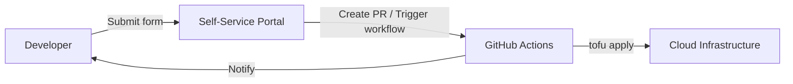

# How to Build a Self-Service Portal with OpenTofu

Author: [nawazdhandala](https://www.github.com/nawazdhandala)

Tags: OpenTofu, Self-Service, Portal, Automation, Developer Platform, Infrastructure as Code

Description: Learn how to build a self-service infrastructure portal that lets developers provision environments by submitting forms that trigger OpenTofu pipelines.

## Introduction

A self-service portal allows developers to provision their own environments without involving operations. They fill out a form, and a CI/CD pipeline runs OpenTofu to create the requested infrastructure. This reduces toil and accelerates development.

## Architecture



## Environment Request Template

Store environment requests as YAML files in a Git repository.

```yaml
# environments/requests/my-feature-env.yaml
name: my-feature-env
owner: nawazdhandala
team: platform-eng
expires: "2026-04-30"  # auto-cleanup after this date
size: small             # small, medium, large

services:
  - type: rds
    engine: postgres
    version: "16"
    instance_class: db.t3.micro

  - type: ecs
    task_cpu: 256
    task_memory: 512
    desired_count: 1

tags:
  CostCenter: cc-1234
  Jira: PLAT-456
```

## OpenTofu Configuration that Reads Requests

```hcl
# environments/dynamic/main.tf

locals {
  # Read environment request from YAML file
  request = yamldecode(file("${path.module}/request.yaml"))
}

# Size definitions
locals {
  sizes = {
    small  = { db_class = "db.t3.micro",  task_cpu = 256,  task_memory = 512  }
    medium = { db_class = "db.t3.medium", task_cpu = 512,  task_memory = 1024 }
    large  = { db_class = "db.r6g.large", task_cpu = 1024, task_memory = 2048 }
  }

  config = local.sizes[local.request.size]
}

# Provision RDS if requested
resource "aws_db_instance" "env_db" {
  count = contains([for s in local.request.services : s.type], "rds") ? 1 : 0

  identifier     = "${local.request.name}-db"
  engine         = "postgres"
  engine_version = [for s in local.request.services : s.version if s.type == "rds"][0]
  instance_class = local.config.db_class

  username = "appuser"
  password = random_password.db.result

  db_subnet_group_name   = var.db_subnet_group_name
  vpc_security_group_ids = [aws_security_group.env.id]
  skip_final_snapshot    = true  # ephemeral environments

  tags = merge(var.base_tags, {
    Owner      = local.request.owner
    Team       = local.request.team
    Expires    = local.request.expires
    CostCenter = local.request.tags.CostCenter
  })
}
```

## GitHub Actions Workflow

```yaml
# .github/workflows/provision-environment.yml
name: Provision Environment

on:
  push:
    paths:
      - "environments/requests/*.yaml"

jobs:
  provision:
    runs-on: ubuntu-latest

    steps:
      - uses: actions/checkout@v4
        with:
          fetch-depth: 2

      - name: Find changed request files
        id: changed
        run: |
          CHANGED=$(git diff --name-only HEAD~1 HEAD -- 'environments/requests/*.yaml')
          echo "files=${CHANGED}" >> $GITHUB_OUTPUT

      - uses: opentofu/setup-opentofu@v1

      - name: Provision environments
        for each changed request file do
        run: |
          for request_file in ${{ steps.changed.outputs.files }}; do
            env_name=$(basename "$request_file" .yaml)
            mkdir -p "environments/active/${env_name}"
            cp "environments/requests/${env_name}.yaml" "environments/active/${env_name}/request.yaml"
            cp environments/dynamic/*.tf "environments/active/${env_name}/"

            cd "environments/active/${env_name}"
            tofu init
            tofu apply -auto-approve
            cd -

            echo "Environment ${env_name} provisioned successfully"
          done
```

## Auto-Cleanup Cron

```yaml
# .github/workflows/cleanup-expired-environments.yml
name: Cleanup Expired Environments

on:
  schedule:
    - cron: "0 0 * * *"  # daily at midnight

jobs:
  cleanup:
    runs-on: ubuntu-latest
    steps:
      - uses: actions/checkout@v4

      - name: Find and destroy expired environments
        run: |
          TODAY=$(date +%Y-%m-%d)
          for request_file in environments/requests/*.yaml; do
            expires=$(grep 'expires:' "$request_file" | awk '{print $2}' | tr -d '"')
            if [[ "$expires" < "$TODAY" ]]; then
              env_name=$(basename "$request_file" .yaml)
              echo "Destroying expired environment: ${env_name} (expired: ${expires})"
              cd "environments/active/${env_name}"
              tofu destroy -auto-approve
              cd -
              git rm "environments/requests/${env_name}.yaml"
            fi
          done
          git commit -m "chore: clean up expired environments" --allow-empty
          git push
```

## Summary

A self-service portal backed by Git and OpenTofu empowers developers to provision their own environments. YAML-based request files, automated pipelines, and expiry-based cleanup create a scalable, cost-controlled developer platform without manual operations involvement.
