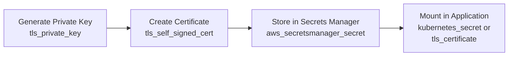

# How to Create Self-Signed Certificates with OpenTofu

Author: [nawazdhandala](https://www.github.com/nawazdhandala)

Tags: OpenTofu, TLS, Certificates, Self-Signed, PKI, Internals, Infrastructure as Code

Description: Learn how to generate self-signed TLS certificates and private keys using OpenTofu's TLS provider for internal services, development environments, and bootstrapping private PKI infrastructure.

---

Self-signed certificates are appropriate for internal services, development environments, and bootstrapping private PKI. OpenTofu's `tls` provider generates private keys, CSRs, and certificates as code - keeping certificate management reproducible and auditable.

## Certificate Generation Flow



## Basic Self-Signed Certificate

```hcl
# tls.tf

terraform {
  required_providers {
    tls = {
      source  = "hashicorp/tls"
      version = "~> 4.0"
    }
  }
}

# Generate RSA private key
resource "tls_private_key" "server" {
  algorithm = "RSA"
  rsa_bits  = 4096
}

# Self-signed certificate
resource "tls_self_signed_cert" "server" {
  private_key_pem = tls_private_key.server.private_key_pem

  subject {
    common_name         = "api.internal.example.com"
    organization        = "Example Corp"
    organizational_unit = "Engineering"
    country             = "US"
    locality            = "San Francisco"
    province            = "California"
  }

  # SAN entries for the certificate
  dns_names = [
    "api.internal.example.com",
    "api.internal",
    "localhost",
  ]

  ip_addresses = ["127.0.0.1", "10.0.1.50"]

  validity_period_hours = 8760  # 1 year

  allowed_uses = [
    "key_encipherment",
    "digital_signature",
    "server_auth",
  ]
}
```

## Private CA and Signed Certificates

```hcl
# Create a private CA certificate first
resource "tls_private_key" "ca" {
  algorithm = "RSA"
  rsa_bits  = 4096
}

resource "tls_self_signed_cert" "ca" {
  private_key_pem = tls_private_key.ca.private_key_pem

  subject {
    common_name  = "Internal CA"
    organization = "Example Corp"
  }

  validity_period_hours = 87600  # 10 years for CA

  is_ca_certificate = true

  allowed_uses = [
    "cert_signing",
    "key_encipherment",
    "digital_signature",
  ]
}

# Issue a server certificate signed by the private CA
resource "tls_private_key" "service" {
  algorithm = "RSA"
  rsa_bits  = 2048
}

resource "tls_cert_request" "service" {
  private_key_pem = tls_private_key.service.private_key_pem

  subject {
    common_name  = "db.internal.example.com"
    organization = "Example Corp"
  }

  dns_names = ["db.internal.example.com", "db.internal"]
}

resource "tls_locally_signed_cert" "service" {
  cert_request_pem   = tls_cert_request.service.cert_request_pem
  ca_private_key_pem = tls_private_key.ca.private_key_pem
  ca_cert_pem        = tls_self_signed_cert.ca.cert_pem

  validity_period_hours = 8760  # 1 year

  allowed_uses = [
    "key_encipherment",
    "digital_signature",
    "server_auth",
  ]
}
```

## Store Certificates in AWS Secrets Manager

```hcl
# Store private key securely
resource "aws_secretsmanager_secret" "tls_key" {
  name                    = "${var.environment}/tls/${var.service_name}/private-key"
  recovery_window_in_days = 0  # Allow immediate deletion for dev environments

  tags = {
    Environment = var.environment
    Service     = var.service_name
  }
}

resource "aws_secretsmanager_secret_version" "tls_key" {
  secret_id = aws_secretsmanager_secret.tls_key.id
  secret_string = jsonencode({
    certificate = tls_self_signed_cert.server.cert_pem
    private_key = tls_private_key.server.private_key_pem
    ca_cert     = tls_self_signed_cert.ca.cert_pem
  })
}
```

## Kubernetes TLS Secret

```hcl
# Mount certificate in Kubernetes for Ingress TLS
resource "kubernetes_secret" "tls" {
  metadata {
    name      = "${var.service_name}-tls"
    namespace = var.namespace
  }

  type = "kubernetes.io/tls"

  data = {
    "tls.crt" = tls_self_signed_cert.server.cert_pem
    "tls.key" = tls_private_key.server.private_key_pem
  }
}

# Reference in Ingress
resource "kubernetes_ingress_v1" "app" {
  metadata {
    name      = var.service_name
    namespace = var.namespace
  }

  spec {
    tls {
      hosts       = ["api.internal.example.com"]
      secret_name = kubernetes_secret.tls.metadata[0].name
    }

    rule {
      host = "api.internal.example.com"
      http {
        path {
          path      = "/"
          path_type = "Prefix"
          backend {
            service {
              name = var.service_name
              port { number = 80 }
            }
          }
        }
      }
    }
  }
}
```

## Best Practices

- Store private keys in AWS Secrets Manager or HashiCorp Vault - never in state files without encryption. Use `sensitive = true` on outputs containing key material.
- Use a private CA (`tls_locally_signed_cert`) rather than individual self-signed certs so you can trust a single CA root across all internal services instead of trusting each certificate individually.
- Set `validity_period_hours` to 8760 (1 year) for service certs and 87600 (10 years) for CA certs - then plan for annual rotation.
- For production internal services, prefer AWS Private CA (`aws_acmpca_certificate_authority`) over self-signed certificates - it integrates with ACM for automated renewal.
- Mark all outputs containing private key material as `sensitive = true` to prevent accidental exposure in CI logs.
