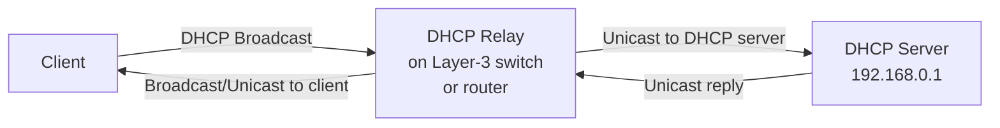

# How to Set Up a DHCP Relay Agent

Author: [nawazdhandala](https://www.github.com/nawazdhandala)

Tags: DHCP, Networking, DHCP Relay, DHCP Agent, Multi-VLAN, Sysadmin

Description: A DHCP relay agent forwards DHCP broadcast messages from clients on one subnet to a DHCP server on another, enabling a single DHCP server to serve multiple VLANs across a routed network.

## Why You Need a DHCP Relay

DHCP uses broadcast (255.255.255.255) which routers don't forward. A relay agent (also called DHCP Helper) converts the broadcast to a unicast directed to the DHCP server:



## Linux: dhcrelay (ISC DHCP Relay)

```bash
# Install

sudo apt install isc-dhcp-relay

# Configure /etc/default/isc-dhcp-relay
# SERVERS="192.168.0.1"                    # DHCP server IP
# INTERFACES="eth0 eth1 eth2"              # Interfaces to listen on
# OPTIONS=""

sudo systemctl enable --now isc-dhcp-relay
```

Or run directly:
```bash
# Relay DHCP requests from clients on eth1 and eth2 to server at 192.168.0.1
sudo dhcrelay -i eth1 -i eth2 192.168.0.1
```

## Cisco IOS: ip helper-address

On a Cisco router or Layer-3 switch, configure the helper address on each VLAN interface:

```text
! VLAN 10 interface
interface Vlan10
  ip address 10.0.10.1 255.255.255.0
  ip helper-address 10.0.0.53    ! DHCP server IP

! VLAN 20 interface
interface Vlan20
  ip address 10.0.20.1 255.255.255.0
  ip helper-address 10.0.0.53
```

## Linux Router: iptables DHCP Relay (Alternative)

If dhcrelay is not available, use iptables to forward DHCP:

```bash
# Forward DHCP broadcasts from 10.0.10.0/24 to server at 10.0.0.53
iptables -t nat -A PREROUTING -i eth1 -p udp --dport 67 \
  -j DNAT --to-destination 10.0.0.53:67
```

## Verifying Relay Operation

```bash
# On the relay, watch for DHCP relayed packets
tcpdump -i eth1 'port 67 or port 68'

# On the DHCP server, check for relayed requests
tcpdump -i eth0 'port 67'
# Relayed packets have giaddr (relay agent IP) set in the DHCP header

# ISC dhcpd logs
journalctl -u isc-dhcp-server | grep relay
```

## The giaddr Field

When a relay agent forwards a DHCP Discover, it sets the `giaddr` (Gateway IP Address) field in the DHCP packet to its own IP address. The DHCP server uses this to:
1. Select the appropriate scope (subnet matching the relay's IP)
2. Know where to send the reply

## Key Takeaways

- DHCP relay agents convert DHCP broadcasts to unicasts forwarded to the DHCP server.
- On Linux, use `dhcrelay -i <interface> <server-ip>`.
- On Cisco, configure `ip helper-address <server-ip>` on each VLAN SVI.
- The `giaddr` field in the DHCP packet identifies the originating subnet to the server.
