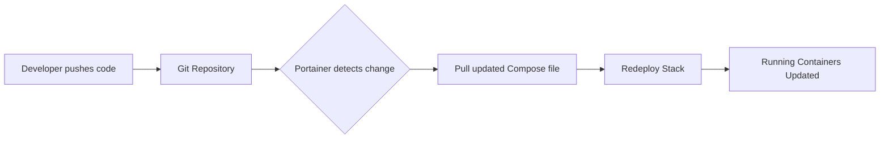

# How to Set Up GitOps Deployments with Portainer

Author: [nawazdhandala](https://www.github.com/nawazdhandala)

Tags: Portainer, GitOps, Git, CI/CD, Automation

Description: Learn how to configure Portainer's GitOps features to automatically deploy and update stacks when Git repository contents change.

## What Is GitOps?

GitOps is a deployment methodology where a Git repository is the single source of truth for infrastructure and application configuration. When changes are pushed to Git, they are automatically applied to the target environment.

Portainer supports GitOps natively by watching Git repositories and applying changes when they occur.

## GitOps Flow with Portainer



## Setting Up a GitOps Stack in Portainer

1. Go to **Stacks > Add stack**.
2. Give the stack a name.
3. Select **Git repository** as the source.
4. Enter:
   - **Repository URL**: `https://github.com/myorg/my-repo`
   - **Branch**: `main`
   - **Compose file path**: `docker/docker-compose.yml`
5. Enable **GitOps updates**.
6. Choose update method:
   - **Polling**: Portainer checks Git every N minutes.
   - **Webhook**: Git triggers Portainer via webhook on push.

## Organizing Your Git Repository for GitOps

```
my-repo/
├── docker/
│   ├── docker-compose.yml           # Production compose file
│   ├── docker-compose.staging.yml   # Staging compose file
│   └── .env.example                 # Example env file
├── k8s/
│   ├── deployment.yaml
│   └── service.yaml
└── README.md
```

## Example Compose File in Git

```yaml
# docker/docker-compose.yml
version: "3.8"

services:
  web:
    # Use a versioned tag, not 'latest', for proper change detection
    image: registry.mycompany.com/web:${APP_VERSION:-1.0.0}
    deploy:
      replicas: 2
    environment:
      - APP_ENV=production
    ports:
      - "80:80"

  api:
    image: registry.mycompany.com/api:${APP_VERSION:-1.0.0}
    deploy:
      replicas: 3
    environment:
      - DB_HOST=postgres
      - DB_NAME=production
```

## Setting Environment Variables for GitOps Stacks

Since `.env` files from Git may contain secrets, Portainer lets you override environment variables in the stack configuration:

1. After setting up the Git-backed stack.
2. Scroll to **Environment variables** in the stack settings.
3. Add key-value pairs that override values from the `.env` file in Git.

```bash
# Never commit real secrets to Git
# Instead, store them in Portainer's environment variable section
DB_PASSWORD=<set_in_portainer_not_in_git>
API_KEY=<set_in_portainer_not_in_git>
```

## Verifying GitOps Updates

After enabling GitOps updates, Portainer shows:
- **Last update time**
- **Current Git commit hash**
- **Pull status** (success or error)

## Rollback via Git

To roll back a deployment, simply revert the commit in Git:

```bash
# Revert the last commit that caused issues
git revert HEAD --no-edit
git push origin main

# Portainer will detect the push and redeploy the previous version
```

## Conclusion

Portainer's GitOps support turns your Git repository into the authoritative source for your Docker deployments. Changes committed to Git are automatically reflected in running stacks, enabling a clean, auditable deployment workflow without manual intervention.
