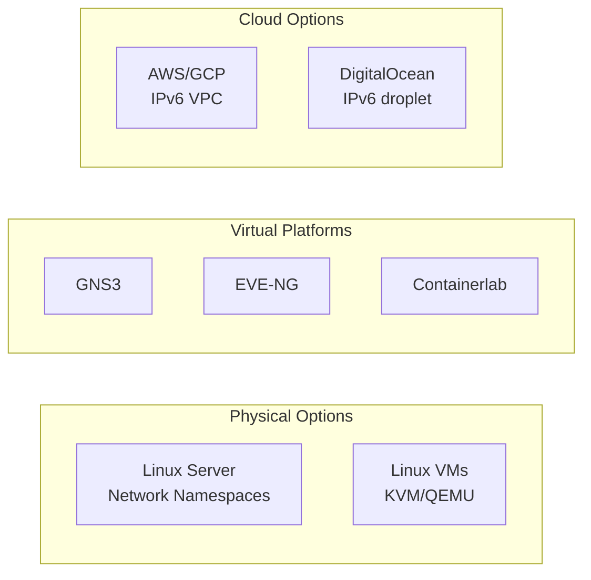

# How to Set Up an IPv6 Test Lab

Author: [nawazdhandala](https://www.github.com/nawazdhandala)

Tags: IPv6, Test Lab, Linux, Networking, Virtualization, Learning

Description: Set up a functional IPv6 test lab using Linux virtual machines, network namespaces, and open-source tools for learning and testing IPv6 protocols.

## Lab Architecture Options



## Minimal Lab: 3-Router IPv6 Topology with Network Namespaces

```bash
#!/bin/bash
# Create a 3-router IPv6 lab using Linux network namespaces

# Create namespaces: Router1, Router2, Router3

for NS in r1 r2 r3; do
    ip netns add ${NS}
    ip netns exec ${NS} ip link set lo up
done

# Create veth pairs for links
# r1 <--> r2
ip link add r1-r2-a type veth peer name r1-r2-b
ip link set r1-r2-a netns r1
ip link set r1-r2-b netns r2

# r2 <--> r3
ip link add r2-r3-a type veth peer name r2-r3-b
ip link set r2-r3-a netns r2
ip link set r2-r3-b netns r3

# Assign IPv6 addresses
# r1-r2 link: 2001:db8:12::/64
ip netns exec r1 ip -6 addr add 2001:db8:12::1/64 dev r1-r2-a
ip netns exec r2 ip -6 addr add 2001:db8:12::2/64 dev r1-r2-b

# r2-r3 link: 2001:db8:23::/64
ip netns exec r2 ip -6 addr add 2001:db8:23::1/64 dev r2-r3-a
ip netns exec r3 ip -6 addr add 2001:db8:23::2/64 dev r2-r3-b

# Loopback addresses for each router
ip netns exec r1 ip -6 addr add 2001:db8:1::1/128 dev lo
ip netns exec r2 ip -6 addr add 2001:db8:2::1/128 dev lo
ip netns exec r3 ip -6 addr add 2001:db8:3::1/128 dev lo

# Bring up interfaces
for NS in r1 r2 r3; do
    ip netns exec ${NS} ip link set $(ip netns exec ${NS} ip link show | grep veth | head -1 | awk '{print $2}' | tr -d ':') up
done

# Enable IPv6 forwarding
for NS in r1 r2 r3; do
    ip netns exec ${NS} sysctl -w net.ipv6.conf.all.forwarding=1 &>/dev/null
done

# Add static routes
ip netns exec r1 ip -6 route add 2001:db8:3::1/128 via 2001:db8:12::2
ip netns exec r3 ip -6 route add 2001:db8:1::1/128 via 2001:db8:23::1

echo "Lab ready. Test with: ip netns exec r1 ping6 2001:db8:3::1"
```

## Installing FRRouting for Dynamic Routing

```bash
# Install FRR on Ubuntu for OSPF/BGP in the lab
apt-get install -y frr frr-pythontools

# Enable OSPFv3 in FRR
sed -i 's/ospf6d=no/ospf6d=yes/' /etc/frr/daemons
systemctl restart frr

# Configure OSPFv3
vtysh << 'EOF'
configure terminal
ipv6 router ospf6
 router-id 1.0.0.1
 area 0.0.0.0 range 2001:db8:1::/48
!
interface eth0
 ipv6 ospf6 area 0.0.0.0
!
end
write
EOF
```

## Lab Validation Checklist

```bash
#!/bin/bash
# Validate lab is functional

echo "=== IPv6 Lab Validation ==="

# 1. Link-local addresses assigned
echo "1. Link-local addresses:"
ip -6 addr show scope link | grep inet6

# 2. Router advertisements received
echo "2. Router discovery:"
ip -6 route show | grep ra

# 3. End-to-end reachability
echo "3. Reachability tests:"
ping6 -c 1 -W 2 2001:db8:3::1 &>/dev/null && \
    echo "   r1 → r3: OK" || echo "   r1 → r3: FAIL"

# 4. DNS resolution
echo "4. DNS AAAA lookup:"
host -t AAAA ipv6.google.com 8.8.8.8 | grep 'has IPv6'

# 5. MTU path
echo "5. MTU discovery:"
ping6 -c 1 -M do -s 1400 2001:db8:3::1 &>/dev/null && \
    echo "   1400-byte ping OK" || echo "   MTU issue at 1400 bytes"
```

## Cleanup Script

```bash
#!/bin/bash
# Tear down the test lab
for NS in r1 r2 r3; do
    ip netns del ${NS} 2>/dev/null
done
echo "Lab cleaned up"
```

## Conclusion

A minimal IPv6 test lab needs only a Linux machine with network namespace support - no hardware or expensive licenses required. Network namespaces provide complete isolation with their own routing tables, interfaces, and sysctl settings. FRRouting adds dynamic routing protocols (OSPFv3, BGP, IS-IS) for realistic scenario simulation. For GUI-based labs and router OS images, GNS3 and EVE-NG provide more realistic environments. Always validate the lab with end-to-end reachability tests, DNS queries, and MTU checks before running experiments.
