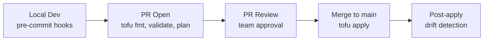

# How to Set Up a Shared OpenTofu Workflow for Teams

Author: [nawazdhandala](https://www.github.com/nawazdhandala)

Tags: OpenTofu, Team Workflows, Collaboration, CI/CD, Infrastructure as Code, GitHub Actions

Description: Learn how to establish a shared OpenTofu workflow for engineering teams with consistent tooling, automated checks, and clear contribution guidelines.

---

A shared OpenTofu workflow ensures every team member follows the same process for infrastructure changes. Inconsistent workflows lead to state corruption, conflicting changes, and production incidents. Establishing clear conventions and automation early saves enormous pain as the team grows.

## Core Workflow Components



## Pre-Commit Hooks

```yaml
# .pre-commit-config.yaml

repos:
  - repo: https://github.com/antonbabenko/pre-commit-terraform
    rev: v1.86.0
    hooks:
      - id: terraform_fmt         # Auto-format HCL
      - id: terraform_validate    # Validate syntax
      - id: terraform_tflint      # Lint for best practices
      - id: terraform_docs        # Generate module docs
        args:
          - --args=--output-file README.md
```

## Standard Makefile for Team Operations

```makefile
# Makefile
.DEFAULT_GOAL := help
ENVIRONMENT ?= dev

.PHONY: help
help: ## Show this help
	@grep -E '^[a-zA-Z_-]+:.*?## .*$$' $(MAKEFILE_LIST) | sort | awk 'BEGIN {FS = ":.*?## "}; {printf "\033[36m%-30s\033[0m %s\n", $$1, $$2}'

.PHONY: init
init: ## Initialize OpenTofu for the specified environment
	cd environments/$(ENVIRONMENT) && tofu init

.PHONY: plan
plan: ## Plan changes for the specified environment
	cd environments/$(ENVIRONMENT) && tofu plan -out=tfplan

.PHONY: apply
apply: ## Apply changes for the specified environment
	cd environments/$(ENVIRONMENT) && tofu apply tfplan

.PHONY: destroy
destroy: ## Destroy the specified environment (requires confirmation)
	cd environments/$(ENVIRONMENT) && tofu destroy

.PHONY: fmt
fmt: ## Format all OpenTofu files
	tofu fmt -recursive .

.PHONY: validate
validate: ## Validate all OpenTofu configurations
	find . -name "*.tf" -not -path "*/\.*" -exec dirname {} \; | sort -u | xargs -I{} sh -c 'cd {} && tofu validate'

.PHONY: docs
docs: ## Generate documentation for all modules
	find modules -type d | xargs -I{} terraform-docs markdown table --output-file README.md {}
```

## CI/CD Workflow

```yaml
# .github/workflows/opentofu.yml
name: OpenTofu Workflow
on:
  pull_request:
    paths: ['**.tf', '**.tfvars']
  push:
    branches: [main]
    paths: ['**.tf', '**.tfvars']

jobs:
  validate:
    runs-on: ubuntu-latest
    steps:
      - uses: actions/checkout@v4
      - uses: opentofu/setup-opentofu@v1
      - name: Format check
        run: tofu fmt -check -recursive .
      - name: Validate
        run: |
          cd environments/production
          tofu init -backend=false
          tofu validate

  plan:
    needs: validate
    if: github.event_name == 'pull_request'
    runs-on: ubuntu-latest
    steps:
      - uses: actions/checkout@v4
      - uses: opentofu/setup-opentofu@v1
      - name: Plan
        run: make plan ENVIRONMENT=production

  apply:
    needs: validate
    if: github.event_name == 'push' && github.ref == 'refs/heads/main'
    environment: production
    runs-on: ubuntu-latest
    steps:
      - uses: actions/checkout@v4
      - uses: opentofu/setup-opentofu@v1
      - name: Apply
        run: make apply ENVIRONMENT=production
```

## Team Conventions Document

```markdown
# Infrastructure Team Conventions

## Branch Naming
- Feature: `infra/TICKET-description`
- Bugfix: `fix/TICKET-description`
- Hotfix: `hotfix/TICKET-description`

## Commit Messages
- Use present tense: "Add S3 bucket" not "Added S3 bucket"
- Reference ticket: "INFRA-123: Add S3 bucket for user uploads"

## PR Requirements
- `tofu plan` output posted as PR comment
- At least 1 approval from the infrastructure team
- All CI checks passing
- No resource deletions without explicit documentation

## Never Do
- Run `tofu apply` locally against production
- Use -auto-approve on production without CI/CD
- Commit .terraform directories or tfstate files
```

## Best Practices

- Document your workflow - a shared `CONTRIBUTING.md` prevents "how do I do X?" questions.
- Make the common path easy: a Makefile with `make plan ENV=production` lowers friction.
- Enforce formatting with pre-commit hooks - don't leave it to CI to catch formatting issues in PRs.
- Use a consistent version of OpenTofu across all machines with `.tool-versions` or `mise.toml`.
- Review `tofu plan` output in every PR - infrastructure changes should be as visible as code changes.
