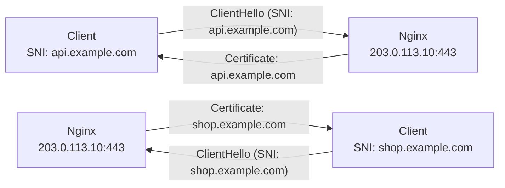

# How to Configure SNI for Multiple Certificates on One IPv4 Address

Author: [nawazdhandala](https://www.github.com/nawazdhandala)

Tags: SNI, TLS, Multiple Certificates, Nginx, Apache, Virtual Hosting

Description: Learn how Server Name Indication (SNI) allows multiple SSL/TLS certificates to be served from a single IPv4 address, enabling HTTPS virtual hosting.

## What Is SNI?

Server Name Indication (SNI) is a TLS extension that allows the client to specify which hostname it's connecting to during the TLS handshake. Without SNI, a server can only present one certificate per IP address. With SNI, the server reads the hostname from the ClientHello message and selects the appropriate certificate before establishing the TLS session.

All modern browsers and operating systems support SNI (IE 7+ on Vista+, Android 3.0+, etc.).

## Architecture



Both connections go to the same IP but receive different certificates based on SNI.

## Step 1: Configure Multiple Virtual Hosts in Nginx

Create separate server blocks for each hostname:

```nginx
# /etc/nginx/conf.d/api.example.com.conf
server {
    listen 443 ssl;
    server_name api.example.com;

    ssl_certificate     /etc/ssl/certs/api.example.com.crt;
    ssl_certificate_key /etc/ssl/private/api.example.com.key;

    ssl_protocols TLSv1.2 TLSv1.3;
    ssl_ciphers HIGH:!aNULL:!MD5;

    location / {
        proxy_pass http://api_backend:8080;
    }
}

# /etc/nginx/conf.d/shop.example.com.conf
server {
    listen 443 ssl;
    server_name shop.example.com;

    ssl_certificate     /etc/ssl/certs/shop.example.com.crt;
    ssl_certificate_key /etc/ssl/private/shop.example.com.key;

    ssl_protocols TLSv1.2 TLSv1.3;
    ssl_ciphers HIGH:!aNULL:!MD5;

    location / {
        proxy_pass http://shop_backend:3000;
    }
}

# Default server for unmatched SNI (returns 444/closes connection)
server {
    listen 443 ssl default_server;
    server_name _;

    ssl_certificate     /etc/ssl/certs/default.crt;
    ssl_certificate_key /etc/ssl/private/default.key;

    return 444;   # Nginx closes connection without response
}
```

## Step 2: Configure Multiple Virtual Hosts in Apache

```apache
# /etc/apache2/sites-available/api.example.com-ssl.conf
<VirtualHost *:443>
    ServerName api.example.com

    SSLEngine on
    SSLCertificateFile      /etc/ssl/certs/api.example.com.crt
    SSLCertificateKeyFile   /etc/ssl/private/api.example.com.key
    SSLCACertificateFile    /etc/ssl/certs/chain.crt

    ProxyPass / http://api_backend:8080/
    ProxyPassReverse / http://api_backend:8080/
</VirtualHost>

# /etc/apache2/sites-available/shop.example.com-ssl.conf
<VirtualHost *:443>
    ServerName shop.example.com

    SSLEngine on
    SSLCertificateFile      /etc/ssl/certs/shop.example.com.crt
    SSLCertificateKeyFile   /etc/ssl/private/shop.example.com.key
</VirtualHost>
```

## Step 3: Use a Wildcard Certificate for Subdomains

Instead of separate certificates, use a wildcard certificate for all `*.example.com`:

```bash
# Obtain wildcard certificate with Certbot (DNS challenge required)
sudo certbot certonly \
  --dns-cloudflare \
  --dns-cloudflare-credentials /etc/letsencrypt/cloudflare.ini \
  -d "*.example.com" -d "example.com"
```

Then reuse one certificate for all subdomains:

```nginx
# Works for api.example.com, shop.example.com, etc.
ssl_certificate /etc/letsencrypt/live/example.com/fullchain.pem;
ssl_certificate_key /etc/letsencrypt/live/example.com/privkey.pem;
```

## Step 4: Serve ECDSAand RSA Dual Certificates

For maximum compatibility, serve both an ECDSA and an RSA certificate:

```nginx
server {
    listen 443 ssl;
    server_name example.com;

    # ECDSA certificate (preferred by modern clients, smaller)
    ssl_certificate     /etc/ssl/certs/example.com-ecdsa.crt;
    ssl_certificate_key /etc/ssl/private/example.com-ecdsa.key;

    # RSA certificate (fallback for older clients)
    ssl_certificate     /etc/ssl/certs/example.com-rsa.crt;
    ssl_certificate_key /etc/ssl/private/example.com-rsa.key;
}
```

Nginx 1.11.0+ supports multiple ssl_certificate directives—the client negotiates which to use.

## Step 5: Verify SNI Is Working

```bash
# Test that different certificates are returned for different hostnames
openssl s_client -connect 203.0.113.10:443 -servername api.example.com 2>/dev/null | \
  openssl x509 -noout -subject
# subject=CN=api.example.com

openssl s_client -connect 203.0.113.10:443 -servername shop.example.com 2>/dev/null | \
  openssl x509 -noout -subject
# subject=CN=shop.example.com

# Verify both return different certificates despite same IP
```

## Conclusion

SNI enables multiple HTTPS virtual hosts on a single IPv4 address by including the target hostname in the TLS ClientHello message. Configure separate server blocks in Nginx or Apache for each hostname with their respective certificates. Use wildcard certificates to simplify management when all domains share a common parent, and test with `openssl s_client -servername` to confirm each hostname returns the correct certificate.
