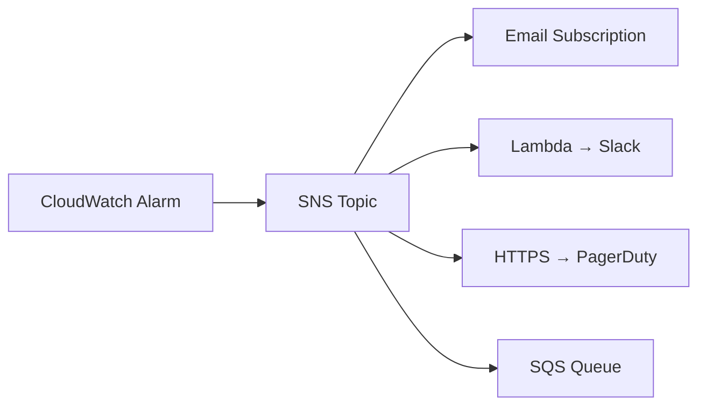

# How to Set Up SNS Notifications for Infrastructure Alerts with OpenTofu

Author: [nawazdhandala](https://www.github.com/nawazdhandala)

Tags: OpenTofu, AWS, SNS, Notifications, CloudWatch, Infrastructure Alerts, Infrastructure as Code

Description: Learn how to set up SNS topics and CloudWatch alarm notifications for infrastructure alerts using OpenTofu, including email, Slack webhook, and PagerDuty integrations.

---

SNS notifications keep your team informed when infrastructure changes or degrades. By wiring CloudWatch alarms to SNS topics with OpenTofu, you create a repeatable alerting layer that deploys consistently across environments.

## Architecture Overview



## SNS Topic with KMS Encryption

```hcl
# sns.tf

resource "aws_sns_topic" "infrastructure_alerts" {
  name              = "${var.environment}-infrastructure-alerts"
  kms_master_key_id = aws_kms_key.sns.arn

  tags = {
    Environment = var.environment
    Purpose     = "infrastructure-alerts"
  }
}

resource "aws_kms_key" "sns" {
  description             = "KMS key for SNS infrastructure alerts"
  deletion_window_in_days = 7

  policy = jsonencode({
    Version = "2012-10-17"
    Statement = [
      {
        Sid    = "AllowCloudWatch"
        Effect = "Allow"
        Principal = {
          Service = "cloudwatch.amazonaws.com"
        }
        Action   = ["kms:GenerateDataKey*", "kms:Decrypt"]
        Resource = "*"
      },
      {
        Sid    = "AllowSNS"
        Effect = "Allow"
        Principal = {
          Service = "sns.amazonaws.com"
        }
        Action   = ["kms:GenerateDataKey*", "kms:Decrypt"]
        Resource = "*"
      },
      {
        Sid       = "AllowAccount"
        Effect    = "Allow"
        Principal = { AWS = "arn:aws:iam::${data.aws_caller_identity.current.account_id}:root" }
        Action    = "kms:*"
        Resource  = "*"
      }
    ]
  })
}
```

## SNS Topic Policy for CloudWatch

```hcl
resource "aws_sns_topic_policy" "infrastructure_alerts" {
  arn = aws_sns_topic.infrastructure_alerts.arn

  policy = jsonencode({
    Version = "2012-10-17"
    Statement = [
      {
        Sid    = "AllowCloudWatchPublish"
        Effect = "Allow"
        Principal = {
          Service = "cloudwatch.amazonaws.com"
        }
        Action   = "SNS:Publish"
        Resource = aws_sns_topic.infrastructure_alerts.arn
        Condition = {
          ArnLike = {
            "aws:SourceArn" = "arn:aws:cloudwatch:${var.aws_region}:${data.aws_caller_identity.current.account_id}:alarm:*"
          }
        }
      }
    ]
  })
}
```

## Subscriptions

```hcl
# Email subscription - requires manual confirmation
resource "aws_sns_topic_subscription" "ops_email" {
  topic_arn = aws_sns_topic.infrastructure_alerts.arn
  protocol  = "email"
  endpoint  = var.ops_email
}

# HTTPS endpoint (PagerDuty, OpsGenie, etc.)
resource "aws_sns_topic_subscription" "pagerduty" {
  topic_arn            = aws_sns_topic.infrastructure_alerts.arn
  protocol             = "https"
  endpoint             = var.pagerduty_endpoint_url
  endpoint_auto_confirms = true
}

# SQS for durable processing
resource "aws_sns_topic_subscription" "alert_queue" {
  topic_arn = aws_sns_topic.infrastructure_alerts.arn
  protocol  = "sqs"
  endpoint  = aws_sqs_queue.alert_processing.arn
}

# Lambda for Slack notifications
resource "aws_sns_topic_subscription" "slack_lambda" {
  topic_arn = aws_sns_topic.infrastructure_alerts.arn
  protocol  = "lambda"
  endpoint  = aws_lambda_function.slack_notifier.arn
}

resource "aws_lambda_permission" "sns_invoke_slack" {
  statement_id  = "AllowSNSInvoke"
  action        = "lambda:InvokeFunction"
  function_name = aws_lambda_function.slack_notifier.function_name
  principal     = "sns.amazonaws.com"
  source_arn    = aws_sns_topic.infrastructure_alerts.arn
}
```

## CloudWatch Alarms Wired to SNS

```hcl
# alarms.tf
locals {
  alarm_actions = [aws_sns_topic.infrastructure_alerts.arn]
}

resource "aws_cloudwatch_metric_alarm" "high_cpu" {
  alarm_name          = "${var.environment}-high-cpu"
  comparison_operator = "GreaterThanThreshold"
  evaluation_periods  = 3
  metric_name         = "CPUUtilization"
  namespace           = "AWS/EC2"
  period              = 60
  statistic           = "Average"
  threshold           = 80
  alarm_description   = "CPU utilization exceeded 80% for 3 minutes"

  dimensions = {
    AutoScalingGroupName = aws_autoscaling_group.app.name
  }

  alarm_actions             = local.alarm_actions
  ok_actions                = local.alarm_actions
  insufficient_data_actions = local.alarm_actions
}

resource "aws_cloudwatch_metric_alarm" "error_rate" {
  alarm_name          = "${var.environment}-high-error-rate"
  comparison_operator = "GreaterThanThreshold"
  evaluation_periods  = 2
  metric_name         = "5XXError"
  namespace           = "AWS/ApplicationELB"
  period              = 60
  statistic           = "Sum"
  threshold           = 10

  dimensions = {
    LoadBalancer = aws_lb.app.arn_suffix
  }

  alarm_actions = local.alarm_actions
}
```

## Filtering Alerts by Severity

```hcl
# Separate topics per severity
resource "aws_sns_topic" "critical_alerts" {
  name = "${var.environment}-critical-alerts"
}

resource "aws_sns_topic" "warning_alerts" {
  name = "${var.environment}-warning-alerts"
}

# Critical alarms wake people up
resource "aws_cloudwatch_metric_alarm" "db_connections_critical" {
  alarm_name          = "${var.environment}-db-connections-critical"
  comparison_operator = "GreaterThanThreshold"
  evaluation_periods  = 1
  metric_name         = "DatabaseConnections"
  namespace           = "AWS/RDS"
  period              = 60
  statistic           = "Average"
  threshold           = 950

  alarm_actions = [aws_sns_topic.critical_alerts.arn]
}

# Warning alarms go to Slack only
resource "aws_cloudwatch_metric_alarm" "db_connections_warning" {
  alarm_name          = "${var.environment}-db-connections-warning"
  comparison_operator = "GreaterThanThreshold"
  evaluation_periods  = 2
  metric_name         = "DatabaseConnections"
  namespace           = "AWS/RDS"
  period              = 60
  statistic           = "Average"
  threshold           = 800

  alarm_actions = [aws_sns_topic.warning_alerts.arn]
}
```

## Best Practices

- Use separate SNS topics per severity level - critical alerts should wake people up; warnings should go to Slack.
- Encrypt SNS topics with KMS and restrict CloudWatch publish permissions to your account only.
- Use `endpoint_auto_confirms = true` for HTTPS endpoints that handle confirmation automatically (PagerDuty, OpsGenie).
- Wire both `alarm_actions` and `ok_actions` to SNS so you receive recovery notifications.
- Test subscriptions with `aws sns publish` after deployment to confirm the pipeline works end-to-end.
