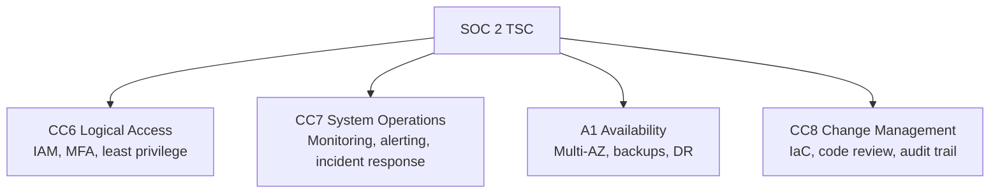

# How to Implement SOC 2-Compliant Infrastructure with OpenTofu

Author: [nawazdhandala](https://www.github.com/nawazdhandala)

Tags: OpenTofu, SOC2, Compliance, Security, Availability, Confidentiality, Infrastructure as Code

Description: Learn how to provision SOC 2-compliant AWS infrastructure using OpenTofu, covering the Trust Services Criteria for Security, Availability, and Confidentiality.

---

SOC 2 audits assess controls across five Trust Services Criteria: Security, Availability, Processing Integrity, Confidentiality, and Privacy. For cloud infrastructure, Security and Availability are most commonly in scope. OpenTofu codifies the technical controls that auditors look for.

## SOC 2 Trust Services Criteria Coverage



## CC6: Logical Access Controls

```hcl
# iam_soc2.tf

# Enforce MFA for console access

resource "aws_iam_account_password_policy" "soc2" {
  minimum_password_length        = 14
  require_symbols                = true
  require_numbers                = true
  require_uppercase_characters   = true
  require_lowercase_characters   = true
  max_password_age               = 90
  password_reuse_prevention      = 12
  allow_users_to_change_password = true
}

# Deny all actions without MFA
resource "aws_iam_policy" "require_mfa" {
  name = "require-mfa"

  policy = jsonencode({
    Version = "2012-10-17"
    Statement = [{
      Sid    = "DenyWithoutMFA"
      Effect = "Deny"
      NotAction = [
        "iam:CreateVirtualMFADevice",
        "iam:EnableMFADevice",
        "iam:GetUser",
        "iam:ListMFADevices",
        "iam:ListVirtualMFADevices",
        "sts:GetSessionToken"
      ]
      Resource = "*"
      Condition = {
        BoolIfExists = { "aws:MultiFactorAuthPresent" = "false" }
      }
    }]
  })
}
```

## CC7: System Operations and Monitoring

```hcl
# monitoring_soc2.tf
resource "aws_securityhub_account" "enabled" {}

resource "aws_guardduty_detector" "enabled" {
  enable = true
}

resource "aws_config_configuration_recorder_status" "enabled" {
  name       = aws_config_configuration_recorder.main.name
  is_enabled = true
}

# Alert on root account usage (SOC 2 requirement)
resource "aws_cloudwatch_metric_alarm" "root_account_usage" {
  alarm_name          = "root-account-usage"
  comparison_operator = "GreaterThanThreshold"
  evaluation_periods  = 1
  metric_name         = "RootAccountUsage"
  namespace           = "CloudTrailMetrics"
  period              = 300
  statistic           = "Sum"
  threshold           = 0
  alarm_description   = "Root account was used - SOC 2 violation"
  alarm_actions       = [aws_sns_topic.security_alerts.arn]
}
```

## A1: Availability Controls

```hcl
# availability_soc2.tf
resource "aws_db_instance" "main" {
  multi_az                = true   # High availability
  backup_retention_period = 35     # 35 days of automated backups
  deletion_protection     = true
  storage_encrypted       = true
  auto_minor_version_upgrade = true

  # Enable enhanced monitoring
  monitoring_interval = 60
  monitoring_role_arn = aws_iam_role.rds_monitoring.arn
}

# Auto-scaling for availability
resource "aws_autoscaling_policy" "target_tracking" {
  name                   = "cpu-target-tracking"
  policy_type            = "TargetTrackingScaling"
  autoscaling_group_name = aws_autoscaling_group.app.name

  target_tracking_configuration {
    predefined_metric_specification {
      predefined_metric_type = "ASGAverageCPUUtilization"
    }
    target_value = 60.0
  }
}
```

## CC8: Change Management

```hcl
# All infrastructure changes go through code review
# This is enforced via GitHub branch protection and Atlantis
# Document this control for auditors

output "change_management_controls" {
  description = "Evidence of change management controls for SOC 2 auditors"
  value = {
    iac_tool          = "OpenTofu 1.6.0"
    code_review       = "Required via GitHub pull requests (branch protection enabled)"
    approval_required = "Minimum 2 approvals from infrastructure-team"
    audit_trail       = "All changes in git history with author, timestamp, and PR reference"
    state_storage     = "S3 with versioning and CloudTrail logging"
  }
}
```

## Audit Evidence Collection

```hcl
# SOC 2 auditors need evidence of controls operating effectively
# Store evidence in S3 with versioning
resource "aws_s3_bucket" "audit_evidence" {
  bucket = "${var.company}-soc2-audit-evidence"
}

resource "aws_s3_bucket_versioning" "evidence" {
  bucket = aws_s3_bucket.audit_evidence.id
  versioning_configuration { status = "Enabled" }
}

# Grant read-only access to auditors
resource "aws_iam_role" "external_auditor" {
  name = "external-auditor-readonly"

  assume_role_policy = jsonencode({
    Version = "2012-10-17"
    Statement = [{
      Effect = "Allow"
      Principal = {
        AWS = var.auditor_account_id
      }
      Action = "sts:AssumeRole"
      Condition = {
        Bool = { "aws:MultiFactorAuthPresent" = "true" }
      }
    }]
  })
}
```

## Best Practices

- Enable AWS Security Hub, GuardDuty, and Config before your SOC 2 audit period begins - auditors need 3-6 months of operating evidence.
- Store CloudTrail and Config logs in a separate, locked-down audit account so production engineers cannot modify evidence.
- Enable root account alerts - SOC 2 auditors specifically look for evidence that root account usage is detected and responded to.
- Document OpenTofu as your change management control - it's strong evidence of formal change procedures.
- Test incident response procedures quarterly and document the tests - SOC 2 requires evidence of incident response capability, not just policies.
