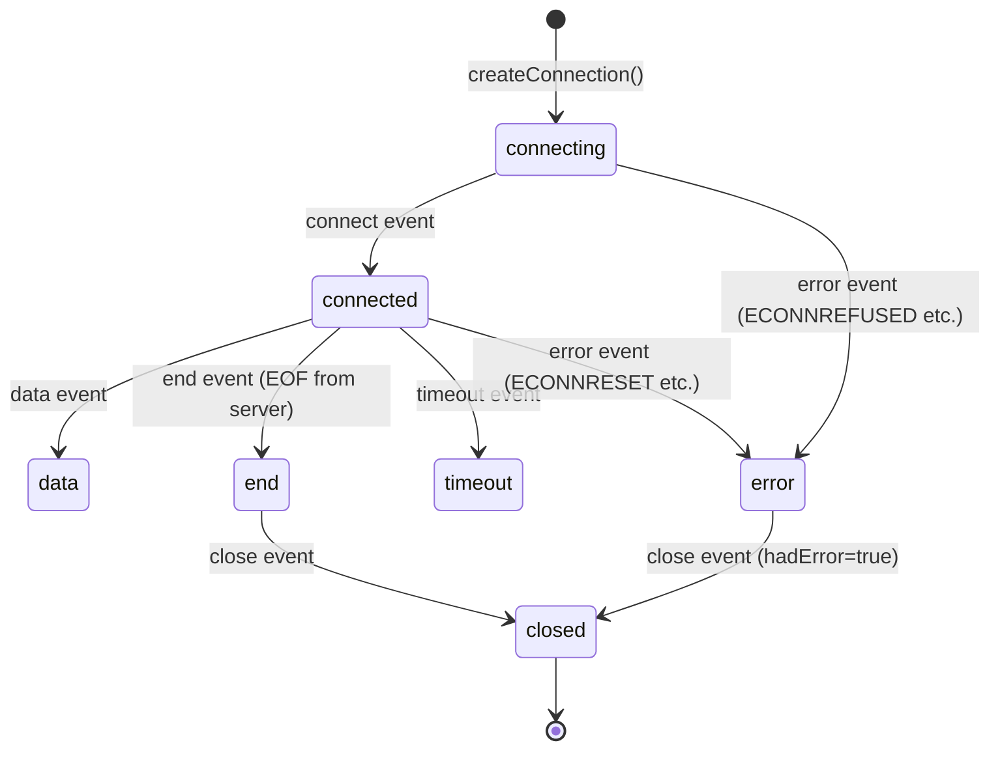

# How to Handle IPv4 Socket Errors and Events in Node.js

Author: [nawazdhandala](https://www.github.com/nawazdhandala)

Tags: Node.js, Socket, IPv4, Error Handling, Net Module, Event

Description: Learn how to handle the most common socket errors and events in Node.js IPv4 TCP and UDP networking for robust, production-ready applications.

## TCP Socket Events

Node.js sockets emit several events throughout their lifecycle:

```javascript
const net = require('net');

const socket = net.createConnection({ host: '127.0.0.1', port: 9000, family: 4 });

// Emitted when connection is established
socket.on('connect', () => {
    console.log('Connected to server');
    socket.write('Hello!\n');
});

// Emitted when data is received
socket.on('data', (data) => {
    console.log(`Received: ${data.toString().trim()}`);
});

// Emitted when the server signals end-of-file (half-close)
socket.on('end', () => {
    console.log('Server ended the connection (EOF)');
});

// Emitted when the socket is fully closed
socket.on('close', (hadError) => {
    console.log(`Socket closed ${hadError ? '(with error)' : '(cleanly)'}`);
});

// Emitted on socket errors
socket.on('error', (err) => {
    // Always handle 'error' - unhandled errors crash the process
    console.error(`Socket error: [${err.code}] ${err.message}`);
});

// Emitted when no data received within timeout period
socket.on('timeout', () => {
    console.log('Socket timed out; closing');
    socket.end();
});
```

## Common Error Codes

```javascript
const net = require('net');

function createRobustClient(host, port) {
    const socket = net.createConnection({ host, port, family: 4 });

    socket.on('error', (err) => {
        switch (err.code) {
            case 'ECONNREFUSED':
                console.error(`Connection refused: ${host}:${port} is not listening`);
                break;
            case 'ECONNRESET':
                console.error('Connection reset by remote host');
                break;
            case 'ETIMEDOUT':
                console.error('Connection timed out (firewall may be dropping packets)');
                break;
            case 'ENOTFOUND':
                console.error(`DNS lookup failed for host: ${host}`);
                break;
            case 'EADDRINUSE':
                console.error(`Port ${port} is already in use`);
                break;
            case 'EPIPE':
                console.error('Broken pipe: tried to write to closed socket');
                break;
            case 'ENETUNREACH':
                console.error('Network unreachable');
                break;
            default:
                console.error(`Unexpected error [${err.code}]: ${err.message}`);
        }
    });

    return socket;
}
```

## Handling Server-Side Socket Errors

```javascript
const net = require('net');

const server = net.createServer((socket) => {
    const addr = `${socket.remoteAddress}:${socket.remotePort}`;

    socket.on('data', (data) => {
        try {
            socket.write(data);
        } catch (err) {
            // write() can throw if socket is already destroyed
            console.error(`Write failed for ${addr}: ${err.message}`);
        }
    });

    socket.on('error', (err) => {
        if (err.code === 'ECONNRESET') {
            // Client disconnected without proper FIN - common in practice
            console.log(`${addr} reset the connection (client crashed or network issue)`);
        } else {
            console.error(`${addr} socket error: ${err.code} ${err.message}`);
        }
        // Socket is already unusable; destroy ensures cleanup
        socket.destroy();
    });

    socket.on('close', () => {
        console.log(`${addr} disconnected`);
    });
});

server.on('error', (err) => {
    if (err.code === 'EADDRINUSE') {
        console.error('Server port is already in use');
        process.exit(1);
    }
    console.error(`Server error: ${err.message}`);
});

server.listen(9000, '0.0.0.0');
```

## UDP Socket Error Handling

```javascript
const dgram = require('dgram');

const socket = dgram.createSocket('udp4');

socket.on('error', (err) => {
    console.error(`UDP socket error: [${err.code}] ${err.message}`);
    socket.close();
});

socket.on('message', (msg, rinfo) => {
    console.log(`From ${rinfo.address}: ${msg}`);
});

socket.bind(9001, '0.0.0.0', () => {
    console.log(`UDP bound: ${JSON.stringify(socket.address())}`);
});
```

## Socket Event Lifecycle



## Conclusion

Always attach an `error` event listener to every socket in Node.js-unhandled error events crash the process. Use the `err.code` property to differentiate `ECONNREFUSED` (port not open), `ECONNRESET` (abrupt disconnect), `ETIMEDOUT` (firewall dropping packets), and other common errors. Call `socket.destroy()` when handling errors to ensure cleanup even if `end()` was never called.
