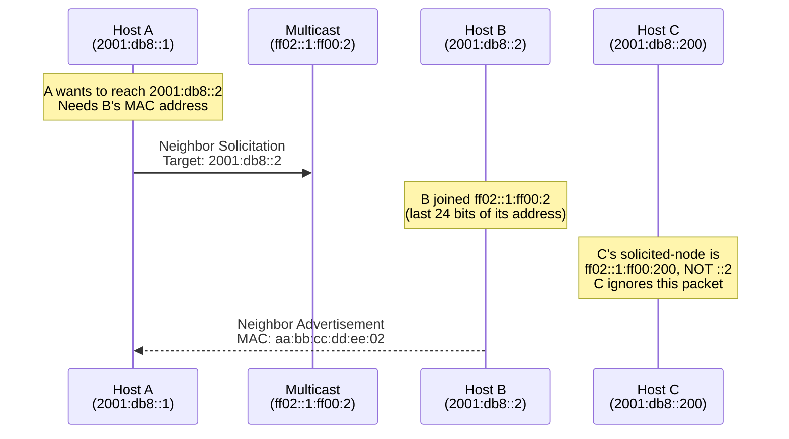

# How to Understand Solicited-Node Multicast Addresses

Author: [nawazdhandala](https://www.github.com/nawazdhandala)

Tags: IPv6, Multicast, NDP, Neighbor Discovery, Address Resolution

Description: A detailed explanation of solicited-node multicast addresses in IPv6 and how they enable efficient neighbor discovery without broadcast traffic.

## What Are Solicited-Node Multicast Addresses?

A solicited-node multicast address is an IPv6 multicast address automatically derived from a unicast or anycast address. It is used by Neighbor Discovery Protocol (NDP) to find the MAC address of a neighboring host — the IPv6 equivalent of ARP.

## Why Solicited-Node Multicast Instead of Broadcast?

In IPv4, ARP sends broadcast packets (`ff:ff:ff:ff:ff:ff`) to all hosts on the link. Every host must process the broadcast, even if it's not the intended target.

IPv6 replaces this broadcast with targeted multicast: only the host(s) sharing the same last 24 bits of their address will receive and process the solicited-node multicast — everyone else discards it at the network interface level.

## How the Solicited-Node Address Is Computed

The solicited-node address is formed by:
1. Starting with the prefix `ff02::1:ff00:0/104`
2. Appending the last 24 bits (3 bytes) of the unicast/anycast address

```
Unicast address: 2001:0db8:0000:0000:0200:5eff:fe00:5301
Last 24 bits:    00:53:01 (hexadecimal)

Solicited-node: ff02::1:ff00:5301
```

## Example Calculations

```bash
# Python script to compute solicited-node address
python3 -c "
import ipaddress

def solicited_node(unicast):
    addr = ipaddress.ip_address(unicast)
    # Get last 3 bytes of the address
    addr_int = int(addr)
    last_24 = addr_int & 0xFFFFFF
    # Combine with solicited-node prefix
    prefix = int(ipaddress.ip_address('ff02::1:ff00:0'))
    result = prefix | last_24
    return ipaddress.ip_address(result)

# Examples
addrs = ['2001:db8::1', '2001:db8::200:5eff:fe00:5301', 'fe80::1']
for a in addrs:
    print(f'{a} → {solicited_node(a)}')
"

# Output:
# 2001:db8::1 → ff02::1:ff00:1
# 2001:db8::200:5eff:fe00:5301 → ff02::1:ff00:5301
# fe80::1 → ff02::1:ff00:1
```

## How NDP Uses Solicited-Node Multicast



## Viewing Solicited-Node Groups on Linux

```bash
# Every configured IPv6 address creates a solicited-node group
ip -6 maddr show dev eth0

# Example output:
# 3:   eth0
#     inet6 ff02::1                        (all nodes)
#     inet6 ff02::1:ff00:1                 (solicited-node for ::1)
#     inet6 ff02::1:ffd4:5f23             (solicited-node for a privacy address)

# Verify specific address → solicited-node mapping
# For address 2001:db8::cafe:1:
ip -6 addr show dev eth0 | grep 'cafe:1'
ip -6 maddr show dev eth0 | grep 'ff02::1:ff'
```

## Duplicate Address Detection (DAD) Uses Solicited-Node

When an interface configures an IPv6 address, it performs DAD:

1. Sends a Neighbor Solicitation to the **new address's solicited-node group**
2. If no Neighbor Advertisement is received, the address is unique
3. If a NA is received, there is an address conflict (DAD failure)

```bash
# Watch DAD in action when assigning a new IPv6 address
tcpdump -i eth0 -n 'icmp6 and (ip6[40] == 135 or ip6[40] == 136)' &

# Assign a new IPv6 address (triggers DAD)
ip -6 addr add 2001:db8::100/64 dev eth0

# You'll see NS sent to ff02::1:ff00:100 and possibly NA in response
```

## Address Collision with Solicited-Node Groups

Because solicited-node groups share the last 24 bits, different addresses can share the same solicited-node group (1 in 2^24 = ~16 million chance per address):

```
2001:db8::1 → ff02::1:ff00:0001
2001:db8:1::1 → ff02::1:ff00:0001  (same solicited-node!)
```

Hosts in this situation receive NS packets for both addresses and must check the target field to see which is relevant.

## Summary

Solicited-node multicast addresses are automatically derived from the last 24 bits of each unicast address and prefixed with `ff02::1:ff`. They replace IPv4 ARP broadcasts with targeted multicast, dramatically reducing unnecessary traffic on large links. Every configured IPv6 address automatically causes the OS to join the corresponding solicited-node multicast group. NDP uses these groups for neighbor resolution and Duplicate Address Detection.
