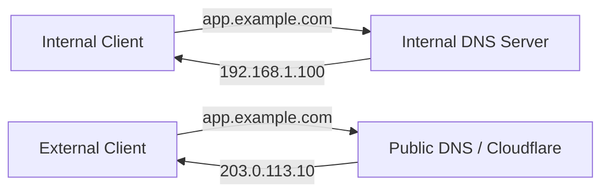

# How to Set Up Split DNS for Portainer Services - Services

Author: [nawazdhandala](https://www.github.com/nawazdhandala)

Tags: Portainer, DNS, Split DNS, Networking, Self-Hosted, Docker

Description: Learn how to configure split DNS so your Portainer services resolve to internal IPs from inside your network and external IPs from outside.

---

Split DNS (also called split-horizon DNS) lets the same hostname resolve differently depending on where the query originates. For Portainer services, this means internal clients hit your server directly on the LAN IP while external clients go through your public IP and reverse proxy - reducing latency, avoiding hairpin NAT, and keeping internal traffic off the internet.

---

## How Split DNS Works



---

## Step 1: Choose Your Internal DNS Server

Split DNS requires an internal DNS resolver that you control. Common options:

- **Pi-hole** (DNS sinkhole with custom records)
- **AdGuard Home** (DNS-based ad blocker with custom rewrites)
- **Bind9** (full-featured DNS server)
- **dnsmasq** (lightweight forwarder)

This guide uses **dnsmasq** as it's lightweight and easy to configure.

---

## Step 2: Install dnsmasq

```bash
# Install dnsmasq on your DNS server (Ubuntu/Debian)

sudo apt update && sudo apt install -y dnsmasq

# Stop systemd-resolved if it conflicts on port 53
sudo systemctl stop systemd-resolved
sudo systemctl disable systemd-resolved

# Point /etc/resolv.conf to localhost
echo "nameserver 127.0.0.1" | sudo tee /etc/resolv.conf
```

---

## Step 3: Configure Internal DNS Records

Add custom A records that point your service hostnames to internal IPs.

```bash
# /etc/dnsmasq.d/portainer-internal.conf
# These entries override public DNS for internal clients

# Portainer UI
address=/portainer.example.com/192.168.1.100

# Services managed by Portainer
address=/app1.example.com/192.168.1.100
address=/app2.example.com/192.168.1.100
address=/grafana.example.com/192.168.1.100

# Forward all other queries to upstream public DNS
server=1.1.1.1
server=8.8.8.8
```

```bash
# Restart dnsmasq to apply the new records
sudo systemctl restart dnsmasq

# Test internal resolution
nslookup portainer.example.com 127.0.0.1
```

---

## Step 4: Configure Public DNS

In your domain registrar or Cloudflare DNS, create public records pointing to your external IP.

```text
# Public DNS (e.g., Cloudflare) - resolves to your public IP
portainer.example.com   A   203.0.113.10
app1.example.com        A   203.0.113.10
app2.example.com        A   203.0.113.10
```

These public records are used by external clients. Internal clients will use your dnsmasq records instead.

---

## Step 5: Point Internal Devices to Your DNS Server

On each internal device or router DHCP settings, point DNS to your dnsmasq server.

```bash
# Test from an internal device using your DNS server
nslookup portainer.example.com 192.168.1.10
# Should resolve to: 192.168.1.100 (internal IP)

# Confirm external DNS resolves differently
nslookup portainer.example.com 1.1.1.1
# Should resolve to: 203.0.113.10 (public IP)
```

---

## Step 6: Configure Portainer's Nginx Reverse Proxy for Internal Services

With split DNS in place, your Nginx or Traefik proxy on the internal host handles all internal traffic.

```nginx
# /etc/nginx/sites-available/portainer-services.conf
server {
    listen 443 ssl;
    server_name portainer.example.com;

    ssl_certificate /etc/letsencrypt/live/portainer.example.com/fullchain.pem;
    ssl_certificate_key /etc/letsencrypt/live/portainer.example.com/privkey.pem;

    location / {
        proxy_pass https://127.0.0.1:9443;
        proxy_ssl_verify off;
        proxy_set_header Host $host;
        proxy_set_header X-Real-IP $remote_addr;
    }
}
```

---

## Summary

Split DNS for Portainer services routes internal clients directly to your LAN IP while external clients use your public IP. The key components are: an internal DNS server (dnsmasq, Pi-hole, or AdGuard) with custom A records for your service hostnames, matching public DNS records pointing to your external IP, and a reverse proxy on the internal host to terminate SSL and forward requests to Portainer containers.
