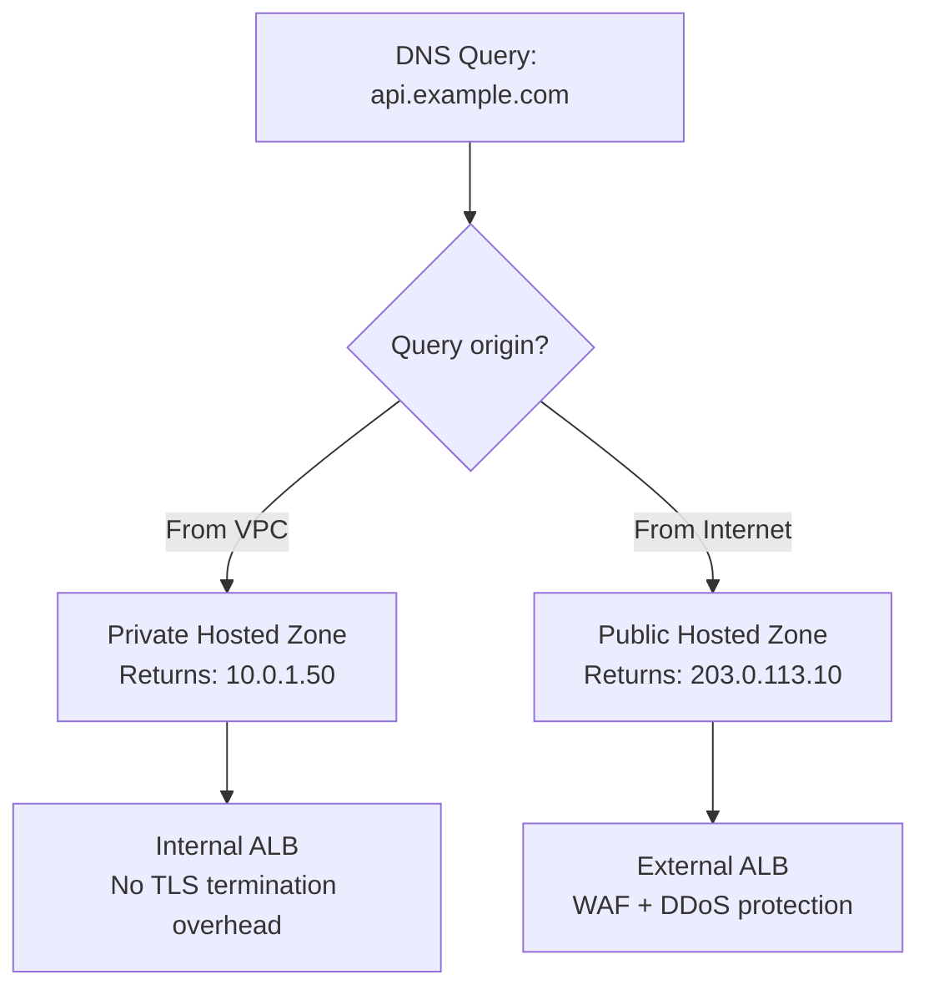

# How to Set Up Split-Horizon DNS with OpenTofu

Author: [nawazdhandala](https://www.github.com/nawazdhandala)

Tags: OpenTofu, DNS, Route53, Split-Horizon, Private DNS, VPC, Infrastructure as Code

Description: Learn how to implement split-horizon DNS using AWS Route 53 with OpenTofu, serving different DNS responses to internal and external clients for the same domain name.

---

Split-horizon DNS (also called split-brain DNS) serves different answers for the same hostname depending on where the query originates. Internal clients get private IP addresses; external clients get public IPs. OpenTofu manages both the public and private hosted zones to keep them in sync.

## Split-Horizon DNS Architecture



## Public Hosted Zone

```hcl
# public_dns.tf

resource "aws_route53_zone" "public" {
  name    = var.domain_name
  comment = "Public zone - internet-facing records"

  tags = {
    Environment = var.environment
    Type        = "public"
    ManagedBy   = "opentofu"
  }
}

# Public record points to external ALB
resource "aws_route53_record" "api_public" {
  zone_id = aws_route53_zone.public.zone_id
  name    = "api.${var.domain_name}"
  type    = "A"

  alias {
    name                   = aws_lb.external.dns_name
    zone_id                = aws_lb.external.zone_id
    evaluate_target_health = true
  }
}

resource "aws_route53_record" "app_public" {
  zone_id = aws_route53_zone.public.zone_id
  name    = "app.${var.domain_name}"
  type    = "A"

  alias {
    name                   = aws_lb.external.dns_name
    zone_id                = aws_lb.external.zone_id
    evaluate_target_health = true
  }
}
```

## Private Hosted Zone

```hcl
# private_dns.tf

# Private zone uses same domain - VPC association makes it authoritative internally
resource "aws_route53_zone" "private" {
  name    = var.domain_name
  comment = "Private zone - VPC-only records"

  vpc {
    vpc_id = aws_vpc.main.id
  }

  # Associate additional VPCs if needed
  dynamic "vpc" {
    for_each = var.additional_vpc_ids
    content {
      vpc_id = vpc.value
    }
  }

  tags = {
    Environment = var.environment
    Type        = "private"
    ManagedBy   = "opentofu"
  }

  # Prevent accidental public zone from being deleted when adding VPC
  lifecycle {
    ignore_changes = [vpc]
  }
}

# Private record points to internal ALB
resource "aws_route53_record" "api_private" {
  zone_id = aws_route53_zone.private.zone_id
  name    = "api.${var.domain_name}"
  type    = "A"

  alias {
    name                   = aws_lb.internal.dns_name
    zone_id                = aws_lb.internal.zone_id
    evaluate_target_health = true
  }
}

# Internal database endpoint - only resolvable within VPC
resource "aws_route53_record" "db_private" {
  zone_id = aws_route53_zone.private.zone_id
  name    = "db.${var.domain_name}"
  type    = "CNAME"
  ttl     = 60
  records = [aws_db_instance.main.address]
}

# Internal cache endpoint
resource "aws_route53_record" "cache_private" {
  zone_id = aws_route53_zone.private.zone_id
  name    = "cache.${var.domain_name}"
  type    = "CNAME"
  ttl     = 60
  records = [aws_elasticache_replication_group.main.primary_endpoint_address]
}
```

## Associating Additional VPCs

```hcl
# Associate peered VPCs with the private zone
resource "aws_route53_vpc_association_authorization" "peer" {
  vpc_id  = var.peer_vpc_id
  zone_id = aws_route53_zone.private.zone_id
}

resource "aws_route53_zone_association" "peer" {
  vpc_id  = aws_route53_vpc_association_authorization.peer.vpc_id
  zone_id = aws_route53_vpc_association_authorization.peer.zone_id

  depends_on = [aws_route53_vpc_association_authorization.peer]
}
```

## Shared Private Zone Module

```hcl
# When multiple environments share a VPC, use a single private zone
module "private_dns" {
  source = "./modules/private-dns"

  domain_name = var.domain_name
  vpc_id      = module.vpc.vpc_id

  records = {
    "api"   = { type = "CNAME", value = module.alb_internal.dns_name, ttl = 60 }
    "db"    = { type = "CNAME", value = module.rds.endpoint, ttl = 60 }
    "cache" = { type = "CNAME", value = module.elasticache.endpoint, ttl = 60 }
    "queue" = { type = "CNAME", value = module.sqs.endpoint, ttl = 300 }
  }
}
```

## Outputs

```hcl
output "public_zone_id" {
  description = "Public hosted zone ID"
  value       = aws_route53_zone.public.zone_id
}

output "private_zone_id" {
  description = "Private hosted zone ID"
  value       = aws_route53_zone.private.zone_id
}

output "public_name_servers" {
  description = "Configure these at your domain registrar"
  value       = aws_route53_zone.public.name_servers
}
```

## Best Practices

- Use the same domain name for both zones - Route 53 automatically returns the private zone records when a query originates from an associated VPC.
- Never put sensitive internal records (database endpoints, admin UIs) in the public zone - they will be publicly resolvable even if the ports are firewalled.
- Use `lifecycle { ignore_changes = [vpc] }` on the private zone to avoid Terraform conflicts when associating additional VPCs using separate `aws_route53_zone_association` resources.
- Keep TTLs low (60s) on private records for services that may change IPs during deployments.
- Test split-horizon behavior by querying from inside and outside the VPC: `dig api.example.com` should return different IPs from each location.
