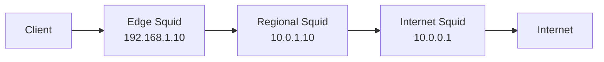

# How to Chain Squid Proxies Using cache_peer with IPv4 Addresses

Author: [nawazdhandala](https://www.github.com/nawazdhandala)

Tags: Squid, Proxy Chain, IPv4, cache_peer, Caching, Networking, Configuration

Description: Learn how to chain multiple Squid proxy servers together using cache_peer directives over IPv4 to build multi-tier caching hierarchies.

---

Chaining Squid proxies creates a tiered caching architecture: an edge proxy handles client requests, a regional proxy provides a larger shared cache, and the upstream proxy connects to the internet. Each tier reduces load on the next.

## Three-Tier Chain Architecture



## Edge Proxy Configuration (Tier 1)

```squid
# /etc/squid/squid.conf (edge proxy: 192.168.1.10)

http_port 3128

# Forward misses to the regional proxy
cache_peer 10.0.1.10 parent 3128 0 no-query default

# Never connect directly to the internet; always go through the chain
never_direct allow all

acl clients src 192.168.1.0/24
http_access allow clients
http_access deny all

# Cache size: small, local cache
cache_mem 256 MB
maximum_object_size 10 MB
```

## Regional Proxy Configuration (Tier 2)

```squid
# /etc/squid/squid.conf (regional proxy: 10.0.1.10)

http_port 3128

# Forward misses to the internet-facing upstream proxy
cache_peer 10.0.0.1 parent 3128 0 no-query default

never_direct allow all

# Allow connections from the edge proxy
acl edge_proxies src 192.168.1.10/32
http_access allow edge_proxies
http_access deny all

# Larger cache at the regional tier
cache_mem 1024 MB
cache_dir ufs /var/spool/squid 20000 16 256
maximum_object_size 50 MB
```

## Upstream/Internet Proxy Configuration (Tier 3)

```squid
# /etc/squid/squid.conf (internet proxy: 10.0.0.1)

http_port 3128

# This tier connects directly to the internet (no further parent)
# No cache_peer directive; Squid uses direct connections by default

# Allow connections only from the regional proxy
acl regional_proxy src 10.0.1.10/32
http_access allow regional_proxy
http_access deny all

# Largest cache at the internet tier
cache_mem 2048 MB
cache_dir ufs /var/spool/squid 50000 16 256
```

## Testing the Chain

```bash
# Request via the edge proxy; should traverse the full chain on a cold cache
curl -x http://192.168.1.10:3128 http://example.com/largefile.iso

# On cache hit (repeat request):
curl -x http://192.168.1.10:3128 http://example.com/largefile.iso

# Check cache hit status in access logs on each tier
grep "example.com" /var/log/squid/access.log
# Look for: TCP_HIT (served from this tier's cache), TCP_MISS (forwarded upstream)
```

## Monitoring Peer Statistics

```bash
# View cache peer connections on the edge proxy
squidclient -h 192.168.1.10 -p 3128 mgr:server_list

# Show peer bytes transferred
squidclient -h 192.168.1.10 -p 3128 mgr:5min | grep -i peer
```

## Key Takeaways

- Each tier configures the next tier's IPv4 address as its `cache_peer parent`.
- Use `never_direct allow all` on intermediate tiers to enforce the chain.
- Set `proxy-only` on intermediate caches if they shouldn't store objects locally.
- Monitor each tier's access log for `TCP_HIT` vs `TCP_MISS` to measure caching effectiveness.
