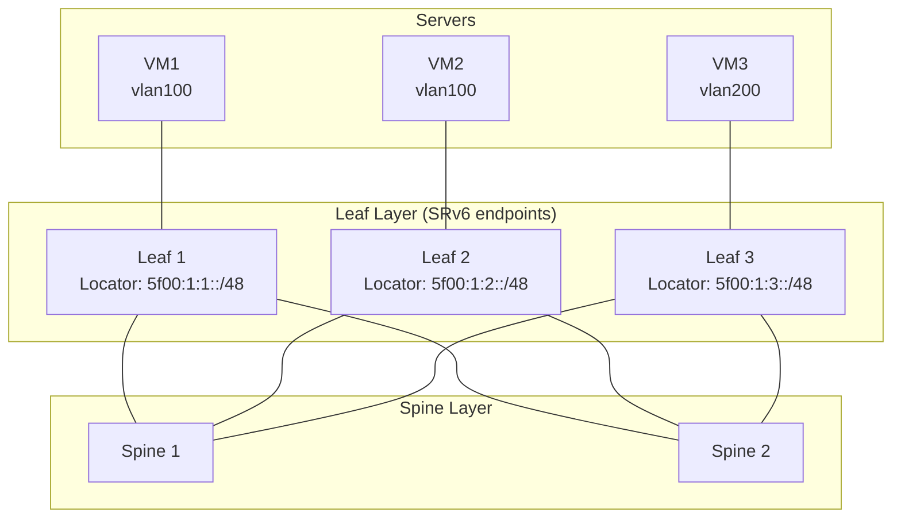

# How to Understand SRv6 in Data Center Fabrics

Author: [nawazdhandala](https://www.github.com/nawazdhandala)

Tags: SRv6, Data Center, EVPN, BGP, Fabric, Networking

Description: Understand how SRv6 is deployed in data center fabric architectures to replace VXLAN and MPLS for L2/L3 overlay services using EVPN SRv6.

## Introduction

Data centers traditionally use VXLAN with BGP EVPN for overlay services. SRv6 with EVPN offers a more efficient alternative: the SRv6 SIDs replace VXLAN VNIs and MPLS labels, providing the same L2/L3 services using only IPv6.

## SRv6 Data Center Architecture



## SRv6 EVPN: L2VPN (VPLS)

SRv6 EVPN uses End.DX2 SIDs for L2 bridging.

```bash
# Leaf 1: configure End.DX2 SID for VLAN 100 bridge
# End.DX2 decapsulates SRv6 and delivers to L2 interface

ip -6 route add 5f00:1:1:0:e010::/128 \
  encap seg6local action End.DX2 \
  dev bridge100   # L2 bridge interface for VLAN 100

# Configure BGP EVPN to advertise MAC/IP routes with SRv6 SID
# (FRRouting or GoBGP configuration)
```

FRRouting BGP EVPN with SRv6:

```
! frr.conf — BGP EVPN SRv6 L2VPN
router bgp 65000
 !
 address-family l2vpn evpn
  advertise-all-vni
  !
  vni 100
   rd 65000:100
   route-target import 65000:100
   route-target export 65000:100
   !
   segment-routing srv6 locator LEAF1
   !
  !
 !
!
```

## SRv6 EVPN: L3VPN (IP VRF)

For L3 routing, SRv6 uses End.DT6 (IPv6) or End.DT4 (IPv4) SIDs.

```bash
# Configure End.DT6 for tenant VRF
ip vrf add TENANT_A
ip -6 route add 5f00:1:1:0:e000::/128 \
  encap seg6local action End.DT6 \
  vrftable $(ip vrf show TENANT_A | awk '{print $3}') \
  dev lo

# Configure End.DT4 for IPv4 tenant traffic
ip -6 route add 5f00:1:1:0:e001::/128 \
  encap seg6local action End.DT4 \
  vrftable $(ip vrf show TENANT_A | awk '{print $3}') \
  dev lo
```

## BGP EVPN Route Types with SRv6

SRv6 replaces the MPLS label field in EVPN NLRI with a SRv6 SID.

| EVPN Route Type | Function | SRv6 SID Used |
|---|---|---|
| Type 2 (MAC/IP) | L2 forwarding | End.DX2 or End.DX6 |
| Type 3 (Inclusive Multicast) | BUM traffic | End.DT2M |
| Type 5 (IP Prefix) | L3 routing | End.DT4 or End.DT6 |

## Underlay Requirements

The SRv6 data center underlay needs:

```bash
# 1. IS-IS for SRv6 locator advertisement between leaves and spines
# 2. No VXLAN — only native IPv6 forwarding in the underlay

# Configure IS-IS on leaf with SRv6 locator advertisement
# (Quagga/FRR)
interface eth0
 ip router isis FABRIC
 ipv6 router isis FABRIC
!
router isis FABRIC
 net 49.0001.0000.0000.0001.00
 is-type level-2-only
 topology ipv6-unicast
 segment-routing srv6
  locator LEAF1
  !
 !
!
```

## Advantages Over VXLAN

| Aspect | VXLAN + BGP EVPN | SRv6 + BGP EVPN |
|---|---|---|
| Overhead | 50 bytes (UDP+VXLAN) | 40 bytes (IPv6 only) |
| Hardware requirements | VTEP support | SRv6 hardware support |
| TE integration | Separate mechanism | Native via SRH |
| VPN type | VNI-based | SID function-based |
| Visibility | VNI opaque to IP tools | SIDs are routable IPv6 |

## Monitoring SRv6 DC Fabric

```bash
# Check locator reachability (IS-IS)
show isis route srv6

# Check EVPN routes with SRv6 SIDs
show bgp l2vpn evpn detail | grep "SRv6"

# Verify end-to-end VM connectivity
ping6 -I TENANT_A 2001:db8:tenant-a::vm2
```

## Conclusion

SRv6 EVPN simplifies data center fabrics by unifying the L2/L3 overlay and underlay into a single IPv6 protocol stack. SIDs replace VNIs and MPLS labels while adding traffic engineering capabilities. Use OneUptime to monitor tenant L3VPN reachability and EVPN control plane health across your data center fabric.
