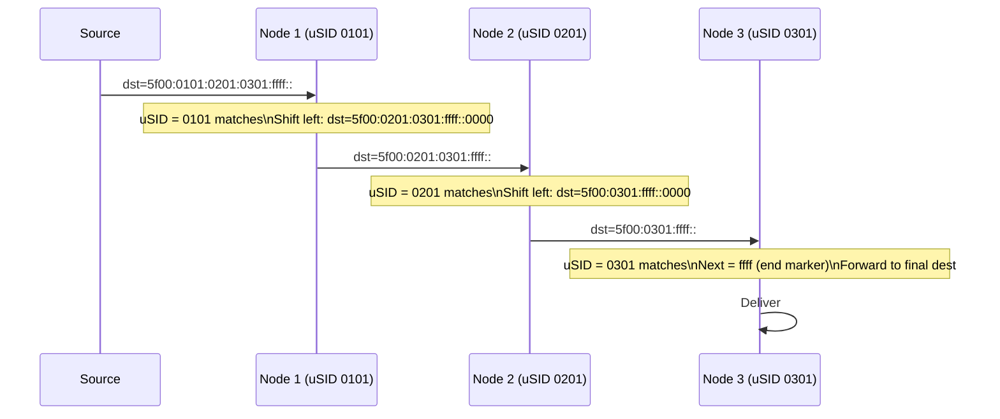

# How to Understand SRv6 micro-SID (uSID) Compression

Author: [nawazdhandala](https://www.github.com/nawazdhandala)

Tags: SRv6, uSID, Micro-SID, Compression, RFC 9631, Networking

Description: Understand SRv6 micro-SID (uSID) compression that packs multiple node identifiers into a single 128-bit SID, drastically reducing SRv6 header overhead.

## Introduction

Standard SRv6 uses one full 128-bit SID per network function. For paths with many hops, this creates large SRH headers. RFC 9631 defines micro-SID (uSID), which packs multiple 16-bit or 32-bit micro-segment IDs into a single 128-bit SID container, reducing overhead by up to 6x.

## The Overhead Problem

```
Standard SRv6 path: 4 waypoints
  Outer IPv6 header: 40 bytes
  SRH:               8 + (4 × 16) = 72 bytes
  Total overhead:    112 bytes per packet

SRv6 with uSID: 4 waypoints in one container
  Outer IPv6 header: 40 bytes
  SRH:               8 + 16 = 24 bytes  (single 128-bit container)
  Total overhead:    64 bytes per packet
```

## uSID Structure

A uSID container is a single 128-bit IPv6 address that encodes multiple micro-SIDs.

```
uSID format (16-bit micro-SIDs):
128 bits = 8 × 16-bit micro-SID slots

Example container: 5f00:0101:0201:0301:ffff::
  5f00 = SRv6 SID address space
  0101 = uSID for node 1 (hop 1)
  0201 = uSID for node 2 (hop 2)
  0301 = uSID for node 3 (hop 3)
  ffff = End-of-uSID-list marker
  ::   = unused slots (zero)
```

## How uSID Processing Works



## Configuring uSID on Linux

```bash
# Enable uSID End behavior on Linux (kernel 5.4+)
# uSID End = End with Penultimate Segment Popping Unsolicited (PSP-USD)

# Configure a uSID locator address
ip -6 addr add 5f00:0101::/32 dev lo

# Add End.uN (uSID node endpoint)
ip -6 route add 5f00:0101::/32 \
  encap seg6local action uN \
  dev lo

# The kernel will process uSID: shift next uSID to front
# when a packet arrives with 5f00:0101:XXXX:YYYY::
```

## Configuring uSID on Cisco IOS-XR

```
! Enable micro-SID on locator
segment-routing srv6
 locators
  locator MAIN
   prefix 5f00:1::/32
   block-length 16
   node-length 16          ! 16-bit node portion = micro-SID
   func-length 0           ! Functions via uBehavior suffix
   micro-segment
    behavior unode psp-usd ! Penultimate Segment Popping
   !
  !
 !
!
```

## uSID Encoding Formats

### 32-bit Micro-SIDs (f3216 format)

Packs 3 micro-SIDs per 128-bit container with more bits per SID.

```
Format: 5f00:NNNN:NNNN:NNNN:FFFF::
  Where NNNN:NNNN = 32-bit node ID
  And FFFF = function

Container: 5f00:0001:0001:0002:0001:0003:0001:ffff
  Node 1 func 1, Node 2 func 1, Node 3 func 1
```

### 16-bit Micro-SIDs (Most Common)

```python
def pack_usids(block: str, usids: list) -> str:
    """
    Pack multiple 16-bit micro-SIDs into a uSID container.

    block: first 16 bits (e.g., "5f00")
    usids: list of 16-bit uSID values (up to 7)
    """
    import ipaddress

    if len(usids) > 7:
        raise ValueError("Maximum 7 micro-SIDs per container")

    # Pad with zeros and end marker
    slots = usids + [0xffff] + [0] * (7 - len(usids))

    # Build 128-bit address
    addr_int = (int(block, 16) << 112)
    for i, usid in enumerate(slots):
        addr_int |= (usid << (112 - 16 - i * 16))

    return str(ipaddress.IPv6Address(addr_int))

# Example: pack 3 uSIDs into one container
container = pack_usids("5f00", [0x0101, 0x0201, 0x0301])
print(f"uSID container: {container}")
# Output: 5f00:101:201:301:ffff::
```

## Benefits of uSID

| Metric | Standard SRv6 | SRv6 uSID |
|---|---|---|
| SIDs per packet | 1 per 128-bit entry | 7 per 128-bit entry |
| Overhead for 4 hops | 112 bytes | 64 bytes |
| Hardware requirements | Same | Same (uses existing IPv6) |
| MTU impact | High | Low |

## Conclusion

uSID compression makes SRv6 competitive with MPLS on header overhead while retaining IPv6 programmability. Packing up to 7 micro-SIDs per 128-bit container is sufficient for most TE and service chaining scenarios. uSID adoption is growing rapidly as a path to practical SRv6 deployment. Monitor uSID path latency with OneUptime to validate compression doesn't introduce processing delays.
