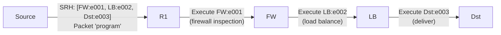

# How to Understand SRv6 Network Programming

Author: [nawazdhandala](https://www.github.com/nawazdhandala)

Tags: SRv6, Network Programming, SID, Service Chaining, RFC 8986, Networking

Description: Understand SRv6 Network Programming, the model for encoding forwarding and service instructions directly in IPv6 packets using Segment Identifiers.

## Introduction

SRv6 Network Programming, defined in RFC 8986, is a framework for encoding sequences of network behaviors directly in IPv6 packet headers. Each Segment Identifier (SID) in the Segment Routing Header (SRH) represents a specific network function at a specific node.

## The Programming Model

Traditional networking: packets are forwarded based on destination lookup at each hop.

SRv6 network programming: the source encodes a complete forwarding/service program in the packet header.



## SRv6 Instruction Set Architecture

RFC 8986 defines a set of standard behaviors (instructions):

### Transit Functions (no SRH processing)

```text
T: Transit - forward without changing SRH
   SID format: none (implicit, no SRH for plain transit)
```

### Endpoint Functions (process SRH at this node)

```text
End        - Update SL, forward to next SID destination
End.X      - Update SL, forward out specific interface
End.T      - Update SL, lookup in specified table
End.B6     - Insert SRH (policy insertion at midpoint)
End.B6.Encaps - Encapsulate with new SRH

Endpoint with Decapsulation:
End.DX2    - Decap + L2 cross-connect
End.DX4    - Decap + IPv4 cross-connect
End.DX6    - Decap + IPv6 cross-connect
End.DT4    - Decap + IPv4 table lookup (L3VPN)
End.DT6    - Decap + IPv6 table lookup (L3VPN)
End.DT46   - Decap + IPv4/IPv6 table lookup
```

## Service Chaining Example

```sql
Goal: Route traffic through Firewall → IDS → Load Balancer → Server

Step 1: Assign SIDs
  Firewall (FW):   5f00:1:1:0:e001::   End.X (inspect + forward)
  IDS:             5f00:2:1:0:e001::   End.X (inspect + forward)
  Load Balancer:   5f00:3:1:0:e002::   End.X (select server)
  Server A:        5f00:4:1:0:e000::   End.DT6

Step 2: Source (or ingress PE) adds SRH
  Original packet: src=client dst=server
  After encapsulation:
    Outer IPv6: src=ingress dst=FW:e001
    SRH: [IDS:e001, LB:e002, Server:e000], SL=2
    Inner packet (original)
```

## Linux iproute2 SRv6 Programming

```bash
# Configure End function (plain routing endpoint)

ip -6 route add 5f00:1:1::1/128 \
  encap seg6local action End \
  dev lo

# Configure End.X (forward to specific next-hop)
ip -6 route add 5f00:1:1:0:e001::/128 \
  encap seg6local action End.X \
  nh6 2001:db8::2 \
  dev eth0

# Configure End.DT6 (IPv6 L3VPN endpoint)
ip -6 route add 5f00:1:1:0:e000::/128 \
  encap seg6local action End.DT6 \
  vrftable 100 \
  dev lo

# Configure End.DX4 (IPv4 decap and forward)
ip -6 route add 5f00:1:1:0:e002::/128 \
  encap seg6local action End.DX4 \
  nh4 192.168.1.1 \
  dev eth1
```

## Source Routing (Ingress Node Encapsulation)

```bash
# At the ingress node: encapsulate a packet with an SRH
# Route packets matching 10.0.0.0/24 via SRv6 path

ip -6 route add 5f00:4::/32 \
  encap seg6 mode encap \
  segs 5f00:1:1:0:e001::,5f00:2:1:0:e001::,5f00:3:1:0:e000:: \
  dev eth0

# Verify encapsulation is applied
ip -6 route show | grep seg6
```

## Inline Mode (No Encapsulation)

```bash
# Inline mode inserts SRH without encapsulation
# (source address stays unchanged)
ip -6 route add 5f00:4::/32 \
  encap seg6 mode inline \
  segs 5f00:1:1::,5f00:2:1:: \
  dev eth0
```

## Conclusion

SRv6 Network Programming provides a flexible instruction set for encoding forwarding and service instructions directly in IPv6 packets. The programmability enables service chaining, traffic engineering, and VPN services without additional signaling protocols. Monitor SRv6 service chain health end-to-end with OneUptime by checking application response from the path's perspective.
