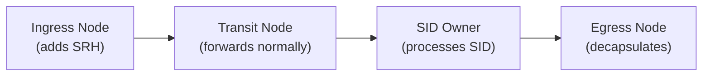

# How to Understand SRv6 Transit Functions

Author: [nawazdhandala](https://www.github.com/nawazdhandala)

Tags: SRv6, Transit Functions, Segment Routing, IPv6, Forwarding, RFC 8986

Description: Understand SRv6 transit node behaviors for routers that are in the SRv6 path but do not own the current SID, including T, T.Insert, T.Encaps, and T.Encaps.L2.

## Introduction

SRv6 transit functions apply to nodes that are in the path of an SRv6 packet but are not the owner of the current active SID. These nodes either forward transparently or apply additional behaviors like inserting new segment lists.

## Transit Node Categories



- **Ingress**: Creates the SRv6 encapsulation
- **Transit**: Forwards based on IPv6 destination (the active SID) without SRH processing
- **Endpoint**: Owns the SID, executes the End function
- **Egress**: Final decapsulation

## T — Plain Transit

A transit node simply forwards the packet based on the IPv6 destination address (the current SID), without any SRH processing.

```
IPv6 packet with SRH:
  dst = 5f00:1:2:0:e001::  (owned by Router 2)
  SRH: [5f00:3:1::, 5f00:2:1::, 5f00:1:2:0:e001::], SL=0

Transit Router 1 (does not own 5f00:1:2::):
  1. Looks up 5f00:1:2:0:e001:: in FIB
  2. Finds route pointing toward Router 2
  3. Forwards the packet unchanged
  (No SRH modification)
```

No special configuration is needed on transit nodes — they just forward IPv6 normally.

## T.Insert — Insert an SRH at a Transit Node

T.Insert inserts a new SRH (or adds segments to an existing one) at a transit point, enabling midpoint traffic engineering.

```bash
# Linux: insert SRH at a transit node for matching traffic
ip -6 route add 2001:db8:dest::/48 \
  encap seg6 mode insert \
  segs 5f00:1:2::,5f00:2:3:: \
  dev eth0

# Note: "insert" mode adds the SRH inline without encapsulation
# The source address of the original packet is preserved
```

**Use case**: Policy-based routing at a midpoint without full encapsulation.

## T.Encaps — Encapsulate with SRH at Transit

```bash
# Encap mode: creates a new outer IPv6 header + SRH
ip -6 route add 2001:db8:dest::/48 \
  encap seg6 mode encap \
  segs 5f00:1:2:0:e001::,5f00:2:3:0:e000:: \
  dev eth0

# The original packet becomes the inner payload
# Useful for color-based TE (BGP Color community → SRv6 policy)
```

## T.Encaps.L2 — L2 Frame Encapsulation

Encapsulates an entire L2 frame in an SRv6 packet (L2 VPN over SRv6).

```bash
# Encapsulate Ethernet frames in SRv6 (EVPN use case)
ip -6 route add 2001:db8:dest::/48 \
  encap seg6 mode l2encap \
  segs 5f00:1:2:0:e010:: \
  dev eth0
```

## T.Encaps.Red — Reduced Encapsulation

When the first segment is the local node, it can be omitted from the SRH to save 16 bytes.

```
Standard encap:
  Outer dst = S[2]
  SRH: [S[0]=Dst, S[1]=Mid, S[2]=Ingress], SL=2

Reduced encap (T.Encaps.Red):
  Outer dst = S[1] (skip S[2] = local node)
  SRH: [S[0]=Dst, S[1]=Mid], SL=1
  (Ingress SID omitted since we are already here)
```

```bash
# Linux supports reduced encap via "encap segs" that omit the first segment
# The kernel automatically performs this optimization
ip -6 route add 2001:db8:dest::/48 \
  encap seg6 mode encap.red \
  segs 5f00:mid1::,5f00:dst:: \
  dev eth0
```

## Combining Transit and Endpoint Functions

```
Example full packet lifecycle:

Packet: src=client, dst=server
Goal: route via FW (5f00:fw::) → LB (5f00:lb::) → DT6 (5f00:egress:0:e000::)

At ingress node (T.Encaps):
  Outer: src=ingress, dst=5f00:fw::
  SRH: [5f00:egress:0:e000::, 5f00:lb::, 5f00:fw::], SL=2

At FW (End.X):
  SL-- → 1, dst=5f00:lb::, forward via FW's inspection path

At LB (End.X):
  SL-- → 0, dst=5f00:egress:0:e000::, select server

At Egress (End.DT6):
  Decap outer IPv6, route inner packet in VRF table 200
```

## Conclusion

SRv6 transit functions keep transit nodes simple — they forward based on IPv6 destination addresses without understanding the SRH. Policy insertion via T.Insert and T.Encaps enables midpoint traffic engineering. Understanding transit vs endpoint roles is key to SRv6 topology planning. Use OneUptime to monitor each hop in your SRv6 path for latency and availability.
