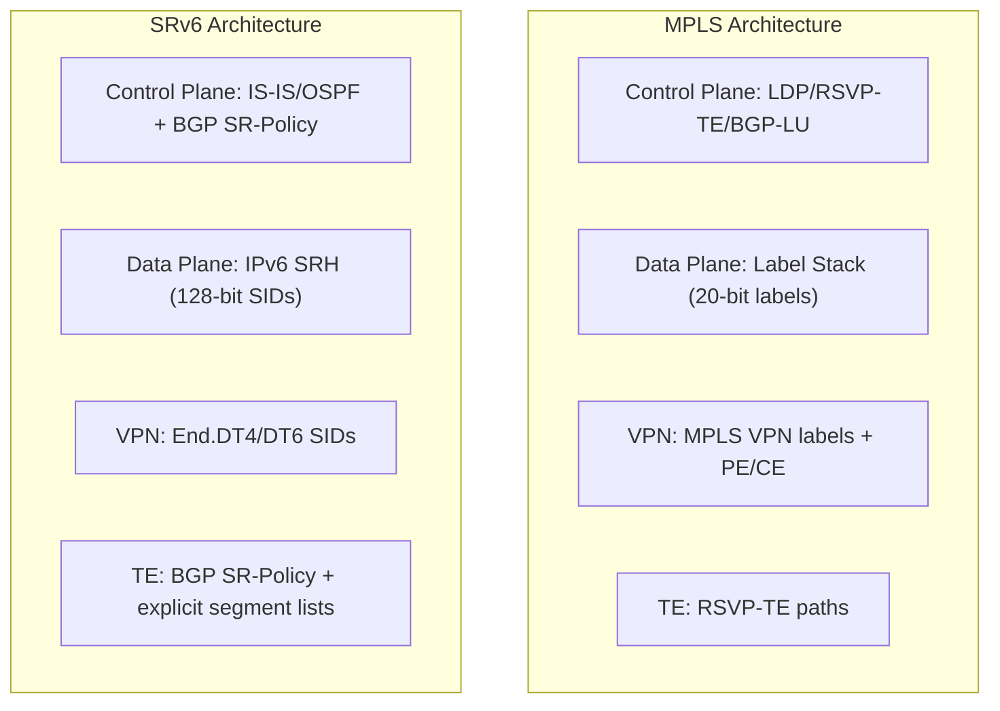

# How to Understand SRv6 vs MPLS Comparison

Author: [nawazdhandala](https://www.github.com/nawazdhandala)

Tags: SRv6, MPLS, Comparison, Segment Routing, Networking, Migration

Description: Compare SRv6 and MPLS architectures across dimensions of protocol complexity, hardware requirements, operational simplicity, and migration path for enterprise and ISP networks.

## Introduction

MPLS has been the workhorse of service provider networks for 25 years. SRv6 offers a modern alternative that leverages the IP forwarding infrastructure most operators already have. Understanding their trade-offs helps make informed migration decisions.

## Protocol Architecture Comparison



## Feature Comparison Table

| Feature | MPLS | SRv6 |
|---|---|---|
| Label/SID size | 20 bits | 128 bits |
| Header overhead | ~4 bytes/label | 40 bytes base + 16 bytes/SID |
| Protocol stack | LDP/RSVP-TE/BGP-LU | IS-IS/OSPF/BGP (fewer protocols) |
| L3VPN | MPLS VPN (RFC 4364) | SRv6 BGP VPN (RFC 9252) |
| L2VPN | MPLS EVPN/VPLS | SRv6 EVPN |
| Traffic engineering | RSVP-TE (stateful) | SR-Policy (stateless) |
| OAM/BFD | MPLS BFD | IPv6 BFD (standard) |
| Visibility | Labels opaque | SIDs are IPv6 addresses |
| Hardware support | Ubiquitous | Growing |
| Path MTU | 1500 - label stack | 1500 - 40 bytes (1 SID) |

## Header Overhead Analysis

```python
# Calculate SRv6 vs MPLS overhead for typical scenarios

def mpls_overhead(num_labels: int) -> int:
    """MPLS overhead: 4 bytes per label."""
    return num_labels * 4

def srv6_overhead(num_sids: int) -> int:
    """
    SRv6 overhead:
    - IPv6 header: 40 bytes (outer encap)
    - SRH fixed: 8 bytes
    - Each SID: 16 bytes
    """
    return 40 + 8 + (num_sids * 16)

# Typical 3-label MPLS VPN
mpls_vpn = mpls_overhead(3)  # Inner VC + Outer transport + LDP = 12 bytes

# SRv6 L3VPN (ingress encap + 2 waypoints + End.DT6)
srv6_vpn = srv6_overhead(3)  # 40 + 8 + 48 = 96 bytes

print(f"MPLS L3VPN overhead: {mpls_vpn} bytes")
print(f"SRv6 L3VPN overhead: {srv6_vpn} bytes")
print(f"SRv6 extra overhead: {srv6_vpn - mpls_vpn} bytes per packet")

# On a 1500-byte frame:
print(f"MPLS efficiency: {(1500-mpls_vpn)/1500*100:.1f}%")
print(f"SRv6 efficiency: {(1500-srv6_vpn)/1500*100:.1f}%")
```

## When to Choose SRv6

**Choose SRv6 when:**
- Building a new greenfield network
- IPv6-only core is the goal
- Simplified operations is a priority
- SRv6 hardware is available (Broadcom, Intel P4, etc.)
- Programmable network behaviors are needed

**Stick with MPLS when:**
- Legacy PE routers without SRv6 hardware support
- Extremely high packet rates where 80-byte overhead matters
- Team expertise and tooling is deep in MPLS

## Migration Strategy: SR-MPLS → SRv6

```
Phase 1: Deploy SR-MPLS (Segment Routing with MPLS labels)
  - Simpler migration from traditional MPLS
  - Same control plane as SRv6 (IS-IS, OSPF, BGP SR-Policy)

Phase 2: Parallel SRv6 deployment
  - Enable IPv6 forwarding in underlay
  - Configure SRv6 locators alongside MPLS

Phase 3: Migrate services to SRv6
  - Move L3VPN from MPLS VPN to SRv6 End.DT4/DT6
  - Move L2VPN from MPLS EVPN to SRv6 EVPN

Phase 4: Decommission MPLS
  - Remove LDP/RSVP-TE after all services migrated
```

## uSID Compression (Closing the Overhead Gap)

uSID reduces SRv6 overhead to near-MPLS levels by packing multiple micro-SIDs into a single 128-bit SID.

```
Standard SRv6 SID: 5f00:1:2:0:e001::   (1 node per SID)
uSID container:    5f00:0101:0201:0301:: (3 nodes in one SID)
```

With uSID, 3 hops fit in a single 16-byte SID instead of 48 bytes.

## Conclusion

SRv6 offers compelling advantages in protocol simplicity, programmability, and end-to-end visibility. MPLS remains more hardware-efficient for high-scale deployments. For most new deployments, SRv6 with uSID is the right architectural choice. Use OneUptime to monitor both MPLS and SRv6 services during parallel deployment to validate equivalent performance before MPLS decommission.
