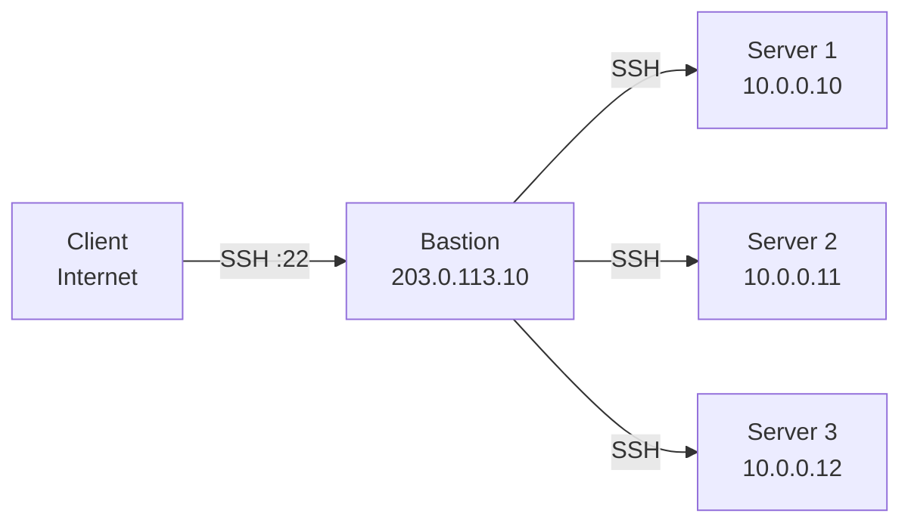

# How to Set Up an SSH Bastion Host for IPv4 Network Access

Author: [nawazdhandala](https://www.github.com/nawazdhandala)

Tags: SSH, Bastion Host, IPv4, Security, Jump Server, Network Access

Description: Configure an SSH bastion host as a secure entry point for accessing internal IPv4 servers, implementing jump server functionality with proper access controls.

## Introduction

A bastion host (jump server) is a hardened SSH server on a public IPv4 address that provides a single, auditable entry point to internal networks. All access to internal servers flows through the bastion, reducing the attack surface.

## Architecture



## Bastion Host sshd_config

Harden the bastion SSH configuration:

```bash
# /etc/ssh/sshd_config (on bastion server)

# Listen on public IPv4 only

ListenAddress 203.0.113.10
Port 22

# Disable root login
PermitRootLogin no

# Key-based auth only
PasswordAuthentication no
PubkeyAuthentication yes

# Disable X11 and forwarding for most users
X11Forwarding no
AllowTcpForwarding no   # Default off; override per-user below

# Only allow specific users
AllowUsers alice bob carol

# For users who need forwarding:
Match User alice
    AllowTcpForwarding yes

# Timeout settings
ClientAliveInterval 300
ClientAliveCountMax 2
LoginGraceTime 30

# Logging
LogLevel VERBOSE
```

## Client-Side ~/.ssh/config with ProxyJump

Configure SSH to automatically use the bastion:

```bash
# ~/.ssh/config

# Bastion host definition
Host bastion
    HostName 203.0.113.10
    User alice
    AddressFamily inet
    IdentityFile ~/.ssh/id_rsa_bastion

# Internal servers: jump through bastion automatically
Host 10.0.0.*
    User ubuntu
    IdentityFile ~/.ssh/id_rsa_internal
    ProxyJump bastion
    AddressFamily inet

# Named shortcuts for specific servers
Host web-prod
    HostName 10.0.0.10
    User deploy
    ProxyJump bastion

Host db-primary
    HostName 10.0.0.20
    User postgres
    ProxyJump bastion
```

## Connecting Through the Bastion

```bash
# Direct access through bastion to internal server
ssh web-prod

# Or inline with -J flag
ssh -J alice@203.0.113.10 ubuntu@10.0.0.10

# Force IPv4 throughout
ssh -4 -J alice@203.0.113.10 ubuntu@10.0.0.10

# SCP through bastion
scp -J alice@203.0.113.10 file.txt ubuntu@10.0.0.10:/home/ubuntu/

# Port forwarding through bastion to internal service
ssh -L 5432:10.0.0.20:5432 -J alice@203.0.113.10 ubuntu@10.0.0.10 -N
```

## Auditing Bastion Access

```bash
# Monitor all connections through the bastion
sudo tail -f /var/log/auth.log | grep sshd

# Log all commands executed on the bastion (if using it as a shell server)
# Add to /etc/profile or /etc/bash.bashrc:
# export HISTFILE=/var/log/bash_history/$(whoami)_$(date +%F)
# export HISTTIMEFORMAT="%F %T "

# Use ForceCommand to log or restrict what users can do
# Match User alice
#     ForceCommand /usr/local/bin/audit-wrapper

# Use auditd for comprehensive syscall logging
sudo auditctl -w /etc/ssh/sshd_config -p rwxa -k sshd_config
```

## Bastion Firewall Rules

```bash
# Allow SSH from internet only (restrict to known IPs if possible)
sudo iptables -A INPUT -p tcp --dport 22 -j ACCEPT

# Allow SSH from bastion to internal servers
sudo iptables -A FORWARD -s 203.0.113.10 -p tcp --dport 22 \
  -d 10.0.0.0/8 -j ACCEPT
sudo iptables -A FORWARD -j DROP

# Block internet from reaching internal directly
sudo iptables -A FORWARD -i eth0 -d 10.0.0.0/8 -j DROP
```

## Conclusion

An SSH bastion host centralizes and audits all administrative access to internal IPv4 infrastructure. Configure `ProxyJump` in `~/.ssh/config` to make bastion-mediated access transparent to developers. Harden the bastion with key-only auth, `PermitRootLogin no`, and `AllowUsers`, and use firewall rules to ensure the bastion is the only path to internal servers.
