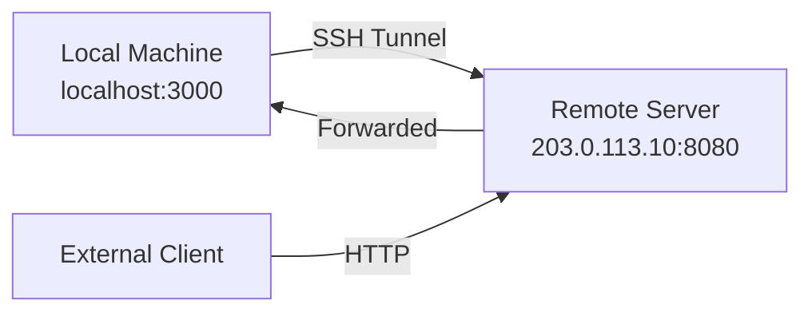

# How to Expose a Local Service to a Remote IPv4 Network via SSH

Author: [nawazdhandala](https://www.github.com/nawazdhandala)

Tags: SSH, IPv4, Remote Port Forwarding, Tunneling, Networking, Security, Development

Description: Learn how to use SSH remote port forwarding to make a locally running service accessible on a remote server's IPv4 address.

---

SSH remote port forwarding lets you expose a service running on your local machine through a remote server's IPv4 address. This is useful for sharing development servers, testing webhooks, or bypassing NAT without opening firewall rules.

## How Remote Port Forwarding Works



An external client connects to `203.0.113.10:8080`. SSH tunnels that connection back to `localhost:3000` on your local machine.

## Basic Remote Port Forward

```bash
# Expose local port 3000 on the remote server's port 8080
# -R [remote_bind]:[remote_port]:[local_host]:[local_port]
ssh -R 8080:localhost:3000 user@203.0.113.10

# Keep the session running in the background
ssh -fN -R 8080:localhost:3000 user@203.0.113.10
```

After this command, anyone who connects to `203.0.113.10:8080` is forwarded to your `localhost:3000`.

## Binding to a Specific IPv4 Address on the Remote Server

By default, the forwarded port binds to `127.0.0.1` on the remote server (not accessible externally). To bind to a public IPv4 address, use the full bind syntax:

```bash
# Bind to a specific remote IPv4 address (requires GatewayPorts yes on server)
ssh -R 203.0.113.10:8080:localhost:3000 user@203.0.113.10
```

```bash
# /etc/ssh/sshd_config on the remote server
# Allow remote port forwards to bind to non-loopback addresses
GatewayPorts yes
```

## Persistent Tunnel with SSH Config

```bash
# ~/.ssh/config
Host expose-tunnel
    HostName 203.0.113.10
    User deploy
    IdentityFile ~/.ssh/tunnel_key
    # Remote port 8080 → local service on port 3000
    RemoteForward 8080 localhost:3000
    # Keep the connection alive
    ServerAliveInterval 30
    ServerAliveCountMax 3
    ExitOnForwardFailure yes
```

```bash
# Start the tunnel using the named host
ssh -fN expose-tunnel
```

## Auto-Reconnect with autossh

```bash
# Install autossh
apt install autossh -y

# Automatically reconnect if the tunnel drops
autossh -M 0 -fN \
  -o "ServerAliveInterval=30" \
  -o "ServerAliveCountMax=3" \
  -R 8080:localhost:3000 \
  user@203.0.113.10
```

## Forwarding Multiple Ports

```bash
# Expose multiple local services through a single SSH session
ssh -fN \
  -R 8080:localhost:3000 \   # Web app
  -R 5432:localhost:5432 \   # PostgreSQL (only accessible from remote loopback)
  user@203.0.113.10
```

## Key Takeaways

- `ssh -R remote_port:localhost:local_port` exposes a local service on the remote server.
- By default, the remote port binds to `127.0.0.1`; set `GatewayPorts yes` on the server to bind to a public IPv4 address.
- Use `autossh` for persistent tunnels that reconnect automatically after network interruptions.
- Use `-fN` to run the tunnel in the background without starting a shell session.
