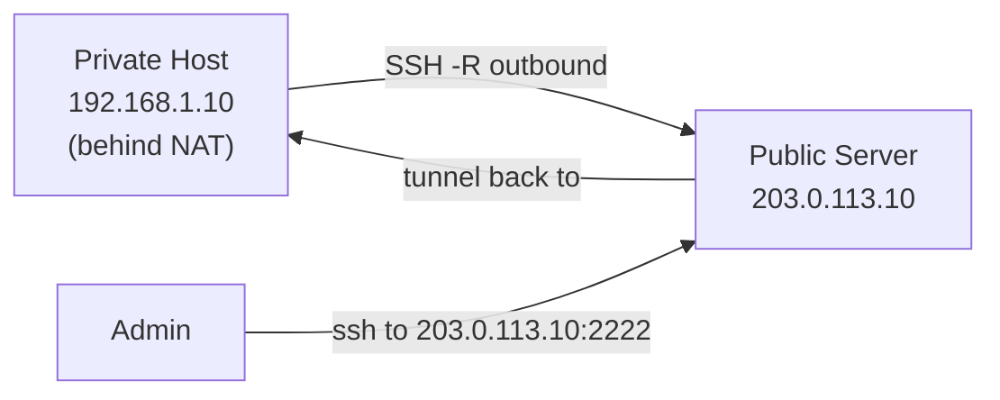

# How to Create a Reverse SSH Tunnel to Access IPv4 Hosts Behind NAT

Author: [nawazdhandala](https://www.github.com/nawazdhandala)

Tags: SSH, Reverse Tunnel, IPv4, NAT, Remote Access, Networking

Description: Create a reverse SSH tunnel from a NAT-ed IPv4 host to a public server, enabling inbound access to machines that have no public IPv4 address.

## Introduction

Machines behind NAT have no public IPv4 address and cannot be reached directly from the internet. A reverse SSH tunnel solves this: the private machine initiates an outbound SSH connection to a public server, creating a port on that server that tunnels back into the private network.

## Architecture



## Creating the Reverse Tunnel

On the private host behind NAT:

```bash
# Open port 2222 on the public server that tunnels back to port 22 here
ssh -4 -fN \
  -R 2222:localhost:22 \
  -o "ServerAliveInterval 30" \
  -o "ServerAliveCountMax 3" \
  user@203.0.113.10

# Port 2222 on 203.0.113.10 now reaches port 22 on the private host
```

On the public server, enable `GatewayPorts` if you need external access:

```bash
# /etc/ssh/sshd_config (on public server)
GatewayPorts clientspecified    # Allow client to specify bind address
AllowTcpForwarding yes
```

## Accessing the Private Host Through the Tunnel

From any machine (or the public server itself):

```bash
# Connect to private host via the reverse tunnel
ssh -p 2222 private-user@203.0.113.10

# Or from the public server directly:
ssh -p 2222 -o "NoHostAuthenticationForLocalhost yes" private-user@127.0.0.1
```

## Persistent Reverse Tunnel with autossh

On the private host, create a systemd service:

```ini
# /etc/systemd/system/reverse-tunnel.service

[Unit]
Description=Reverse SSH Tunnel to Public Server
After=network.target
Wants=network-online.target

[Service]
User=tunnel-user
ExecStart=/usr/bin/autossh -M 0 -4 -N \
    -o "ServerAliveInterval=30" \
    -o "ServerAliveCountMax=3" \
    -o "ExitOnForwardFailure=yes" \
    -o "StrictHostKeyChecking=yes" \
    -i /home/tunnel-user/.ssh/reverse_tunnel_key \
    -R 127.0.0.1:2222:localhost:22 \
    tunnel@203.0.113.10

Restart=always
RestartSec=15

[Install]
WantedBy=multi-user.target
```

```bash
sudo systemctl daemon-reload
sudo systemctl enable reverse-tunnel
sudo systemctl start reverse-tunnel
```

## Exposing the Reverse Tunnel on a Public IP

To make the tunnel accessible from the internet (not just localhost on the public server):

On the private host (with `GatewayPorts clientspecified` on public server):

```bash
# Bind to public server's external IP
autossh -M 0 -4 -fN \
  -R 203.0.113.10:2222:localhost:22 \
  tunnel@203.0.113.10
```

Add firewall rule on public server:

```bash
# Allow inbound to tunnel port
sudo iptables -A INPUT -p tcp --dport 2222 -j ACCEPT
```

## Security Hardening

```bash
# On the public server: restrict what the tunnel user can do
# /etc/ssh/sshd_config

Match User tunnel
    AllowTcpForwarding yes
    PermitTTY no           # No shell for tunnel user
    X11Forwarding no
    PermitOpen localhost:2222   # Only allow specific forward
    ForceCommand /usr/sbin/nologin
```

## Monitoring the Reverse Tunnel

```bash
# On public server: verify tunnel port is open
ss -tlnp | grep :2222

# Test connectivity
ssh -p 2222 private-user@127.0.0.1

# View autossh logs
sudo journalctl -u reverse-tunnel -f
```

## Conclusion

Reverse SSH tunnels enable IPv4 access to machines behind NAT by having them dial out to a public server. Use `autossh` with systemd for reliable persistence, set `GatewayPorts clientspecified` on the public server for internet-accessible tunnels, and lock down the tunnel user with `PermitTTY no` and `PermitOpen` restrictions to minimize the attack surface on the public server.
