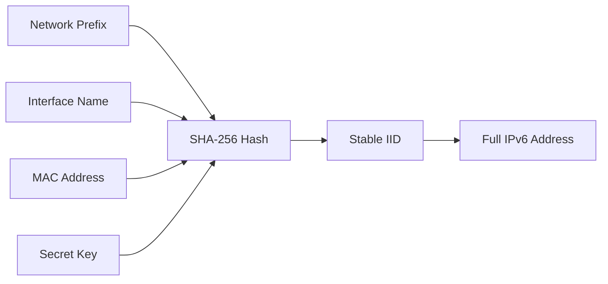

# How to Configure Stable Privacy Addresses (RFC 7217) on Linux

Author: [nawazdhandala](https://www.github.com/nawazdhandala)

Tags: IPv6, Privacy, RFC7217, Linux, Networking, SLAAC

Description: Configure RFC 7217 stable privacy addresses on Linux to prevent cross-network tracking while maintaining consistent addresses per network interface.

## Introduction

RFC 7217 defines a method for generating semantically opaque Interface Identifiers (IIDs) that remain stable within a network but change when moving between networks. Unlike EUI-64 (which exposes your MAC address) or RFC 4941 temporary addresses (which change too frequently), RFC 7217 addresses strike a balance between privacy and stability.

## How RFC 7217 Works

The address is derived from a one-way hash that combines:
- The network prefix
- The interface name
- The interface's stable hardware identifier
- A network ID (optional)
- A secret key (generated randomly at boot)

This means the same device gets the same address on the same network, but a different address on a different network - so cross-network tracking via the IID is not possible.



## Enabling RFC 7217 on Linux with NetworkManager

Modern NetworkManager (v1.2+) supports RFC 7217 via the `addr-gen-mode` setting.

The following command sets the address generation mode to `stable-privacy` for an interface named `eth0`:

```bash
# Set stable privacy address generation for eth0

nmcli connection modify eth0 ipv6.addr-gen-mode stable-privacy

# Apply the change
nmcli connection up eth0
```

To verify the setting is active:

```bash
# Check the connection profile for addr-gen-mode
nmcli connection show eth0 | grep addr-gen-mode
```

## Configuring via NetworkManager Config File

For system-wide configuration, edit or create a file in `/etc/NetworkManager/conf.d/`:

```ini
# /etc/NetworkManager/conf.d/ipv6-privacy.conf
# Enforce stable privacy addresses globally for all connections

[connection]
ipv6.addr-gen-mode=stable-privacy
```

Reload NetworkManager to apply:

```bash
sudo systemctl reload NetworkManager
```

## Verifying the Generated Address

After configuration, check that the IID is no longer based on the MAC address:

```bash
# Show IPv6 addresses on eth0
ip -6 addr show eth0

# The IID (last 64 bits) should NOT match the EUI-64 derived from your MAC
# Example: 2001:db8:1::/64 -> 2001:db8:1::a3f2:1b4e:7c9d:2e50
```

The MAC address of `00:11:22:33:44:55` would produce EUI-64 IID `0211:22ff:fe33:4455`. If you see a different IID that stays consistent across reboots, RFC 7217 is working correctly.

## Checking the Secret Key

NetworkManager stores the secret key used for address generation:

```bash
# Location of the secret key file
sudo cat /var/lib/NetworkManager/secret_key
```

This key is machine-specific and should not be shared. If it is regenerated (e.g., after a reinstall), all stable privacy addresses will change.

## Manual Configuration with `ip` Command

For testing without NetworkManager:

```bash
# Generate a stable privacy address manually using iproute2 (kernel 4.7+)
# The kernel automatically uses stable-privacy mode when configured via sysctl

# Enable stable privacy in the kernel for eth0
echo 2 | sudo tee /proc/sys/net/ipv6/conf/eth0/addr_gen_mode
# 0 = EUI-64, 1 = none, 2 = stable-privacy (RFC 7217), 3 = random
```

To make this persistent across reboots:

```bash
# /etc/sysctl.d/99-ipv6-privacy.conf
net.ipv6.conf.default.addr_gen_mode = 2
net.ipv6.conf.all.addr_gen_mode = 2
```

Apply immediately:

```bash
sudo sysctl -p /etc/sysctl.d/99-ipv6-privacy.conf
```

## Conclusion

RFC 7217 stable privacy addresses give Linux systems a strong privacy posture without the instability of purely random temporary addresses. They are the recommended default for most modern Linux deployments and are supported natively by the Linux kernel and NetworkManager. Enable them system-wide via sysctl or per-connection via NetworkManager to ensure your devices remain untraceable across different networks.
