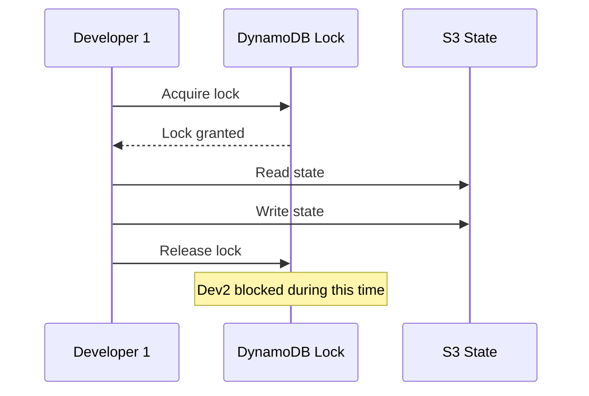

# How to Handle State Locking for Concurrent Team Access in OpenTofu

Author: [nawazdhandala](https://www.github.com/nawazdhandala)

Tags: OpenTofu, State Locking, DynamoDB, Concurrent Access, Team Collaboration, Infrastructure as Code

Description: Learn how OpenTofu state locking works with DynamoDB, how to resolve stuck locks, and how to prevent concurrent apply conflicts when multiple team members work on the same infrastructure.

---

State locking prevents two OpenTofu operations from modifying the same state file simultaneously. Without locking, concurrent applies can corrupt state or cause partial deployments. DynamoDB provides the locking mechanism for S3 backends.

## How State Locking Works



## DynamoDB Lock Table

```hcl
# The LockID is the S3 state path — DynamoDB uses it as the partition key
resource "aws_dynamodb_table" "state_lock" {
  name         = "tofu-state-lock"
  billing_mode = "PAY_PER_REQUEST"
  hash_key     = "LockID"

  attribute {
    name = "LockID"
    type = "S"
  }

  # Enable TTL to auto-clean stale locks (optional safety net)
  ttl {
    attribute_name = "ExpireTime"
    enabled        = true
  }

  point_in_time_recovery {
    enabled = true
  }

  lifecycle {
    prevent_destroy = true
  }
}
```

## Lock Behavior in Practice

```bash
# When a lock is held, other operations see:
# Error: Error acquiring the state lock
# Error message: ConditionalCheckFailedException
# Lock Info:
#   ID:        12345678-abcd-1234-efgh-123456789012
#   Path:      mycompany-tofu-state/environments/production/terraform.tfstate
#   Operation: OperationTypeApply
#   Who:       ci-user@hostname
#   Version:   1.6.0
#   Created:   2024-01-15 14:30:00 +0000 UTC
```

## Resolving Stuck Locks

```bash
# If a process crashed while holding a lock, you'll need to force-unlock
# Only do this after verifying no other operation is running

# Get the lock ID from the error message or DynamoDB console
LOCK_ID="12345678-abcd-1234-efgh-123456789012"

# Force release the lock
tofu force-unlock $LOCK_ID

# Verify the DynamoDB item was removed
aws dynamodb scan \
  --table-name tofu-state-lock \
  --filter-expression "contains(LockID, :env)" \
  --expression-attribute-values '{":env":{"S":"production"}}'
```

## Checking Locks via DynamoDB

```hcl
# Query current locks in your CI/CD or monitoring
data "aws_dynamodb_table_item" "current_lock" {
  table_name = "tofu-state-lock"
  key = jsonencode({
    LockID = { S = "mycompany-tofu-state/environments/production/terraform.tfstate" }
  })
}
```

## Preventing Lock Timeouts in CI/CD

```yaml
# .github/workflows/infra.yml
- name: Apply with lock timeout
  run: |
    # Wait up to 10 minutes for a lock to be released
    tofu apply -lock-timeout=10m -auto-approve tfplan
  env:
    TF_CLI_ARGS: "-lock=true"
```

## Lock-Free Operations

```bash
# Some read-only operations can skip locking (use with caution)
tofu plan -lock=false    # OK for read-only plan in CI that shows plans only
tofu output -lock=false  # Safe for reading outputs

# NEVER skip locking for apply
# tofu apply -lock=false  # Dangerous — never do this
```

## Monitoring Stale Locks with CloudWatch

```hcl
resource "aws_cloudwatch_metric_alarm" "stale_lock" {
  alarm_name          = "tofu-stale-lock"
  comparison_operator = "GreaterThanThreshold"
  evaluation_periods  = 1
  metric_name         = "ItemCount"
  namespace           = "AWS/DynamoDB"
  period              = 3600  # 1 hour
  statistic           = "Maximum"
  threshold           = 0

  dimensions = {
    TableName = aws_dynamodb_table.state_lock.name
  }

  alarm_description = "A lock has been held for over an hour — may be stale"
  alarm_actions     = [aws_sns_topic.alerts.arn]
}
```

## Best Practices

- Never use `tofu force-unlock` without first confirming no other process is running — check CI/CD job status and running pipelines first.
- Set `-lock-timeout` in CI/CD to wait for locks rather than failing immediately, reducing flaky pipeline runs.
- Use pay-per-request billing on the lock table — lock operations are infrequent and don't benefit from provisioned capacity.
- Enable DynamoDB TTL as a safety net for locks from processes that crash — set TTL to 2-4 hours beyond the maximum expected apply duration.
- Alert on locks older than 1 hour — legitimate applies rarely take that long, and a stale lock may indicate a crashed process.
